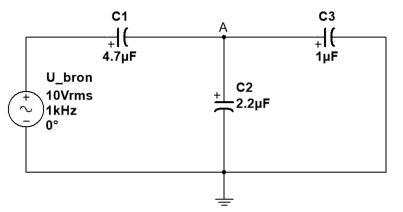

# Foutzoeken

Gegeven: de schakeling van figuur 8-42. Als deze schakeling correct werkt wordt op het punt $$A$$ $$6 V$$ gemeten ten opzichte van de massa.

Figuur 8-42

1. Als de spanning op punt $$A$$ gelijk is aan $$0 V$$ . Wat is dan de fout?
2. $$C1$$ is kortgesloten
3. C2 is kortgesloten
4. C3 is onderbroken
5. Als de spanning op punt $$A$$ gelijk is aan $$10 V$$ , wat is dan de fout?
6. $$C1$$ is kortgesloten
7. C2 is onderbroken
8. C3 is onderbroken
9. Als de spanning op punt $$A$$ gelijk is aan $$\mathrm{6,86} V$$ , wat is dan de fout?
10. $$C1$$ is onderbroken
11. C2 is onderbroken
12. C3 is onderbroken
13. Als de spanning op punt $$A$$ gelijk is aan $$\mathrm{8,28} V$$ , wat is dan de fout?
14. $$C1$$ is kortgesloten
15. C2 is onderbroken
16. C3 is onderbroken
17. Als de spanning op punt A gelijk is aan $$0 V$$ , wat is dan de fout?
18. $$C1$$ is onderbroken
19. C2 is onderbroken
20. C3 is onderbroken

