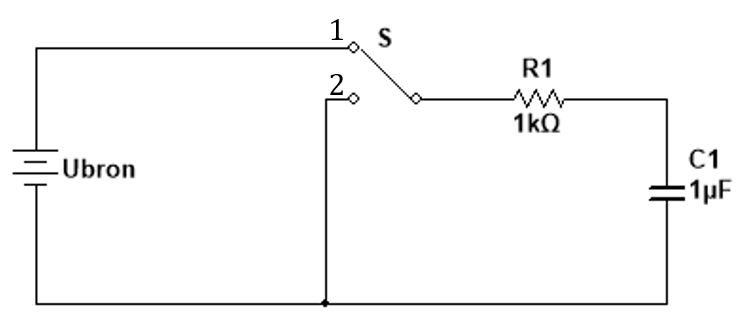
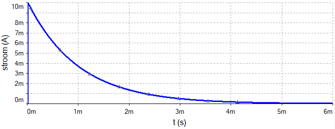
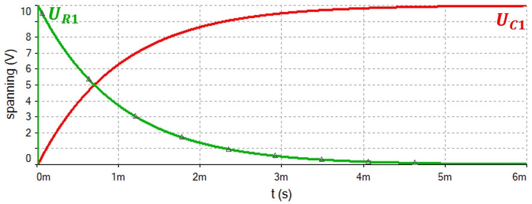
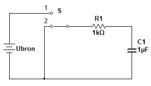
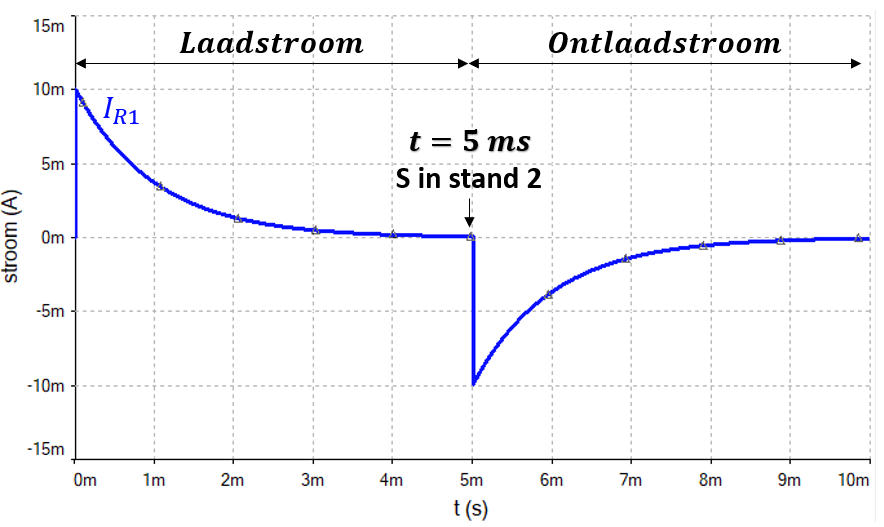
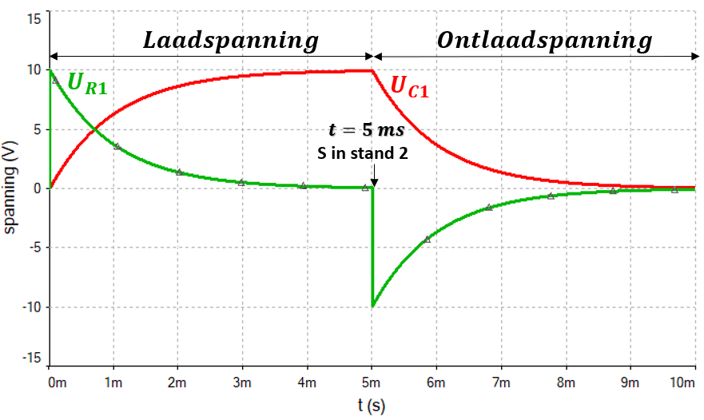
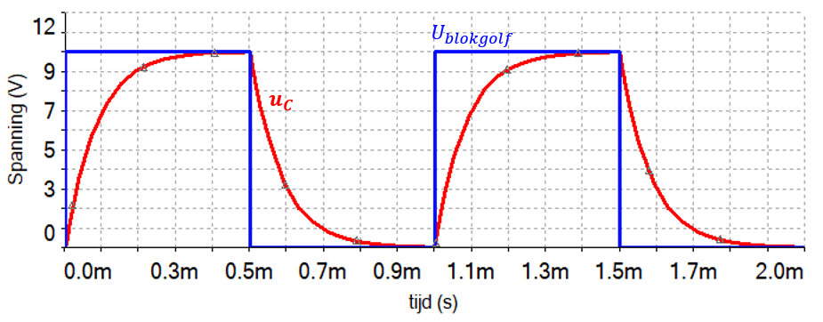

# Het  gedrag van condensatoren op gelijkstroom

Wanneer een condensator verbonden wordt met een gelijkspanningsbron zal deze zich beginnen op te laden. De opbouw van de lading op zijn platen gebeurt op een voorspelbare manier die afhankelijk is van de capaciteit en de weerstand in het stroompad waarlangs de condensator zich aan het opladen is.

Wat is belangrijk?

* Je verklaart het ladings- en ontladingsverloop van een condensator.
* **Je zegt de definitie van tijdsconstante \(RC of** $$\mathit{\tau }$$ **\)** **op.**
* Je verklaart het verband tussen tijdsconstante en het laden of ontladen van een condensator.
* Je verklaart waarom een condensator gelijkstroom blokkeert.

## Laden van een condensator 

Indien we een condensator op een gelijkspanningsbron aansluiten dan zal de laadstroom van deze condensator niet constant blijven. Bij het aansluiten van de spanning zal de laadstroom in het begin zeer groot zijn. Bekijk hiervoor eerst de schakeling in figuur 8-13.

Figuur 8-13 : opladen van een condensator

Bepalen van de laadstroom

De condensator bevat op het moment dat de schakelaar in stand $$1$$ wordt geschakeld nog geen lading. Vermits er nog geen lading aanwezig is, betekent dit dat de spanning over de condensator $$0 V$$ moet zijn. Immers uit $$Q=C\times U$$ volgt dat als $$Q$$ gelijk is aan nul coulomb de spanning nul volt moet zijn. Het gevolg hiervan is dat de volledige bronspanning op dit eerste moment over de weerstand moet staan \(spanningswet van Kirchhoff\). Vanaf het moment dat de stroom door de weerstand vloeit kan je de stroom berekenen. Als op het moment $$t=0$$ de schakelaar in stand $$1$$ wordt gebracht, is op dat moment de stroom te vinden via de wet van Ohm :

$$I=\frac{ {U}_{bron}}{ {R}_{1}}$$

Dit is de maximale laadstroom die er zal vloeien tijdens het laden van de condensator. Deze stroom wordt de maximale stroom $${I}_{max}$$ genoemd.

De stroom zal echter door het laden van de condensator gaan dalen. Er komen immers steeds meer ladingsdeeltjes op de condensator waardoor er over deze condensator een spanning komt te staan. Volgens de spanningswet van Kirchhoff zal door het feit dat de spanning over $${C}_{1}$$ groter wordt, de spanning over $${R}_{1}$$ evenredig gaan dalen waardoor de stroom doorheen $${R}_{1}$$ ook gaat dalen. Naarmate dat de condensator zich verder aan het opladen is zal de stroom ook steeds meer en meer dalen. Op het moment dat de condensator $${C}_{1}$$ volledig is opgeladen staat de volledige bronspanning over de condensator. Hierdoor is er geen spanningsval meer over de weerstand $${R}_{1}$$ en is de stroom erdoor gelijk aan nul. Je kan hieruit concluderen dat vanaf je de schakelaar in stand $$1$$ brengt er een bepaald overgangsmoment is. Dit overgangsmoment bestaat er in dat er stroom vloeit totdat de condensator volledig is opgeladen. Eens de condensator volledig is opgeladen gedraagt deze zich als een open keten voor de gelijkstroom en wordt deze niet meer doorgelaten. Het overgangsmoment wordt bepaald door de capaciteitswaarde en de weerstand waarlangs wordt opgeladen. Algemeen kan je zeggen dat dit moment relatief van korte duur is en dat een condensator gelijkstroom blokkeert.

Hoe zit het nu met de grootte van de laadstroom? Vanaf het moment dat de schakelaar in stand $$1$$ is gebracht, vloeit er een stroom naar de condensator. Op het eerste moment is deze maximaal. Vermits de condensator zich exponentieel oplaadt, zal de stroom evenredig exponentieel afnemen tot deze de waarde nul bereikt. Algemeen kan het exponentieel verloop van de stroom op volgende wijze geformuleerd worden:

$$I={I}_{max} \times {e}^{-\frac{t}{R\times C}}$$ **\(8-8\)**

Hierbij is $${I}_{max}$$ de stroom die er vloeit op het eerste moment dat de condensator begint op te laden en is te vinden door de verhouding aangelegde spanning ten opzichte de weerstand waarlangs de condensator zich oplaad. $$R$$ is de weerstand waarlangs de condensator zich oplaad en $$C$$ de capaciteitswaarde van de condensator. Het getal $$e$$ is een belangrijke wiskundige constante en is het grondtal van de natuurlijke logaritme en heeft een benaderende waarde : $$e= \mathrm{2,718281828459}\dots$$ Je vindt $$e$$ op het rekenmachine als $${e}^{x}$$ of het inverse van $$ln$$ .

Met de gegeven formule ben je in staat om op verschillende tijdsmomenten tijdens het laden van de condensator de stroom door de condensator of weerstand te bepalen. Ook de spanning over de weerstand kan je met deze formule bepalen. De figuur 8-14 geeft het stroomverloop tijdens het laden weer van de schakeling in figuur 8-13. Er is verondersteld dat de bronspanning gelijk is aan $$10 V$$ .

Figuur 8-14 : stroomverloop tijdens het laden van de condensator van de schakeling in figuur 8-13.

Merk op dat op het moment $$t=0 ms$$ , als de schakelaar wordt geplaatst in stand $$1$$ , de stroom zeer snel verandert naar zijn maximale waarde \( $$10 mA$$ \) om vervolgens exponentieel te dalen naar $$0 mA$$ . In dit voorbeeld is na een tijdsduur van $$5 ms$$ de stroom herleid tot $$0 mA$$

Bepalen van de spanning over de condensator

Als je de vergelijking \(8-8\) vermenigvuldigt met de weerstandswaarde $${R}_{1}$$ bekom je de spanning over de weerstand. In formulevorm:

$${U}_{R1}={R}_{1}\times$$ $${ {I}_{max }\times e}^{-\frac{t}{ {R}_{1}\times {C}_{1}}}$$

De laadspanning over de condensator kan dan gevonden worden met de spanningswet van Kirchhoff:

$${U}_{bron}={U}_{R1}+{U}_{C1}$$

$${U}_{C1}={U}_{bron}-{U}_{R1}$$

Als voor $${U}_{R1}$$ terug zijn wet van Ohm equivalent gebruikt wordt :

$${U}_{C1}={U}_{bron}-({R}_{1}\times$$ $${ {I}_{max }\times e}^{-\frac{t}{ {R}_{1}\times {C}_{1}}}$$ \)

Op het moment dat de stroom $${I}_{max}$$ vloeit, staat alle spanning over de weerstand. Bijgevolg is op dat moment de spanning over de weerstand gelijk aan de bronspanning. Hieruit volgt:

$${U}_{bron}={R}_{1} \times {I}_{max}$$

Voor $${U}_{c1}$$ wordt dan verkregen:

$${U}_{C1}={U}_{bron}-{U}_{bron}\times {e}^{-\frac{t}{ {R}_{1}\times {C}_{1}}}$$

Of:

$${U}_{C1}={U}_{bron}\times \left(1- {e}^{-\frac{t}{ {R}_{1}\times {C}_{1}}}\right)$$

Figuur 8-16 : spanningsverloop tijdens het laden over de condensator en weerstand van de schakeling in figuur 8-13 \(in de veronderstelling dat de bronspanning gelijk is aan $$10 V.$$

Met bovenstaande formule ben je in staat om op verschillende tijdsmomenten de spanning tijdens het laden van de condensator te bepalen. Ken je de spanning op een bepaald tijdsmoment over de condensator, dan heb je via de spanningswet van Kirchhoff ook snel de spanning over de weerstand. De algemene formule om de spanning te bepalen tijdens het laden van de condensator is:

$${U}_{C}={U}_{bron}\times \left(1- {e}^{-\frac{t}{RC}}\right) \left(8-9\right)$$

Figuur 8-16 toont het spanningsverloop over de condensator en de weerstand tijdens het laadproces. Merk op dat de spanning over de weerstand tegengesteld verloopt dan de spanning over de condensator.

## Ontladen van een condensator 

De condensator kan ontladen worden door de schakelaar in figuur 8-18 in stand 2 te schakelen.

Stel dat tijdstip $$t=5 ms$$ het moment is dat de schakelaar in stand $$2$$ wordt geschakeld. Vanaf dit moment zal er een ontlaadstroom vloeien door de weerstand die tegengesteld is aan de laadstroom. Dit betekent dat de spanning over de weerstand nu negatief gaat zijn omwille van de tegengestelde stroom. Merk op condensator nu fungeert als spanningsbron met de weerstand $${R}_{1}$$ als belasting. Dit betekent dat de spanning over beide componenten dezelfde absolute waarde hebben maar tegengestel van teken. De ontlaadstroom vertrekt van de negatieve plaat van de condensator en stroomt door de weerstand naar de positieve plaat van de condensator. Door deze stroom zal het ladingsverschil op de twee platen verminderen waardoor ook het spanningsverschil tussen de twee platen zal dalen. Zolang er ladingsverschil is tussen de twee platen blijft de ontlaadstroom vloeien. Van zodra de lading op beide platen van de condensator gelijk is, is er geen spanningsverschil meer en vloeit er ook geen stroom meer door de schakeling.

Figuur 8-18: ontladen van een condensator

De condensatorspanning kan op ieder tijdsmoment als volgt worden bepaald:

$${U}_{C1}={U}_{C1max} \times {e}^{-\frac{t}{R1C1}} \left(8-10\right)$$

Hierin is $${U}_{C1max}$$ de spanning die over de condensator staat op het moment dat de schakelaar in stand $$2$$ wordt geplaatst. Als de condensator volledig is opgeladen is $${U}_{C1max}$$ gelijk aan de bronspanning. Dit is echter niet altijd het geval. Als de schakelaar wordt omgeschakeld nog voor de condensator volledig opgeladen is, is de spanning over de condensator bij het begin van het ontladen gelijk aan de spanningswaarde tot waar de condensator is opgeladen in plaats van de bronspanning.

De tegengestelde spanning over de weerstand is als volgt te bepalen:

$${U}_{R1}= -{U}_{C1max} \times {e}^{-\frac{t}{R1C1}}$$

De stroom op ieder tijdsmoment kan als volgt bepaald worden:

$$I= -{I}_{Cmax} \times {e}^{-\frac{t}{R1C1}}$$

$$I= -\frac{ { U}_{Cmax}}{ {R}_{1}} \times {e}^{-\frac{t}{R1C1}}$$

Het stroomverloop tijdens het laden en ontladen is in figuur 8-19 weergegeven

Figuur 8-19 : laad- en ontlaadstroomverloop van de schakeling van figuur 8-13

Het laad- en ontladingsverloop van de condensator $${C}_{1}$$ en het spanningsverloop over $${R}_{1}$$ van de schakeling in figuur 8-13 is in figuur 8-20 weergegeven.

Figuur 8-20 : laad- en ontlaadspanningsverloop van de schakeling van figuur 8-13

## De RC-tijdsconstante 

**In een praktische situatie staat er geen capaciteit zonder enige weerstand in een schakeling.** Ook al is er niet direct een weerstand zichtbaar, toch is deze aanwezig. Al was het maar de kleine weer **stand** van een printbaan. Daarom is er bij het laden en ontladen van de condensator steeds een bepaalde weerstand aanwezig met een bepaalde invloed op dit laad- en ontlaadproces. De weerstand introduceert een tijdselement in het laden- en ontladen van een condensator. Wanneer een condensator wordt op- of ontladen via een weerstand zal er een zekere tijd nodig zijn om de condensator volledig op te laden of te ontladen. De spanning over een condensator kan niet ogenblikkelijk veranderen omdat een eindige tijd nodig is om de lading van het ene punt naar het andere te verplaatsen. De tijdconstante van de serie $$RC$$ -keten bepaalt de snelheid waarmee de condensator zal opladen of ontladen. De $$RC$$ -tijdsconstante is een vast tijdsinterval dat gelijk is aan het product van de weerstand en de condensator in de serie $$RC$$ -kring. De tijdsconstante wordt uitgedrukt in eenheden van seconden wanneer de weerstand in Ohm is uitgedrukt en de capaciteit in Farad. Het symbool van de tijdsconstante is de Griekse letter tau \( $$\tau$$ \). In formulevorm:

$$\tau =R\times C \left(8-11\right)$$

Merk op dat . De stroom hangt bijgevolg af van de hoeveelheid lading die verplaatst wordt in een bepaalde tijd. Wanneer de weerstand wordt verhoogd, vermindert de oplaadstroom waardoor de oplaadtijd van de condensator verhoogt. Wanneer de capaciteit wordt verhoogd, neemt de hoeveelheid lading toe. Dit heeft als gevolg dat bij éénzelfde stroom meer tijd nodig zal zijn om de condensator op te laden.

Een condensator wordt opgeladen tussen twee spanningsniveaus. De lading over de capaciteit verandert met ongeveer $$63 \%$$ van zijn volledige ladingscapaciteit na een tijd gelijk aan één tijdsconstante. Dit betekent dat na $$1 \tau$$ een volledig ontladen condensator opgeladen is tot $$63 \%$$ van zijn volledig opgeladen waarde. Is een condensator opgeladen tot $$100 \%$$ , dan zal bij ontlading de condensator na $$1 \tau$$ ongeveer $$63 \%$$ ontladen zijn. De spanning over de condensator bedraagt dan nog $$37 \%$$ van de maximaal opgeladen waarde.

Bij het gebruik van condensatoren wordt dikwijls vanuit gegaan dat deze een onderbreking voor gelijkstroom vormen zodat geen gelijkstroom door een condensator kan vloeien. In werkelijkheid blijkt dit pas te gelden na een bepaalde tijd gelijk aan $$5 \tau$$ . Na een tijd gelijk aan $$5 \tau$$ kan je een condensator als volledig opgeladen of volledig ontladen beschouwen.

Wat als de condensator niet volledig op- of ontladen was?

Tot nu toe zijn we er van uit gegaan dat de condensator volledig opgeladen was vooraleer deze begint te ontladen of dat de condensator volledig ontladen was bij het starten van het oplaadproces. Wanneer dit niet het geval is moet je de formules voor het opladen en het ontladen aanpassen op volgende wijze: Stel dat $${V}_{begin}$$ de beginspanning die de condensator heeft. Voor het laden bekom je:

$${u}_{C}= {U}_{bron}+\left({U}_{begin}-{U}_{bron}\right)\times {e}^{-\frac{t}{RC}}$$ en $${u}_{R}={(U}_{bron}-{U}_{begin}) \times {e}^{-\frac{t}{RC}}$$

Voor het ontladen :

$${u}_{C}={U}_{begin} \times {e}^{-\frac{t}{RC}}$$ en $${u}_{R}= {-U}_{begin} \times {e}^{-\frac{t}{RC}}$$

## De response op een blokgolf 

Een vaak voorkomende situatie dat illustreert dat het laden- en ontladen van een condensator exponentieel verloopt is de aansturing van een RC-schakeling met een blokgolf waarvan de periodetijd groter is dan de tijdsconstante. In figuur 8-22 is zo’n voorbeeld weergegeven. Hierin is de periodetijd van de blokgolf gelijk aan tien keer de tijdsconstante \( $$10\tau ).$$ De blokgolf kan je vergelijken met het aan en uitschakelen van de schakelaar. In tegenstelling met een gewone schakelaar biedt de generator, tijdens de momenten dat de blokgolf gelijk is aan $$0 V$$ , de condensator de gelegenheid om zich langs de generator te ontladen. Wanneer de blokgolf stijgt, stijgt de spanning over de condensator exponentieel naar de maximale waarde van de blokgolf in een tijd die afhankelijk is van de tijdsconstante. Telkens de blokgolf terug naar het nulniveau komt, gaat de condensatorspanning exponentieel afnemen. Dit afnemen is terug afhankelijk van de tijdsconstante. De interne weerstand van de blokgolfgenerator kan meestal worden verwaarloosd ten opzichte van de weerstandswaarde in de schakeling.

Figuur 8-22: exponentieel laden en ontladen van een condensator ten gevolge van een blokgolf

## Test jezelf : Het gedrag van condensatoren op gelijkstroom 

1. **Bepaal de tijdconstante als** $$\mathit{R}=1200\mathit{ }\mathit{\Omega }$$ **en** $$\mathit{C}=1\mathit{ }\mathit{n}\mathit{F}$$ **.**
2. **Stel dat** $$\mathit{R}=1200\mathit{ }\mathit{\Omega }$$ **en** $$\mathit{C}=1\mathit{ }\mathit{n}\mathit{F}$$ **.** Deze $$\mathit{R}\mathit{C}$$ **-combinatie wordt aangesloten op een bronspanning van** $$5\mathit{ }\mathit{V}.$$
3. Na hoeveel tijd is de condensator volledig opgeladen. Stel dat deze volledig ontladen was.
4. Welk is de waarde van de spanning over de condensator als deze volledig opgeladen is?
5. **Een bepaalde schakeling heeft een tijdsconstante van** $$1\mathbf{ }\mathit{m}\mathit{s}$$ **.** Als deze opgeladen wordt met een batterijspanning van $$10\mathit{V},$$ **hoeveel bedraagt de condensatorspanning dan na** $$2\mathbf{ }\mathit{m}\mathit{s},\mathbf{ }3\mathbf{ }\mathit{m}\mathit{s},\mathbf{ }4\mathbf{ }\mathit{m}\mathit{s}$$ **en** $$5\mathit{ }\mathit{m}\mathit{s}$$ **?**
6. **Een condensator is opgeladen tot** $$\mathit{ }100\mathit{ }\mathit{V}$$ **.** Als deze zich ontlaadt via een weerstand, hoeveel bedraagt dan de spanning over deze condensator na een tijd gelijk aan één tijdsconstante?

