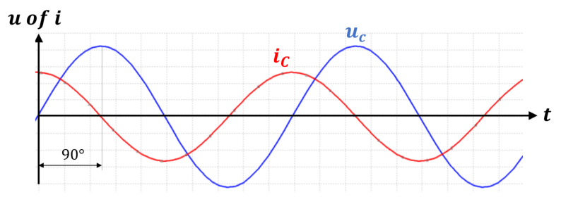
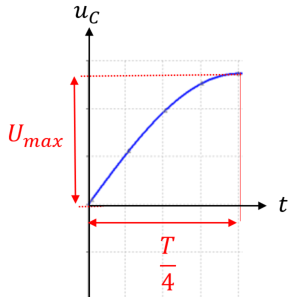
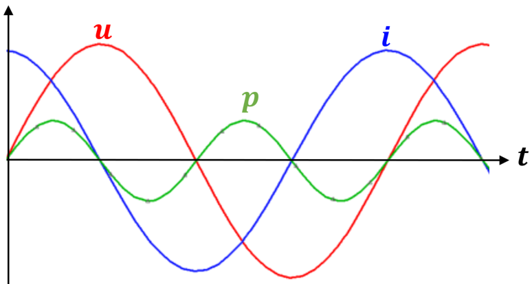
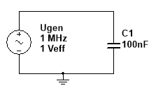

# Het gedrag  van een condensator op wisselstroom

Een condensator blokkeert een constante stroom van zodra hij volledig is opgelaten maar laat de wisselstroom door met een zekere hoeveelheid aan oppositie, reactantie genoemd.

Wat is belangrijk?

* **Je legt uit waarom een condensator** $$90°$$ **faseverschuiving veroorzaakt tussen spanning en stroom.**
* Je legt het begrip reactantie uit.
* Je berekent de waarde van de capacitieve reactantie \(capacitantie\)
* Je berekent de vervangreactantie van een aantal condensatoren in serie.
* Je berekent de vervangreactantie van een aantal condensatoren in parallel.
* Je legt het verschil uit tussen het werkelijk vermogen en het reactief vermogen.

Wannneer over een condensator een gelijkspanning wordt aangesloten zal deze opladen met een laadstroom gelijk aan de ladingsverandering per tijdseenheid. In formulevorm:

$$i=\frac{dQ}{dt}$$

Hierin stelt $$dQ$$ de steeds verminderde ladingstoevoer naar de condensator voor vermits deze steeds meer en meer opgeladen wordt terwijl $$dt$$ de tijd voorstelt om deze ladingsverandering te laten plaatsvinden. Als je een wisselstroom aansluit over deze condensator, dan kan je nagaan hoe de laad- en ontlaadstroom door de condensator verloopt in functie van deze spanning. Algemeen geldt bij een condensator:

$$Q=C \times U$$

Aangezien een wisselspanning een steeds veranderende spanning in de tijd is, kan bovenstaande formule omgevormd worden tot:

$$i \times dt=C \times du$$

Of:

$$i=C\times \frac{du}{dt}$$

Dit betekent dat de momentele stroomwaarde op een bepaald punt gelijk is aan de capaciteitswaarde vermenigvuldigt met de spanningsverandering per tijdseenheid. Beschouw figuur 8-23. We gaan de stroom bepalen voor de punten $$A, B, C$$ en $$D$$ .

Figuur 8-23: Bepalen van de wisselstroom door de condensator

Eerst bepalen we de stroom door de condensator bij het punt $$A.$$ Dit kan gedaan worden door rond dit punt een bepaalde spanningsval te nemen door bijvoorbeeld de spanning te bepalen tussen de tijdsmomenten $${t}_{1}$$ en $${t}_{2}.$$ Merk op dat beide tijdspunten even ver van punt $$A$$ liggen waardoor beide overeenkomstige momentele spanningen \( $${u}_{1}$$ en $${u}_{2}$$ \) even groot zijn. Het tijdsinterval $$dt$$ is dan als volgt te bepalen:

$$dt={t}_{2}-{t}_{1}$$

Het overeenkomstig spanningsinterval $$du$$ is dan gelijk aan :

$$du={u}_{2}-{u}_{1}$$

Vullen we dit in voor de stroom dan vinden we:

$${i}_{A}=C\times \frac{du}{dt}=C\times \frac{ {u}_{2}-{u}_{1}}{ {t}_{2}-{t}_{1}}= C\times \frac{0}{ {t}_{2}-{t}_{1}}=0 A$$

Hieruit kan je concluderen dat wanneer de wisselspanning positief maximum is, de stroom nul ampère is. Vervolgens bepalen we de stroom tijdens de doorgang in punt $$B$$ . De tijdsintervallen zijn $${t}_{3}$$ en $${t}_{4}$$ en liggen symmetrisch rond punt $$B$$ . Merk op dat de spanning op tijdsmoment $${t}_{3}$$ positief is en op tijdsmoment $${t}_{4}$$ negatief. Vullen we dit terug in voor de stroom dan verkrijgen we:

$${i}_{B}=C\times \frac{du}{dt}=C\times \frac{ {-u}_{4}-{u}_{3)}}{ {t}_{3}-{t}_{4}}= C\times \frac{-({u}_{4}+{u}_{3)}}{ {t}_{3}-{t}_{4}}=-{I}_{max}$$

De stroom bereikt in punt $$B$$ zijn maximale negatieve waarde die kan voorkomen, namelijk de som van twee momentele deelspanningen. Dit maximum komt omdat de spanning van polariteit omkeert. In punt $$C$$ kan je terug twee intervallen nemen rondom dit punt. Ook hier zullen de twee mo mentele spanningsvallen \(net als bij punt $$A$$ \) aan elkaar gelijk zijn als beide tijdsmomenten even ver van punt $$C$$ worden genomen. We bekomen voor de stroom in punt $$C$$ :

$${i}_{C}=C\times \frac{du}{dt}=C\times \frac{ {u}_{6}-{u}_{5}}{ {t}_{6}-{t}_{5}}= C\times \frac{0}{ {t}_{6}-{t}_{5}}=0 A$$

Als de spanning positief maximum is, is de stroom gelijk aan nul ampère. Beschouwen we tenslotte punt $$D$$ . In dit punt gaat de spanning over van een negatieve momentele waarde naar een positieve momentele waarde. Ook nu verkrijgen we een maximum:

$${i}_{D}=C\times \frac{du}{dt}=C\times \frac{ {u}_{8}-{(-u}_{7})}{ {t}_{8}-{t}_{7}}= C\times \frac{ {u}_{8}+{u}_{7})}{ {t}_{8}-{t}_{7}}= +{I}_{max}$$

Hieruit kunnen we besluiten dat als de wisselspanning vanuit negatieve waarde het nulniveau doorkruist, de stroom maximaal is door de condensator. Figuur 8-24 toont de faserelatie tussen de wisselspanning en de wisselstroom bij de condensator.

Figuur 8-24: stroom-spanningsverloop bij een condensator

Uit de figuur 8-24 blijkt dat bij een condensator de stroom $$90°$$ voorijlend is op de spanning. Telkemale de stroom maximaal is, is de spanning gelijk aan nul en omgekeerd. Door het feit dat er eerst lading op de platen van een condensator moet staan vooraleer er spanning kan over staan moet er bijgevolg eerst een stroom met ladingsdragers vloeien vooraleer het elektrisch veld tussen de platen kan opgebouwd worden en er een spanning kan ontstaan.

## Capacitieve reactantie XC 

Nu je het spannings- en stroomverloop van een condensator op wisselstroom kent, kunnen we de mate van tegenwerking bepalen \(lees weerstand bieden\) die de condensator biedt op wisselstroomgebied. Deze mate van tegenwerking doet zich niet voor bij gelijkstroom. Weerstand bieden enkel bij wisselstroom en niet bij gelijkstroom wordt reactantie genoemd. Reactantie wordt voorgesteld met $${X}_{C}$$ en wordt uitgedrukt in Ω . Als het een condensator is die deze weerstand biedt wordt ook wel eens gesproken van capacitantie. Voor het bepalen van de reactantie beschouw je eerst de figuur 8-25.

Vertrek terug vanuit de basisformule $$Q=C \times U$$ . Hierin wordt terug $$Q$$ vervangen door het product $$I \times t$$ . Wanneer er een wisselstroom door de condensator vloeit, dan kan deze bepaald worden op volgende wijze \(zie het bepalen van de stroom door een condensator\) :

$$i=C\times \frac{du}{dt}$$

Figuur 8-25 : bepalen van de reactantie van een condensator

Beschouw een tijdsinterval tussen $$t=0$$ en $$t=\frac{T}{4}$$ _._ Dit komt overeen met ¼ van de periode. De spanning over de condensator varieert dan tussen $$0 V$$ en $${U}_{max}$$ . De stroom die je hiermee vindt door de formule uit te rekenen is gelijk aan de gemiddelde stroom over deze ¼ periode. Vullen we deze waarden in de formule voor de stroom:

$${I}_{gem}=C\times \frac{ {U}_{max}}{\frac{T}{4}}$$

De gemiddelde stroom $${I}_{gem}$$ kan in functie van de maximale stroom $${I}_{max}$$ geschreven worden op volgende wijze:

$${I}_{gem}=\frac{2}{\pi }\times {I}_{max}$$

Invullen in de formule voor de stroom:

$$\frac{2}{\pi }\times {I}_{max}= C\times \frac{ {U}_{max}}{\frac{T}{4}}$$

Vereenvoudigen van bovenstaande formule:

$$\frac{2}{\pi }\times {\frac{T}{4}\times I}_{max}= C\times {U}_{max}$$

$$\frac{T}{2\times \pi } \times {I}_{max}= C\times {U}_{max}$$

De reactantie $${X}_{C}$$ is de weerstand die de condensator biedt op wisselstroom. De weerstandswaarde kan je vinden via de wet van Ohm en bijgevolg de verhouding te nemen van de maximale spanning over de maximale stroom. Omvormen naar deze reactantie levert volgende formule op:

$$\frac{ {U}_{max}}{ {I}_{max}}={X}_{C}\mathrm{ }=\frac{T}{2\times \pi \times C}$$

Vermits de periode het omgekeerde is van de frequentie kan je de formule van de reactantie verder verfijnen tot :

$${X}_{C}\mathrm{ }=\frac{1}{2\times \pi \times f \times C}$$

of

$${X}_{C}\mathrm{ }=\frac{1}{2\pi f C} \left(8-12\right)$$

Uit vergelijking \(8-12\) is af te leiden dat de reactantie $${X}_{C}$$ afhankelijk is van de frequentie van de wisselstroom. Hoe hoger deze frequentie wordt, hoe kleiner de waarde van $${X}_{C}$$ wordt en omgekeerd. Uit de formule kan je ook afleiden dat hoe groter de capaciteitswaarde is, hoe kleiner de $${X}_{C}$$ -waarde zal zijn.

Opmerking vermits $$2\pi f$$ gelijk is aan de hoeksnelheid $$\omega$$ , wordt de formule voor $${X}_{C}$$ ook op volgende wijze geschreven:

$${X}_{C}\mathrm{ }=\frac{1}{\omega C}$$

### Reactantie van condensatoren in serie en/of parallel 

Stel twee condensatoren $${C}_{1}$$ en $${C}_{2}$$ in serie. De vervangingscapciteit van deze serieschakeling is met volgende formule te vinden:

$${C}_{t}=\frac{1}{\frac{1}{ {C}_{1}}+\frac{1}{ {C}_{2}}}$$

Wanneer door deze serieschakeling een bepaalde wisselstroom met frequentie $$f$$ stroomt, moet de reactantie van de totale capaciteit even groot zijn als de reactantie die wordt geboden door de con densatoren in serie. Vervangen we de condensatoren door hun respectievelijke reactanties dan bekomen we:

$$\frac{1}{ {X}_{Ct}}=\frac{1}{\frac{\frac{\frac{1}{1}}{1}}{ {X}_{C1}}+ \frac{\frac{\frac{1}{1}}{1}}{ {X}_{C2}}}$$

Herwerken van de vergelijking en rekening houdend dat een breuk delen door een breuk gelijk is aan de breuk vermenigvuldigt met het omgekeerde van de tweede breuk.

$${X}_{Ct}=\frac{\frac{\frac{1}{1}}{1}}{ {X}_{C1}}+ \frac{\frac{\frac{1}{1}}{1}}{ {X}_{C2}}$$

$${X}_{Ct}=\frac{1}{1}\times \frac{ {X}_{C1}}{1}+ \frac{1}{1}\times \frac{ {X}_{C1}}{1}$$

$${X}_{Ct}={X}_{C1}+{X}_{C2} \left(8-13\right)$$

De totale reactantie $${X}_{Ct}$$ van een aantal condensatoren in serie is gelijk aan de som van de afzonderlijke reactanties van de in serie staande condensatoren. Merk op dat deze formule overeenkomt met de formule van de serieschakeling van weerstanden.

Stel nu twee condensatoren in parallel. De totale vervangingsreactantie van deze parallelschakeling kan je op analoge wijze vinden. Vertrek terug van de formule voor parallelschakeling van condensatoren en vervang de capaciteiten door hun overeenkomstige reactanties:

$${C}_{t}={C}_{1}+{C}_{2}$$

$$\frac{1}{ {X}_{Ct}}=\frac{1}{ {X}_{C1}}+\frac{1}{ {X}_{C2}}$$

$${X}_{Ct}=\frac{1}{\frac{1}{ {X}_{C1}}+\frac{1}{ {X}_{C2}}} \left(8-14\right)$$

Ook hier valt de gelijkenis op met de formule voor parallelschakeling van weerstanden.

### Toepassing van wet van Ohm via reactantie 

De weerstand \(reactantie\)die een condensator biedt tegen wisselstroom is analoog aan de weerstand die een normale weerstand biedt tegen gelijkstroom. Beide worden uitgedrukt in Ohm. Vermits de reactantie weerstand biedt tegen de wisselstroom kan ook de wet van Ohm toegepast worden op deze reactanties. In formulevorm:

$$I=\frac{U}{ {X}_{C}} \left(8-15\right)$$

## Capacitieve spanningsdeler 

In wisselstroomschakelingen kunnen condensatoren gebruikt worden in toepassingen die een spanningsdeler nodig hebben. De spanning over een bepaalde condensator in serie met een andere condensator kan worden gevonden via volgende formule;

$${U}_{Cx}=\frac{ {C}_{t}}{ {C}_{x}}\times {U}_{bron}$$

Een resistieve spanningsdeler wordt uitgedrukt in termen van een overbrengingsverhouding . Je kan denken aan de capacitieve spanningsdeler door het toepassen van dit idee van een resistieve spanningsdeler. Echter nu met behulp van een reactantie in plaats van een weerstand. De vergelijking voor de spanning over een condensator in een capacitieve spanningsdeler kan worden geschreven als volgt:

$${U}_{x}=\frac{ {X}_{Cx}}{ {X}_{Ct}}\times {U}_{bron} \mathit{ }\left(8-16\right)$$

Hierbij is $${X}_{Cx}$$ de reactantie van de condensator $${C}_{x}$$ en $${X}_{Ct}$$ de totale capacitieve reactantie. $${U}_{bron}$$ is de aangelegde wisselspanning over de capacitieve spanningsdeler.

## Het vermogen in een condensator 

Zoals in het begin van paragraaf 8.5 reeds vermeld is, ijlt de stroom $$90°$$ voor op de spanning bij een condensator. Deze stroom en spanning zorgen voor een bepaald gedissipeerd vermogen in de con densator. Bij een condensator kan je drie soorten vermogens onderscheiden. Het momenteel of ogenblikkelijk vermogen, het werkelijk vermogen en het reactief vermogen.

_**Momenteel vermogen**_ ****$$\mathit{p}$$

Het product van de momentele spanning $$u$$ met de momentele stroom $$i$$ levert het momentele vermogen $$p$$ op. Op de punten waar de spanning en de stroom nul zijn, is het vermogen ook gelijk aan nul.

De groene lijn in figuur 8-30 stelt het vermogen voor bij een condensator. Wanneer er een spanning over de condensator verschijnt, wordt er een elektrisch veld opgebouwd tussen de platen van de condensator. Het elektrisch veld manifesteert zich in het diëlektricum. Wanneer er een wisselspanning is aangesloten over de condensator dan wordt er energie opgeslagen in de condensator gedurende één vierde van de spanningscylclus. Gedurende het volgende vierde cyclus wordt deze energie teruggegeven aan de spanningsbron. Als de condensator ideaal verondersteld kan worden is hierbij geen energieverlies.

Figuur 8-30 : vermogencurve \(groene lijn\) voor een condensator

_**Het werkelijk vermogen**_ ****$${\mathit{P}}_{\mathit{w}\mathit{e}\mathit{r}\mathit{k}\mathit{e}\mathit{l}\mathit{i}\mathit{j}\mathit{k}}$$_\*\*_

In het ideale geval wordt alle energie die door de condensator is opgeslagen tijdens het positieve gedeelte van de vermogencyclus teruggegeven aan de bron gedurende het negatieve deel van deze vermogencyclus. Er is geen energie verloren gegaan als gevolg van de omzetting van warmte in de condensator. Hierdoor volgt dat het werkelijk vermogen over een hele spanningscyclus gelijk is aan nul. In de werkelijkheid zal, vanwege lekkage en de weerstand van het folie, in een echte condensator een klein percentage van het totale vermogen worden gedissipeerd in de vorm van het werkelijk vermogen $${P}_{werkelijk}$$ .

_**Het reactief vermogen**_ ****$${\mathit{P}}_{\mathit{r}}$$

De snelheid waarmee een condensator energie opslaat en terug afgeeft wordt zijn reactief vermogen $${P}_{r}$$ genoemd. Het reactief vermogen is verschillend van nul omdat op elk moment in de tijd door de condensator energie vanuit de spanningsbron wordt opgenomen of energie wordt afgegeven aan deze spanningsbron. Het reactief vermogen stelt dus geen energievelies voor. De volgende formules zijn van toepassing voor het bepalen van het reactief vermogen:

$${P}_{r}={U}_{eff} \times {I}_{eff} \left(8-17\right)$$

$${P}_{r}=\frac{ {U}_{eff}^{2}}{ {X}_{C}} \left(8-18\right)$$

$${P}_{r}={I}_{eff}^{2} \times {X}_{C} \left(8-19\right)$$

De eenheid van reactief vermogen is $$VAR$$ \( _V_ olt _A_ mpère _R_ eactief\). De spanningen en stromen worden in effectieve waarde gegeven \(of geplaatst\) om het reactief vermogen te kunnen bepalen.

## Test jezelf : Het gedrag van condensatoren op wisselstroom 

1. Bereken $${X}_{C}$$ voor een condensator van $$47 pF$$ bij een frequentie van $$5 kHz$$ .
2. Bij welke frequentie is de reactantie van een $$100 nF$$ condensator gelijk aan $$2 k\Omega$$ ?
3. Bereken de effectieve stroom in de schakeling van figuur 8-32.

Figuur 8-32

1. Verklaar de faserelatie tussen de spanning over een condensator en stroom die er door vloeit.
2. Als een $$1 \mu F$$ condensator verbonden is over een spanningsbron van $$12 {V}_{eff}$$ , bepaal dan zijn werkelijk vermogen en zijn reactief vermogen bij een frequentie van $$500 Hz$$ .

