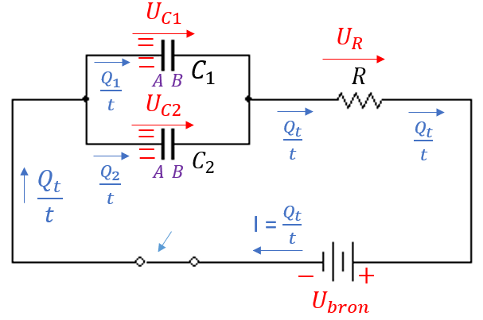
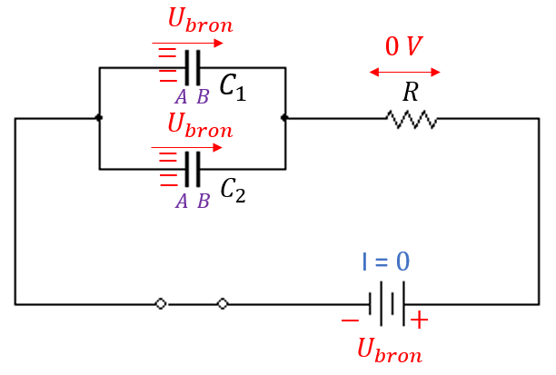

# Parallelschakelen van condensatoren

De totale capaciteit van een aantal in parallel geschakelde condensatoren is gelijk aan de som van alle capaciteitswaarden die in parallel staan. De spanning over iedere in parallel geschakelde condensator is gelijk aan de bronspanning die gebruikt wordt over deze parallel geschakelde condensatoren.

Wat is belangrijk?

* Je berekent de totale vervangingscapaciteit van een aantal in parallel geschakelde condensatoren.

In figuur 8-11 \(a\) zie je twee condensatoren in parallel geschakeld. Deze parallelschakeling is in serie met een weerstand aangesloten op de bronspanning. Van zodra de schakelaar gesloten is vloeit er een stroom door de schakeling. Vermits $${C}_{1}$$ parallel staat met $${C}_{2}$$ splitst de totale stroom zich in een stroom $${I}_{C1}$$ door $${C}_{1}$$ en een stroom $${I}_{C2}$$ door $${C}_{2}$$ . Dit betekent dat vanaf het sluiten van de schakelaar een bepaalde hoeveelheid totale lading $${Q}_{T}$$ zich beweegt naar de condensatoren toe. Een deel van deze lading, namelijk de hoeveelheid lading $${Q}_{1}$$ beweegt zich naar de condensator $${C}_{1}$$ en het overige deel van deze lading \( $${Q}_{2}$$ \) naar condensator $${C}_{2}$$ .

|  |  |
| :--- | :--- |
| De hoeveelheid lading over iedere condensator in parallel is recht evenredig met zijn capaciteitswaarde | Eens de condensatoren opgeladen vloeit er geen stroom meer. De totale opgeladen lading is de som van de afzonderlijke ladingen van de parallelcondensatoren |

Figuur 8-11 : ladingsverloop bij condensatoren in parallel

Vermits beide condensatoren in parallel staan hebben ze dezelfde spanning over zich. Aangezien $$Q=C\times U$$ en $$U$$ hetzelfde is bij de parallelschakeling, zal de condensator met de grootste capaciteitswaarde de meeste lading bevatten. Achter de parallelschakeling komen beide ladingsbewegingen terug samen en vloeien via de weerstand naar de positieve klem van de spanningbron. Zolang de spanning over de condensatoren niet gelijk is aan de bronspanning zal er stroom door de weerstand vloeien en staat er een spanningsval over de weerstand. Eens de condensatoren opgeladen zijn tot de bronspanning, zie figuur 8-11 \(b\), vloeit er geen stroom meer door de schakeling en staat over de weerstand geen spanning meer.

Om de totale capaciteit te bepalen bij een parallelschakeling van condensatoren wordt vertrokken van de totale lading. De som van de deelladingen in de condensatoren is gelijk aan de totale lading $${Q}_{T}.$$ In formulevorm:

$${Q}_{T}= {Q}_{1}+{Q}_{2}$$

Wanneer de condensatoren volledig opgeladen zijn, is de spanning over deze condensatoren gelijk aan de bronspanning. Vervangen we de lading in voorgaande vergelijking door de het product van capaciteit met spanning bekomen we volgende formule:

$${C}_{T}\times {U}_{bron}={C}_{1} \times {U}_{bron}+{C}_{2} \times {U}_{bron}$$

Wegdelen van $${U}_{bron} :$$

$${C}_{T}={C}_{1}+{C}_{2}$$

Algemeen is de formule voor de totale capaciteit van een parallelschakeling met $$n$$ condensatoren :

$${C}_{T}={C}_{1}+{C}_{2}+{C}_{3}+\dots +{C}_{n} \left(8-7\right)$$

## Test jezelf : parallelschakelen van condensatoren 

1. Hoe wordt de totale capaciteit in parallel bepaald?
2. **Voor een bepaalde toepassing heb je een condensator van** $$0.05\mathit{ }\mathit{\mu }\mathit{F}$$ **nodig. Je beschikt enkel over condensatoren van** $$10\mathit{ }\mathit{n}\mathit{F}$$ **.** Hoe kan je de capaciteit bekomen die je nodig hebt?
3. **De volgende condensatoren staan in parallel :** $$10\mathit{ }\mathit{p}\mathit{F}$$ **,** $$56\mathit{ }\mathit{p}\mathit{F}$$ **,** $$1\mathit{ }\mathit{n}\mathit{F}$$ **en** $$33\mathit{ }\mathit{p}\mathit{F}$$ **.** Wat is $${\mathit{C}}_{\mathit{T}}$$ **?**

