# Werkingsprincipe van een condensator

Bovenkant formulier

1. Zoek de capaciteit wanneer $$Q = 50 \mu C$$ en $$V = 10 V.$$
2. Bepaal de lading in de condensator wanneer $$C = 1 nF$$ en $$V = 1 kV$$ .
3. Zoek de spanning over de condensator wanneer $$Q = 2 mC$$ en $$C = 200 \mu F$$ .
4. Converteer de volgende waarden van picofarads naar microfarads:\(a\) 1000 pF

\(b\) 3500 pF

\(c\) 250 pF

1. Welke condensator is geschikt voor het opslaan van 10 mJ energie met 100 V over zijn platen?
2. Een luchtcondensator heeft platen met een oppervlakte van $$\mathrm{0,1} {m}^{2}$$ . De platen staan uit elkaar met een afstand gelijk aan $$\mathrm{0,01} m$$ . Berekenen de capaciteit.
3. Een student besluit een condensator te bouwen met behulp van twee geleidende platen die per zijde $$30 cm$$ lang zijn. Hij scheidt de platen met een papieren diëlektricum $${\epsilon }_{r}= \mathrm{2,5}$$ \) dat $$8 x {10}^{-5} m$$ dik is. Wat is de capaciteit van zijn condensator?
4. Een condensator van $$1 nF$$ heeft een positieve temperatuurcoëfficiënt van . Hoeveel verandering in capaciteit zal een stijging van $$25 ° C$$ in temperatuur veroorzaken?
5. Welk type condensator heeft de hoogste diëlektrische constante? Mica of keramiek?

## Serieschakeling van condensatoren 

1. Bepaal de totale vervangingscapaciteit van de schakeling in figuur 8-43.

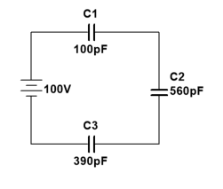

Figuur 8-43

1. Bepaal de totale vervangingscapaciteit van de schakeling in figuur 8-44.

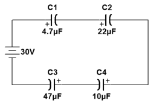

Figuur 8-44

1. De totale lading die opgeslagen is in de condensatoren bedraagt $$10 \mu C$$ . Bepaal de spanning over elke condensator in figuur 8-45.

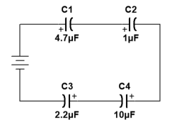

Figuur 8-45

## Parallelschakelen van condensatoren 

1. Bepaal de totale capaciteit van de parallelschakeling in figuur 8-46.

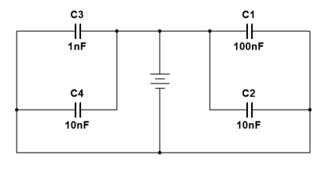

Figuur 8-46

1. Bepaal de totale capaciteitswaarde en de totale lading in de schakeling van figuur 8-47.

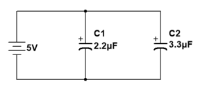

Figuur 8-47

## Het gedrag van condensatoren op gelijkstroom 

1. Bepaal de tijdsconstante van volgende $$RC$$ -combinaties:
2. $$R=100 \Omega , C=1 \mu F$$
3. $$R=10 M\Omega , C=56 pF$$
4. $$R=\mathrm{4,7} k\Omega , C=\mathrm{4,7} nF$$
5. $$R=\mathrm{1,5} M\Omega , C=10 nF$$
6. In de schakeling van figuur 8-48 is de condensator in de begintoestand volledig ontladen. Bepaal de spanningswaarde over de condensator op volgende tijdsmomenten nadat de schakelaar werd gesloten.
7. $$10 \mu s$$ \(b\) $$20 \mu s$$ \(c\) 3 $$0 \mu s$$ \(d\) $$40 \mu s$$ \(e\) $$50 \mu s$$

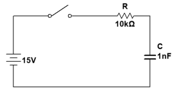

Figuur 8-48

1. In figuur 8-49 is de condensator reeds opgeladen tot $$25 V$$ . Bereken telkens de spanning over de condensator na de volgende tijden dat de schakelaar is gesloten.
2. $$\mathrm{0,5} ms$$ \(b\) $$1 ms$$ \(c\) $$2 ms$$

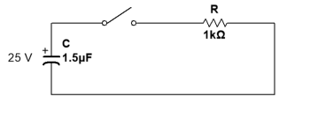

Figuur 8-49

## Het gedrag van een condensator op wisselstroom 

1. Bepaal de capacitieve reactantie van een $$47 nF$$ condensator voor volgende frequenties:
2. $$10 Hz$$ \(b\) $$250 Hz$$ \(c\) $$5 kHz$$ \(d\) $$100 kHz$$
3. Voor de schakeling in figuur 8-50: bepaal de reactantie van iedere condensator, de totale reactantie en de spanning over iedere condensator.

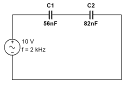

Figuur 8-50

1. Wanneer een spannningsbron met sinusoïdale spanning van $$20 {V}_{eff}$$ verbonden wordt met een bepaalde condensator vloeit er een effectieve stroom van $$100 mA$$ . Hoeveel bedraagt de reactantie?
2. Een $$10 kHz$$ spanning staat over een condensator met capaciteitswaarde gelijk aan $$\mathrm{4,7} nF$$ . Er wordt een stroom gemeten met effectieve waarde gelijk aan $$1 mA$$ . Bepaal het werkelijk en reactief vermogen.

## Oefeningen : Indeling van condensatoren 

1. Welk type van condensator heeft de hoogste diëlektrische constante mica of keramiek?
2. Bepaal de waarde van de keramische schijfcondensatoren die gelabeld zijn zoals in figuur 8-51.

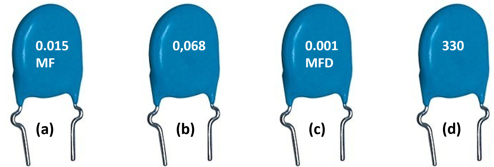

Figuur 8-51

## Geavanceerde oefeningen 

1. Hoe lang duurt het vooraleer de condensator in figuur 8-49 is ontladen tot $$3 V$$ ?
2. Bepaal de tijdsconstante in de schakeling van figuur 8-52.

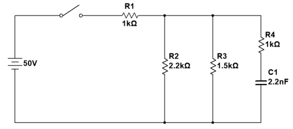

Figuur 8-52

1. De condensator in figuur 8-53 is ongeladen als de schakelaar in positie $$1$$ wordt geschakeld. De schakelaar blijft in positie $$1$$ gedurende 10 ms en wordt dan naar positie $$2$$ geschakeld. Daar blijft de schakelaar voor onbepaalde tijd staan.
2. Geef de volledige golfvorm weer voor de spanning over de condensator.
3. Als de schakelaar terug wordt geschakeld na $$5 ms$$ in positie $$2$$ te hebben gestaan en dan in positie 1 blijft staan, hoe ziet de spanningsvorm over de condensator er dan uit?

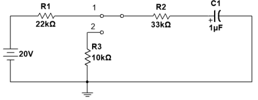

Figuur 8-83

