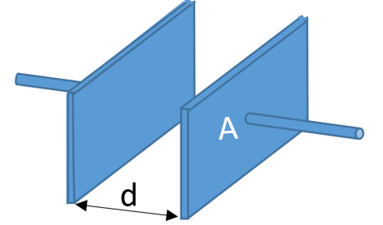
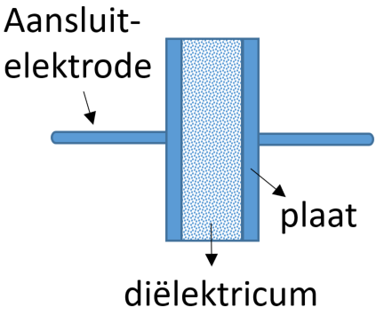
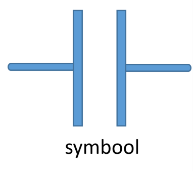
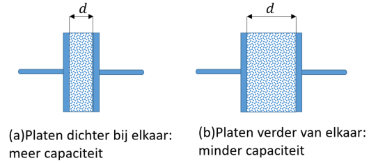
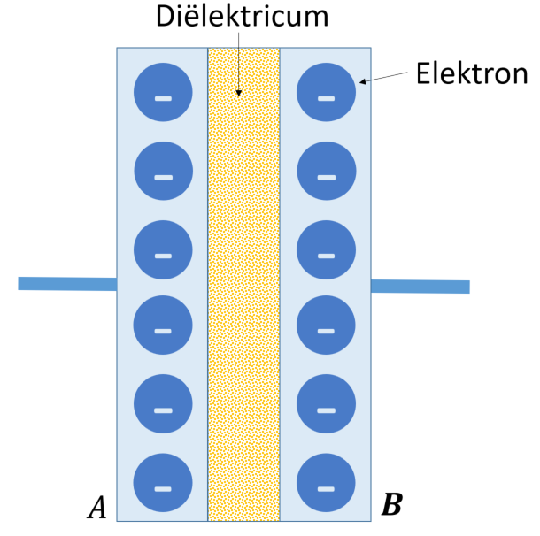
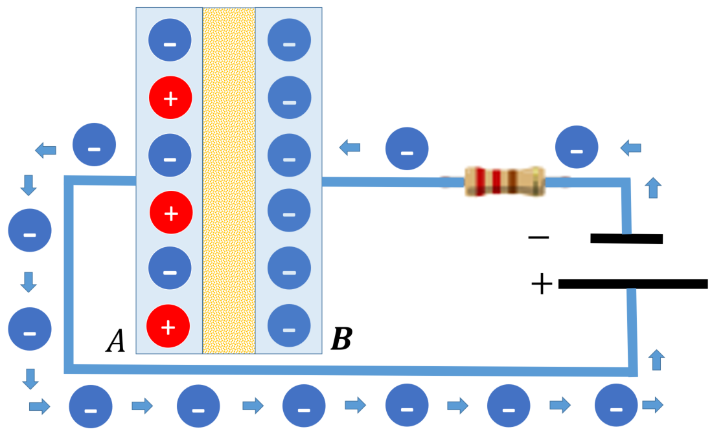
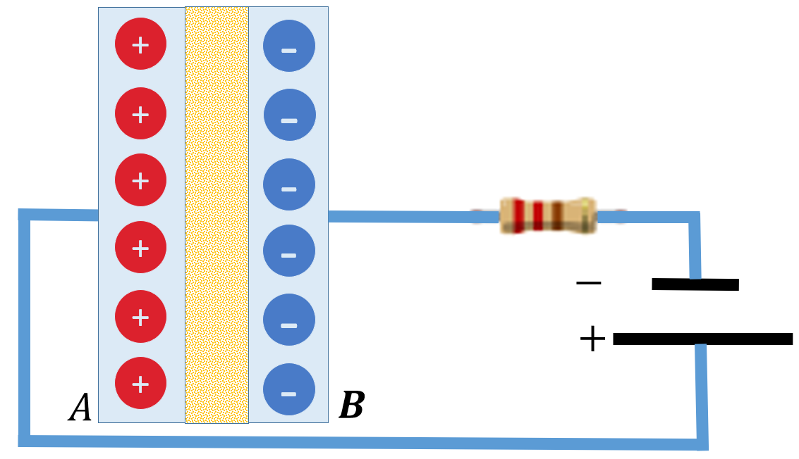
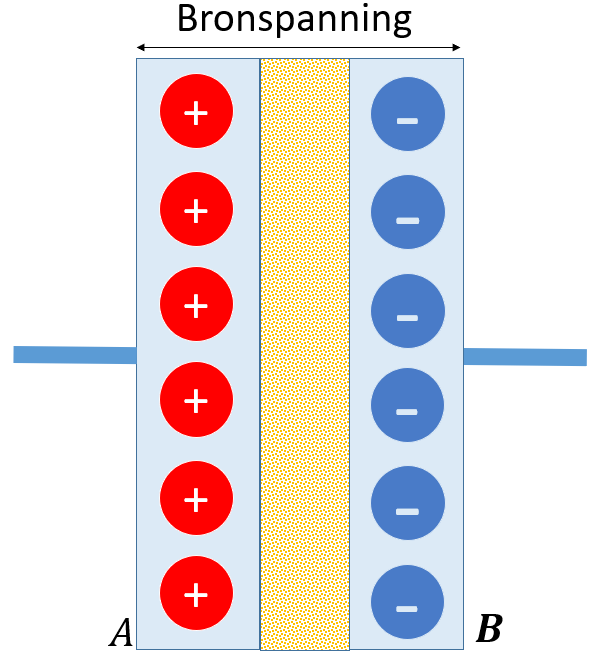
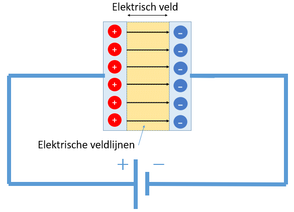
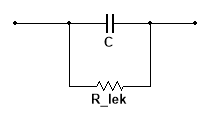

# Werkingsprincipe van een condensator

Een condensator is een passieve elektrische component dat elektrische lading kan opslaan en de eigenschap capaciteit bezit.

Wat is belangrijk?

* Je verklaart hoe een condensator zijn lading kan bewaren.
* Je verklaart hoe de fysische karakteristieken van een condensator de capaciteit beïnvloeden
* Je definieert capaciteit en je kan zijn eenheid opnoemen.
* Je verklaart hoe een condensator zijn energie kan bewaren.
* Je definieert temperatuurscoëfficiënt.
* Je verklaart waarom een condensator lading lekt.

## Algemene opbouw van een condensator 

Een condensator \(zie figuur 8-1\) is een elektrische component die bestaat uit twee parallelle geleidende platen die van elkaar gescheiden zijn door een isolerend materiaal dat diëlektricum wordt genoemd. Het algemeen symbool van een condensator is in figuur 8-1 \(c\) weergegeven.

|  |  |  |
| :--- | :--- | :--- |
| \(a\) | \(b\) | \(c\) |

Figuur 8-1 : algemene opbouw van een condensator

De plaatoppervlakte $$A$$ , de afstand $$d$$ tussen de platen en de diëlektrische constante zijn belangrijke parameters aangaande capaciteit en werkspanning van de condensator. Sluit men een spanning aan op de condensator dan zullen er ladingsdeeltjes op de platen ontstaan. Voor elke condensator geldt dat de lading op de platen recht evenredig is met de spanning tussen de platen. Deze evenrediheidsconstante wordt capaciteit van een condensator genoemd. Het verband tussen lading en spanning kan als volgt worden uitgedrukt:

$$Q=C\times U \left(8-1\right)$$

Hierbij is :

* $$Q$$ : de lading in Coulomb
* $$U$$ : de spanning over de platen van de condensator in Volt
* $$C$$ : de everendigheidsconstante aangeduid als de capaciteit in Farad \(

## Fysische eigenschappen van een condensator 

Plaatoppervlakte

Capaciteit is recht evenredig met de plaatoppervlakte. Een grotere plaat produceert meer capaciteit terwijl een kleinere plaat minder capaciteit vormt. Bewegen de platen ten opzichte van elkaar, dan bepaalt de overlapping van de plaatoppervlakte de effectieve plaatoppervlakte. In figuur 8-2 geeft weer dat verschuiving van een plaat van de condensator ten opzichte van de andere de effectieve plaatoppervlakte verkleind waardoor ook de capaciteit verkleind.

Figuur 8-2 : Capaciteit is recht evenredig met het nuttig plaatoppervlak $$A$$.

Afstand tussen de platen

De capaciteit is omgekeerd evenredig met de afstand tussen de twee platen. De plaatafstand wordt weergegeven door $$d$$ in figuur 8-3. Een grotere afstand tussen de platen levert een kleinere capaciteit op en een kortere afstand een grotere capaciteit.

Figuur 8-3: Capaciteit is omgekeerd evenredig met de afstand $$\mathit{d}$$ tussen twee platen

De doorslagspanning \(breakdown\) is de spanning waardoor er geleiding ontstaat in het diëlektricum. Als deze doorslagspanning bereikt wordt kan permanente schade aan de condensator het resultaat zijn. De doorslagspanning van een condensator is rechtstreeks evenredig met de afstand tussen de platen. Hoe verder de platen uit elkaar staan, hoe groter de doorslagspanning.

_**Diëlektrische constante**_ ****$$\mathit{\epsilon }$$

De isolatie tussen de platen wordt het diëlektricum genoemd. Elk diëlektrisch materiaal heeft de mogelijkheid om de elektrische krachtlijnen \(veldlijnen\) te concentreren tussen de tegengesteld geladen platen van de condensator. Hoe beter de krachtlijnen geconcentreerd worden tussen de twee platen, hoe groter de capaciteitswaarde wordt voor de energieopslag. De mate dat een bepaald materiaal het elektrisch veld kan doorlaten wordt diëlektrische constante of relatieve permittiviteit genoemd. De diëlektrische constante wordt gesymboliseerd door de Griekse letter epsilon \( $$\epsilon$$ \). De diëlektrische constante van vacuüm is gelijk aan en wordt gebruikt als referentiewaarde. Deze diëlektrische constante wordt voorgesteld door $${\epsilon }_{0}$$ . De diëlektrische constante van lucht benaderd deze van vacuüm. Met de relatieve diëlektrische constante $${\epsilon }_{r}$$ wordt aangegeven hoeveel maal deze groter is als deze van vacuüm. Vermits de diëlektrische constante van lucht deze van vacuüm heel goed benadert, is de relatieve diëlektrische constante $${\epsilon }_{r}$$ voor lucht gelijk aan $$1$$ . Alle andere materialen hebben waarden en bepalingen ten opzichte van vacuüm of lucht. Hun diëlektrische constante wordt aangeduid ten opzichte van vacuüm en gesymboliseerd door $${\epsilon }_{r}$$ . De formule voor de relatieve diëlektrische constante is de volgende:

$${\epsilon }_{r}=\frac{\epsilon }{ {\epsilon }_{0}} \left(8-2\right)$$

Bijvoorbeeld een materiaal met $${\epsilon }_{r}$$ gelijk aan vijf heeft een capaciteit die vijf keer groter is dan die van lucht of vacuüm. Tabel 8-1 geeft een aantal gebruikelijke diëlektrische materialen en hun typische relatieve diëlektrische constante $${\epsilon }_{r}$$ .

| Materiaal | **Typische** $${\mathit{\epsilon }}_{\mathit{r}}$$ **-waarde** |
| :--- | :--- |
| Lucht | 1 |
| Teflon | 2 |
| Papier | 2.5 |
| Olie | 4 |
| Mica | 5 |
| Porselein | 7 |
| Glas | 7.5 |
| Aluminiumoxide | 8 |
| Tantaaloxide | 26 |
| Keramiek | 1200 |

Tabel 8-1: Voorbeelden van $${\epsilon }_{r}-waarden$$

Formule voor capaciteit

Uit de fysische eigenschappen kan je afleiden dat de capaciteit van een condensator afhankelijk is van de gebruikte plaatoppervlakte, de afstand tussen de platen en het gebruikte materiaal als diëlektricum. Vermits de capaciteit recht evenredig is met de plaatoppervlakte $$A$$ en de diëlektrische constante $$\epsilon$$ van het gebruikte materiaal als diëlektricum, en omgekeerd evenredig is met de afstand $$d$$ tussen de platen wordt volgende formule bekomen om de capaciteit te bepalen:

$$C=\frac{A\times \epsilon }{d}$$

Vermits $$\epsilon$$ gelijk is aan het product $${\epsilon }_{r}\times {\epsilon }_{0}$$ wordt bekomen:

$$C=\frac{A\times {\epsilon }_{r}\times {\epsilon }_{0}\mathrm{ }\mathrm{ }}{d}$$

Aangezien $${\epsilon }_{0}$$ gelijk is aan $$8,85 \times {10}^{-12} \frac{F}{m}$$ is de uiteindelijke formule :

## Hoe slaat een condensator lading op? 

In de neutrale stand hebben beide platen van een condensator een gelijk aantal vrije elektronen. Dit is weergegeven in figuur 8-4 \(a\). Wanneer de condensator wordt aangesloten op een gelijkspanningsbron via een weerstand, zoals in figuur 8-2 \(b\) is weergegeven, worden elektronen uit plaat $$A$$ \(links\) weggetrokken en evenveel elektronen komen op plaat $$B$$ \(rechts\) terecht.

|  |  |
| :--- | :--- |
| Een ongeladen condensator heeft dezelfde lading op beide platen | b\) Verbonden met een spanningsbron: elektronen gaan stromen van plaat A naar plaat B en de condensator gaat opladen |
|  |  |
| Als condensator volledig opgeladen is tot de bronspanning vloeit er geen stroom meer | In het ideale geval behoudt een condensator zijn lading als hij is losgekoppeld van de spanningsbron |

Figuur 8-4: Principe van opslaan van lading door een condensator

Tijdens het laadproces stromen de elektronen alleen door verbindingskabels en de spanningsbron. Door het diëlektricum van de condensator stroomt er geen lading vermits dit een isolator is. De beweging van elektronen wordt beëindigd wanneer de spanning over de condensator gelijk is aan de voedingsspanning zoals in figuur 8-4 \(c\) wordt weergegeven. Als de condensator wordt losgekoppeld van de bron behoudt hij de opgeslagen lading gedurende een lange periode en staat er nog steeds spanning over de condensator zoals getoond wordt in figuur 8-4 \(d\). De tijd van het bijhouden van de opgeslagen lading is afhankelijk van het type condensator. Een opgeladen condensator kan tijdelijk fungeren als een batterij.

## Capaciteit 

De hoeveelheid lading dat een condensator kan opslaan per spanningseenheid over zijn platen wordt capaciteit genoemd en voorgesteld door $$C$$ . De capaciteit is een maateenheid voor condensatoren aangaande de mogelijkheid om lading te bewaren. Hoe meer lading per spanningseenheid een condensator kan opslaan, hoe groter zijn capaciteit. Wiskundig kan de capaciteit als volgt worden voorgesteld:

$$C=\frac{Q}{U}$$

Hierin stelt $$C$$ de capaciteit voor, $$Q$$ de hoeveelheid lading en $$U$$ de opgeladen spanning. De eenheid van capaciteit is Farad \( $$F$$ \). Eèn Farad is de hoeveelheid capaciteit wanneer één coulomb lading wordt bewaard op de platen van een condensator terwijl er één Volt over staat. De meeste condensatoren in elektronische schakelingen hebben capaciteitswaarden in de orde van microfarad \( $$\mu F$$ \) tot picofarad \( $$pF)$$ .

## Hoe kan een condensator energie opslaan? 

Een condensator slaat energie op in een elektrisch veld dat ontstaat door de tegengestelde ladingen opgeslagen op de twee platen. Het elektrisch veld wordt weergegeven door krachtlijnen tussen de positieve en negatieve ladingen en is geconcentreerd in het diëlektricum, zoals getoond in figuur 8-5. De platen van de condensator in figuur 8-5 hebben een bepaalde lading gekregen doordat zij verbonden zijn met de gelijkspanningsbron. De grootte van het elektrisch veld is direct gerelateerd aan de grootte van de condensator en het kwadraat van de spanning. Dit is weergeven in volgende vergelijking :

$$W=\frac{1}{2}\times C\times {U}^{2} \left(8-4\right)$$

Als de capaciteit $$C$$ in Farad wordt weergegeven en de spanning $$U$$ in Volt, dan wordt de energie $$W$$ in Joules uitgedrukt.

Figuur 8-5 : Het elektrisch veld slaat energie op in een condensator

## De werkspanning 

Elke condensator heeft een limiet op de hoeveelheid spanning hij aankan over de platen. De werkspanning specificeert de maximale gelijkspanning die kan worden toegepast zonder risico van beschadiging van de component. Deze maximale spanning wordt gewoonlijk de doorslagspanning of werkspanning genoemd. Als de opgegeven werkspanning overschreden wordt, kan permanente schade aan de condensator het resultaat zijn.

Vooraleer je een condensator in een schakeling gebruikt moet je rekening houden met zowel de capaciteit als de spanning. De keuze van de capaciteitswaarde is gebaseerd op bepaalde eisen die aan de schakeling worden gesteld. De werkspanning van de condensator moet steeds hoger zijn dan de maximale spanning die verwacht wordt in een bepaalde toepassing.

Diëlektrische sterkte

De doorslagspanning van een condensator wordt bepaald door de diëlektrische sterkte van het diëlektrisch materiaal. De diëlektrische sterkte wordt uitgedrukt in of in . In tabel 8-2 worden typische waarden voor diverse materialen weergegeven. De exacte waarden variëren afhankelijk van de specifieke samenstelling van het materiaal.

De diëlektrische sterkte van een condensator kan het best worden verklaard door een voorbeeld. Veronderstel dat een bepaalde condensator een plaatscheiding heeft van $$\mathrm{0,1} mm$$ en het diëlektrisch materiaal is mica. Volgens de tabel 8-2 heeft mica een diëlektrische sterkte van . Voor een dikte van het diëlektricum van $$\mathrm{0,1} mm$$ komt dit overeen met een doorslagspanning van $$\mathrm{5,910} kV.$$

| Materiaal | **Diëlektrische sterkte \(** \) |
| :--- | :--- |
| Lucht | 3,152 |
| Olie | 14,775 |
| Keramiek | 39,4 |
| Papier \(parafine\) | 47,28 |
| Mica | 59,1 |
| Teflon | 59,1 |
| Glas | 78,8 |

Tabel 8-2: de diëlektrische sterkte van bepaalde materiaalsoorten die gebruikt worden als diëlektricum bij condensatoren.

## Temperatuurscoëfficiënt 

De temperatuurscoëfficiënt geeft de mate aan van een verandering in capaciteitswaarde bij verandering van temperatuur. Een positieve temperatuurscoëfficiënt betekent dat de capaciteit toeneemt met een temperatuurstijging en een negatieve temperatuurscoëfficiënt betekent dat de capaciteit afneemt bij een temperatuurstijging. Temperatuurcoëfficiënten worden doorgaans gespecificeerd in parts per million \( $$ppm$$ \) per graad Celsius \( $$\frac{ppm}{°C}$$ \).

Stel bijvoorbeeld dat een $$1 \mu F$$ condensator een negatieve temperatuurscoëfficiënt heeft van $$150\frac{ppm}{°C}$$ . Hiervoor geldt dat voor elke graad Celsius temperatuurstijging de capaciteit afneemt met $$150 pF$$ \(er zijn een milioen picofarads in één microfarad\)

## Lekkage 

Geen isolatiemateriaal is perfect. Het diëlektricum van een condensator zal een kleine hoeveelheid stroom geleiden. Zo zal de lading op een condensator uiteindelijk weglekken. Sommige soorten condensatoren hebben een hogere lekkage dan andere condensatoren. Een equivalente schakeling van een niet ideale condensator wordt getoond in figuur 8-6. De parallelweerstand $${R}_{lek}$$ is de weerstand van het diëlektrisch materiaal waardoor de lekstroom vloeit. Deze weerstand is een extreem hoge weerstand van honderden $$k\Omega$$ of meer.

Figuur 8-6 : equivalent schema voor een niet-ideale condensator

## De condensator als sensor 

Capacitieve sensoren zijn gebruikelijk in systemen die hoeveelheden meten zoals druk, vochtigheid, vloeistofniveau en nog veel meer. Ook bewegingssensoren kunnen op het principe van capaciteit werken. Een capacitieve sensor is een variabele condensator die voldoet aan de fysische prikkel. Bij een druksensor vormt een geleidend flexibel diafragma één plaat van de condensator. De andere plaat is vast bevestigd. Druk zorgt ervoor dat het membraan beweegt waardoor de capaciteit verandert. De verandering in capaciteit kan worden gemeten door een externe schakeling. Bij een bewegingssensor is één plaat vastgemaakt aan een as. Hierdoor zal bij een bepaalde beweging de plaat verdraaien ten opzichte van de andere plaat waardoor de capaciteit verandert. Bij vloeistofsensoren verandert het diëlektricum als het vloeistofniveau de sensor bereikt.

## Test jezelf : Algemene opbouw van een condensator 

1. Definieer capaciteit.
2. **Hoeveel energie in Joule wordt opgeslagen door een** $$10\mathit{ }\mathit{n}\mathit{F}$$ **condensator als er** $$15\mathit{ }\mathit{V}$$ **over zijn platen staat?**
3. Als de plaatafstand van een condensator vergroot, stijgt dan de capaciteit of daalt deze?
4. Als het plaatoppervlak van een condensator wordt vergroot, stijgt dan de capaciteit of daalt deze?
5. **De platen van een keramische condensator staan** $$50\mathit{ }\mathit{\mu }\mathit{m}$$ **uit elkaar.** Wat is de typische doorslagspanning dan van deze condensator?

