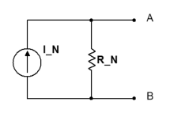
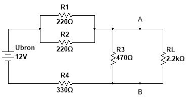

# Het Theorema van Norton

Naast het Thevenin equivalent schema, dat bestaat uit een serieschakeling van een spanningsbron en een weerstand, wordt ook gebruik gemaakt van een equivalent schema dat bestaat uit een parallelschakeling van een stroombron met een weerstand. Deze equivalente schakeling wordt het theorema van Norton genoemd.

Wat is belangrijk?

* Je tekent het Norton equivalent schema en benoemd de componenten ervan.
* Je bepaalt van een Norton equivalent schema van een schakeling gezien vanaf twee bepaalde punten.

Het theorema van Norton gebruikt een parallelweerstand en een stroombron als equivalent schema. Dit is weergegeven in figuur 6-39.

Figuur 6-39 : equivalent schema van Norton

De Norton equivalente weerstand wordt op dezelfde manier gevonden als de Thevenin equivalente weerstand. Je haalt de belasting $${R}_{L}$$ weg tussen de beschouwde punten, sluit de aanwezige spanningsbron\(nen\) kort en bepaalt de weerstandswaarde tussen de punten waarop de belasting $${R}_{L}$$ was aangesloten. Om de waarde van de equivalente Nortonstroom te vinden wordt de belastings- weerstand $${R}_{L}$$ vervangen door een kortsluiting. De kortsluitstroom is de equivalente Nortonstroom.

Figuur 6-40: Procedure voor het bepalen van het Norton equivalent van een schakeling

In figuur 6-40 is weergegeven hoe een Norton equivalent bepaald kan worden tussen twee punten $$A$$ en $$B$$ . Om de Nortonstroom te vinden verwijder je de belasting $${R}_{L}$$ \(zie figuur 6-40 \(b\)\) en sluit je de punten $$A$$ en $$B$$ kort. De stroom die door de kortsluiting vloeit, is eveneens de stroom die door de weerstand $${R}_{3}$$ vloeit. Deze stroom kan je vinden door de totale weerstand $$R\_\left(R2\mathrm{”}\right|\left|” R3\right)$$ van de parallelschakeling bestaande uit $${R}_{2}$$ en $${R}_{3}$$ te berekenen. Vervolgens vind je de spanning over $${R}_{3}$$ via de spanningsdelerformule. In formulevorm:

$${R}_{R2\text{||}R3}=\frac{ {R}_{2}\times {R}_{3}}{ {R}_{2}+{R}_{3}}$$

$${U}_{R3}={U}_{ {R}_{R2\text{||}R3}}=\frac{ {R}_{R2\text{||}R3}}{ {R}_{1}+ {R}_{R2\text{||}R3}}\times {U}_{bron}$$

$${I}_{N}={I}_{R3}=\frac{ {U}_{R3}}{ {R}_{3}}$$

Zoals reeds vermeld worde de Norton equivalent weerstand $${R}_{N}$$ op dezelfde manier bepaald als de Thevenin equivalent weerstand $${R}_{TH}$$ . In figuur 6-40 \(c\) is weergegeven hoe je deze weerstand bepaald. Je verwijdert $${R}_{L}$$ en sluit de spanningsbron $${U}_{bron}$$ kort. Vervolgens bepaal je de totale weerstand tussen de punten $$A$$ en $$B$$ . In formulevorm vind je de Norton equivalent weerstand $${R}_{N}$$ dan als volgt:

$${R}_{N}={R}_{AB}={R}_{3}+\left({R}_{1}\text{||}{R}_{2}\right)$$

Figuur 6-41 toont het uiteindelijke Norton equivalent schema van de schakeling van figuur 6-40 \(a\).

Figuur 6-41: \(b\) is het Norton equivalent schema van de schakeling in \(a\)

## Test jezelf : Het theorema van Norton 

1. Welke zijn de twee componenten van een Norton equivalent schema?
2. **Definieer** $${\mathit{R}}_{\mathit{N}}$$ **.**
3. **Definieer** $${\mathit{I}}_{\mathit{N}}$$ **.**
4. **Teken een algemeen schema van een Norton equivalent.**
5. **Bepaal het Norton equivalent schema van de schakeling van figuur 6-44**

Figuur 6-44

