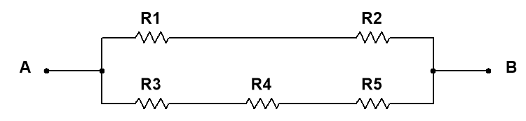

# Multiple choice test

1. Welk van onderstaande beweringen komt overeen met de schakeling in figuur 6-50?

Figuur 6-50

1. $${R}_{1}$$ en $${R}_{2}$$ staan in serie met $${R}_{3}$$ , $${R}_{4}$$ en $${R}_{5}$$ .
2. $${R}_{1}$$ en $${R}_{2}$$ staan in serie.
3. $${R}_{3}$$ , $${R}_{4}$$ en $${R}_{5}$$ staan in parallel.
4. $${R}_{1}$$ en $${R}_{2}$$ staan in serie en deze combinatie staat in parallel met de serieschakeling bestaande uit $${R}_{3}$$ , $${R}_{4}$$ en $${R}_{5}$$ .
5. De antwoorden \(b\) en \(d\)
6. De totale weerstand van figuur 6-50 kan gevonden worden met volgende formule:
7. $${R}_{1}+{R}_{2}+{R}_{3}\text{||}{R}_{4}\text{||}{R}_{5}$$
8. $$\left({R}_{1}+{R}_{2}\right)\text{ ||}$$ \( $${R}_{3}“+” {R}_{4}“+” {R}_{5}$$ \)
9. $${R}_{1}\text{||}{R}_{2}+ {R}_{3}\text{||}{R}_{4}\text{||}{R}_{5}$$
10. $$\left({R}_{1}\text{||}{R}_{2}\right)\text{+}$$ \( $$R\_3\mathrm{ }“\left|\right|” R\_4\mathrm{ }“\left|\right|” {R}_{5}$$ \)
11. Stel dat alle weerstanden van figuur 6-50 over dezelfde weerstandswaarde beschikken. Als er dan een bepaalde spanning tussen de punten $$A$$ en $$B$$ wordt aangelegd dan is de stroom:
12. Het grootst in $${R}_{3}.$$
13. Het grootst in $${R}_{3}“, ” {R}_{4}“ “$$ en $${R}_{5}$$ .
14. Het grootst in $${R}_{1}$$ en $${R}_{2}$$.
15. Even groot in alle weerstanden.
16. Twee weerstanden van $$1 k\Omega$$ staan in serie en deze seriecombinatie staat in parallel met een weerstand van $$\mathrm{2,2} k\Omega .$$De spanning over één van de twee $$1 k\Omega$$-weerstanden wordt gemeten en bedraagt $$6 V$$. De spanning over de $$\mathrm{2,2} k\Omega$$ weerstand bedraagt dan:
17. $$6 V$$
18. $$3 V$$
19. $$12 V$$
20. 13,2 V
21. De parallelcombinatie van een weerstand van $$330 \Omega$$ met een weerstand van $$470 \Omega$$ staat in serie met de parallelcombinatie van vier weerstanden van $$1 k\Omega$$. Een spanningsbron met spanning $$10 V$$ wordt aangesloten over deze schakeling. De weerstand waardoor de grootste stroom gaat heeft een waarde van :
22. $$1 k\Omega$$
23. $$330 \Omega$$
24. $$470 \Omega$$
25. De parallelcombinatie van een weerstand van $$330 \Omega$$ met een weerstand van $$470 \Omega$$ staat in serie met de parallelcombinatie van vier weerstanden van $$1 k\Omega$$. Een spanningsbron met spanning $$10 V$$ wordt aangesloten over deze schakeling. De weerstand waarover de grootste spanning staat heeft een waarde van :
26. $$1 k\Omega$$
27. $$330 \Omega$$
28. $$470 \Omega$$
29. De parallelcombinatie van een weerstand van $$330 \Omega$$ met een weerstand van $$470 \Omega$$ staat in serie met de parallelcombinatie van vier weerstanden van $$1 k\Omega$$. Een spanningsbron met spanning $$10 V$$ wordt aangesloten over deze schakeling. Het percentage van de totale stroom door ieder van de $$1 k\Omega$$ weerstanden is gelijk aan:
30. $$100 \%$$
31. $$50 \%$$
32. $$25 \%$$
33. $$\mathrm{31,25} \%$$
34. De uitgangsspanning van een spanningsdeler is gelijk aan $$9 V$$. Wanneer een belasting aan de spanningsdeler wordt aangelegd dan zal de uitgangsspanning:
35. Stijgen
36. Dalen
37. Hetzelfde blijven
38. Daalt naar $$0 V$$
39. Een spanningsdeler bestaat uit twee weerstanden van $$10 k\Omega$$ in serie. Welk van volgende belastingsweerstanden zal het meeste invloed hebben op de uitgangsspanning?
40. $$1 M\Omega$$
41. $$100 k\Omega$$
42. 10 $$k\Omega$$
43. 1 $$k\Omega$$
44. Als een belastingsweerstand wordt aangelegd aan een spanningsdeler dan zal de stroom vanuit de spanningsbron:
45. Dalen
46. Stijgen
47. Hetzelfde blijven
48. Herleid worden naar $$0 A$$
49. De uitgangsspanning van een gebalanceerde Wheatstonebrug is:
50. Gelijk aan de bronspanning
51. Gelijk aan $$0 V$$
52. Afhankelijk van de weerstandswaarden in de brug
53. Afhankelijk van de waarde van de onbekende weerstand
54. De methode voor het analyseren van een elektrische schakeling met twee of meer spanningsbronnen is gewoonlijk:
55. Theorema van Thevenin
56. Theorema van Norton
57. Superpositie
58. De wetten van Kirchhoff
59. In een schakeling zijn twee spanningsbronnen aanwezig. Als de eerste spanningsbron aan staat en de tweede uit, vloeit er een stroom van $$10 mA$$ door een bepaalde tak van de schakeling. Schakelt men deze spanningsbron uit en de andere in dan vloeit er $$8 mA$$ door dezelfde tak maar in de tegenovergestelde richting. Als beide spanningsbronnen worden aangeschakeld, dan is de totale stroom door deze tak gelijk aan:
60. $$10 mA$$
61. $$8 mA$$
62. $$18 mA$$
63. $$2 mA$$
64. Een Thevenin equivalente schakeling bestaat uit:
65. Een spanningsbron in serie met een weerstand
66. Een spanningsbron in parallel met een weerstand
67. Een stroombron in serie met een weerstand
68. Een stroombron in parallel met een weerstand
69. Een spanningsbron met een interne bronweerstand van $$600 \Omega$$ brengt maximaal vermogen over naar een belasting met weerstandswaarde van :
70. 300 Ω
71. 50 Ω
72. 1200 Ω
73. 600 Ω
74. Je meet de spanning op een bepaald punt in een schakeling dat zeer hoge weerstandswaarde heeft. De gemeten spanning blijkt iets lager dan de spanningswaarde die het normaal zou moeten zijn. Dit is mogelijk omdat:
75. Een of meerdere weerstanden stuk zijn
76. De voltmeter een bepaald belastingseffect heeft op de schakeling
77. De bronspanning te laag is.
78. Alle bovenstaande antwoorden juist zijn.

