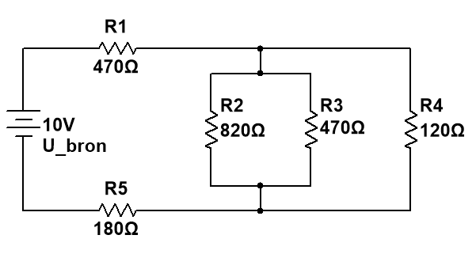
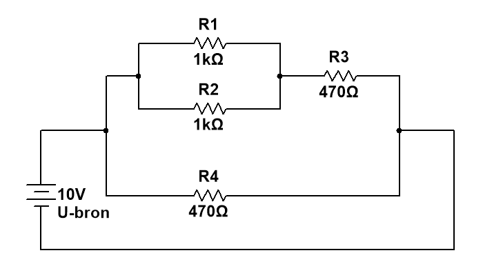
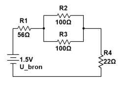
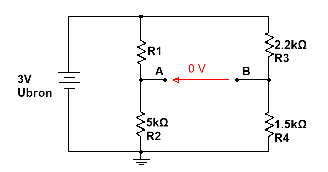
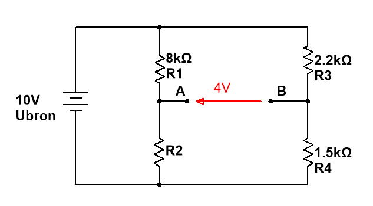
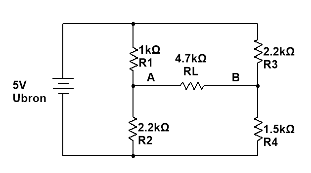
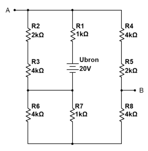
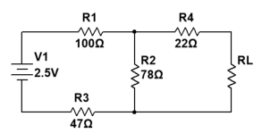
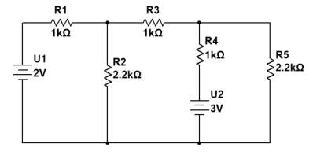

# Oefeningen

## Identificeren van serie-parallel relaties 

1. Identificeer de serie- en parallelrelaties gezien vanaf de aansluitklemmen van de spanningsbron in figuur 6-57.

Figuur 6-57

1. Visualiseer en teken de volgende combinatie van serie- en parallelschakelingen: een serieschakeling bestaande uit een parallelcombinatie van twee takken die elk twee weerstanden in serie bevatten, en een parallelcombinatie van twee takken die elk één weerstand bevatten.

## Analyse van gemengde schakelingen 

1. Een bepaalde schakeling bestaat uit twee weerstanden in parallel. Een van deze weerstanden heeft een weerstandswaarde van $$1 k\Omega$$ . Als de totale weerstand van de parallelschakeling gelijk is aan $$667 \Omega$$ , bepaal dan de weerstandswaarde van de andere weerstand.
2. Bepaal de totale weerstand van de schakeling in figuur 6-58.

Figuur 6-58

1. Bepaal de stroom door iedere weerstand van figuur 6-59. Bepaal ook de spanningsval over iedere weerstand van deze schakeling.

Figuur 6-59

## Spanningsdelers met resistieve belasting 

1. Een spanningsdeler bestaat uit een serieschakeling van twee weerstanden van $$56 k\Omega$$ . Bepaal de onbelaste uitgangsspanning over één van de $$56 k\Omega$$ weerstanden. Welke uitgangsspanning wordt er bekomen als over deze $$56 k\Omega$$ -weerstand een belastingsweerstand van $$1 M\Omega$$ wordt aangesloten?
2. Een $$12 V$$ batterij wordt gebruikt als bron voor een spanningsdeler. De spanningsdeler bestaat uit een serieschakeling van drie $$\mathrm{3,3} k\Omega$$ weerstanden. Deze weerstanden worden gebruikt om twee uitgangen te creëren waarbij steeds één uitgang belast wordt met $$10 k\Omega$$ . De eerste uitgang wordt afgetakt over de onderste weerstand en de twee uitgang over de twee onderste weerstanden van de schakeling. Bepaal de uitgangsspanning in beide gevallen.
3. Over welke van de onderstaande weerstanden zal een voltmeter met inwendige weerstand gelijk aan $$10 M\Omega$$ zich voordoen als minimale belasting op de schakeling?
4. $$100 k\Omega$$
5. $$\mathrm{1,2} M\Omega$$
6. $$22 k\Omega$$
7. 8,2 M Ω

## De brug van Wheatstone 

1. Een onbekende weerstand is aangesloten op een Wheatstonebrug. De brug wordt aangesloten op een spanningsbron met $$10 V$$ spanning. De brug is opgebouwd uit twee spanningsdelers aan de linkerzijde de onbekende weerstand \(bovenaan\) in serie met een regelweerstand die op $$18 k\Omega$$ is afgeregeld. Aan de rechterzijde een weerstand van

$$200 \Omega$$ bovenaan en een weerstand van $$10 k\Omega$$ onderaan. Bepaal de onbekende weerstandswaarde.

1. Bepaal de onbekende weerstand $${R}_{x}$$ in de Wheatstonebrug van figuur 6-60.

|  |  |  |
| :--- | :--- | :--- |
| Figuur 6-60 | Figuur 6-61 |  |

1. In de ongebalanceerde brug van figuur 6-61 wordt een spanning van $$+4 V$$ gemeten voor de spanning $${U}_{AB}$$ . Bepaal de onbekende weerstandswaarde in de brug.

## Theorema van Thevenin 

1. Bepaal de spanning en stroom door $${R}_{L}$$ in de schakeling van figuur 6-62.
2. Bepaal $${U}_{TH}$$ en $${R}_{TH}$$ tussen de punten $$A$$ en $$B$$ van de schakeling in figuur 6-63.

|  |  |
| :--- | :--- |
| Figuur 6-62 | Figuur 6-63 |

## Het maximaal vermogenoverdrachttheorema 

1. Een bepaald Thevenin equivalent schema heeft een $${U}_{TH}=\mathrm{5,5} V$$ en een $${R}_{TH}=75\Omega .$$ Welke belasting $${R}_{L}$$ moet hierop aangesloten worden om maximaal vermogenoverdracht te bekomen?
2. Bepaal de weerstandswaarde van $${R}_{L}$$ in de schakeling van figuur 6-64 opdat maximaal vermogenoverdracht wordt bekomen.

Fig. 6-64

## Het theorema van Norton 

1. Vervang de schakeling in figuur 6.64 door zijn Norton equivalent schema, gezien vanaf $${R}_{L}$$ .

## Superpositietheorema 

1. Bereken de stroom door weerstand $${R}_{5}$$ via superpositie in de schakeling van figuur 6-65.

Fig. 6-65

