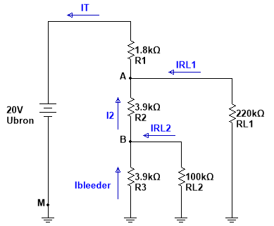
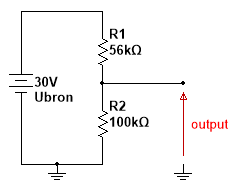

# Spanningsdelers met resistieve belasting

In hoofdstuk 4 is het begrip spanningsdeler besproken. Tot nu toe hebben we een spanningsdeler steeds onbelast beschouwd. Hier bekijken we wat het effect is als een spanningsdeler resistief wordt belast.

Wat is belangrijk?

* Je bepaalt het effect van een resistieve belasting op een spanningsdelerschakeling.
* Je berekent de “bleeder”-stroom in een spanningsdeler.
* Je verklaart waarom een voltmeter het circuit kan belasten

Figuur 6-14: invloed van een belasting \($${R}_{L}$$\) op een spanningsdeler

In figuur 6-14 is een spanningsdeler weergegeven. Deze bestaat uit de weerstanden $${R}_{1}$$ en $${R}_{2}$$ . De verlaagde spanning als gevolg van de spanningsdeling wordt over de weerstand $${R}_{2}$$ afgetakt. Als beide weerstanden gelijk zijn, zoals in figuur 6-14 \(a\) is te zien, verdeelt de spanning zich in twee gelijke delen over de weerstanden $${R}_{1}$$ en $${R}_{2}$$ . De uitgangsspanning $${U}_{out}$$ , gelijk aan de spanning over $${R}_{2}$$ , is als volgt te bepalen:

$${U}_{out}={U}_{R2}=\frac{ {R}_{2}}{ {R}_{1}+{R}_{2}} \times {U}_{bron}=\frac{10 k\Omega }{10 k\Omega +10 k\Omega } \times 10 V=5 V$$

Deze $${U}_{R2}$$ is in ons voorbeeld eveneens de uitgangsspanning.

Wat gebeurt er als we deze spanningsdeler zouden belasten met een weerstand? Stel dat we de spanningsdeler zouden gebruiken om een spanning van $$5 V$$ te plaatsen over een weerstand van $$1 k\Omega$$ . Deze weerstand van $$1 k\Omega$$ vormt een belasting \(loading\) op de spanningsdeler. Dit is weergegeven in figuur 6-14 \(b\). Vermits de $$1 k\Omega$$ -weerstand de spannnigsdelerschakeling gaat belasten noemen we deze weerstand $${R}_{Load}$$ of simpelweg $${R}_{L}$$ . Door het feit dat we $${R}_{L}$$ parallel plaatsen op $${R}_{2}$$ wordt de totale weerstandswaarde op die positie kleiner dan de kleinste weerstandswaarde van de gevormde parallelschakeling. Dit betekent dat de weerstandswaarde verlaagt tot volgende waarde;

$${R}_{R2\text{||}RL}=\frac{ {R}_{2}\times {R}_{L}}{ {R}_{2}+{R}_{L}}=\frac{10 k\Omega \times 1 k\Omega }{10 k\Omega +1 k\Omega }=909 \Omega$$

Het gevolg hiervan is dat de spanningsdeler nu wordt gevormd door $${R}_{1}$$ in serie met $$R\_\left(R1\mathrm{”}\right|\left|” RL\right)$$ . Deze weerstanden zijn nu niet meer gelijk waardoor de uitgangsspanning verschillend van $$5 V$$ zal worden. De uitgangsspanning in deze situatie kan als volgt worden bepaald:

$${U}_{out}=\frac{ {R}_{R2\text{||}RL}}{ {R}_{1}+{R}_{R2\text{||}RL}} \times {U}_{bron}=\frac{909 \Omega }{10 k\Omega +909 \Omega } \times 10 V=0,833 V$$

De uitgangsspanning is door het plaatsen van de belastingsweerstand $${R}_{L}$$ van $$1 k\Omega$$ gedaald van $$5 V$$ naar 0,833 V. Een bijkomend effect van deze weerstand $${R}_{L}$$ is dat er meer stroom uit de spanningsbron wordt getrokken omdat de totale weerstand is verlaagd ten gevolge van de parallelschakeling van $${R}_{2}$$ met $${R}_{L}$$ .

Wat gebeurt er als we de spanningsdeler zouden belasten met een weerstandswaarde van $$100 k\Omega$$ ? Deze situatie doet zich voor in figuur 6-14 \(c\). Vermits $${R}_{L}$$ in deze situatie veel groter is dan $${R}_{2}$$ zal de vervangingsweerstand $$R\_\left(R1\mathrm{”}\right|\left|” RL\right)$$ iets kleiner zijn dan $${R}_{2}$$ . De vervangingsweerstand is in dit geval gelijk aan :

$${R}_{R2\text{||}RL}=\frac{ {R}_{2}\times {R}_{L}}{ {R}_{2}+{R}_{L}}=\frac{10 k\Omega \times 100 k\Omega }{10 k\Omega +100 k\Omega }=\mathrm{9,09} k\Omega$$

De uitgangsspanning in deze situatie is gelijk aan:

$${U}_{out}=\frac{ {R}_{R1\text{||}RL}}{ {R}_{1}+{R}_{R2\text{||}RL}} \times {U}_{bron}=\frac{\mathrm{9,09} \Omega }{10 k\Omega +\mathrm{9,09} \Omega } \times 10 V=\mathrm{4,762} V$$

Je kan hieruit besluiten dat als $${R}_{L}$$ veel groter is dan $${R}_{2}$$ er een klein effect optreedt. De uitgangsspanning daalt lichtjes en in veel situaties is de spanningsdelerschakeling dan bruikbaar om een bepaalde lagere spanningswaarde te bekomen. Als de belastingsweerstand minstens tien groter is dan de weerstanden die gebruikt worden in de spanningsdeler bekomt men een stabiele schakeling. Ook nu zal er meer stroom vloeien door het plaatsen van de belastingsweerstand, doch minder dan in de situatie wanneer $${R}_{L}$$ kleiner is dan $${R}_{2}$$ .

## Belastingseffect van een voltmeter 

Van zodra je in een schakeling spanning meet met een voltmeter verschijnt zijn inwendige weerstand parallel op de weerstand waarover spanning wordt gemeten. Als de inwendige weerstand van de voltmeter heel wat groter is dan de weerstand waarover de spanning wordt gemeten, beïnvloedt de voltmeter de schakeling maar weinig en is de afwijking van meting klein. Is echter de inwendige weerstand van de voltmeter gelijk aan de weerstand in de schakeling waarover de spanning wordt gemeten, dan ontstaat er een grote afwijking van de gemeten spanningswaarde ten opzichte van de werkelijke spanningswaarde. Een typische digitale voltmeter in draagbare multimeters heeft een inwendige weerstand van $$10 M\Omega$$ . Een typische analoge voltmeter heeft een inwendige weerstand die afhankelijk is van het schaalbereik. Deze is bedraagt meestal zo’n $$20000\frac{\Omega }{V}$$ . Dit levert een inwendige weerstand van $$20000 \Omega$$ op de $$1 V$$ -schaal en $$2000000 \Omega$$ op de $$10 V$$ -schaal.

Figuur 6-16 geeft je een idee wat de invloed is van een typische digitale voltmeter op een aantal spanningsmetingen. In de figuur zijn drie schakelingen te zien met telkens twee dezelfde weerstanden. In de figuur 6-16 \(a\) zijn de weerstanden gelijk aan $$1 k\Omega$$ . In figuur 6-16 \(b\) zijn de weerstanden $$100 k\Omega$$ en in figuur 6-16 \(c\) $$10 M\Omega$$ . Telkens wordt de spanning over de onderste weerstand gemeten met een voltmeter met inwendige weerstand $$10 M\Omega$$ . \( $$DC 10 MOhm$$ bij de voltmeters in figuur 6-16 slaat op een inwendige weerstand op DC van $$10 M\Omega$$ \). Door het feit dat de inwendige weerstand telkens een parallelschakeling vormt met $${R}_{2}$$ is het niet moeilijk om in te zien dat hoe groter $${R}_{2}$$ is, hoe groter de afwijking wordt in het meetresultaat \(zie hiervoor de spanningsdeler met resistieve belasting\).

Figuur 6-16 : hoe hoger de weerstand waarover spanning wordt gemeten, hoe onnauwkeuriger het meetresultaat

In figuur 6-17 is weergegeven wat het effect is van de inwendige weerstand van de voltmeter op het meetresultaat. Telkens is bij een schakeling met twee gelijke weerstanden een voltmeter aangelegd met verschillende inwendige weerstanden.

Figuur 6-17: hoe lager de inwendige weerstand van de voltmeter, hoe onnauwkeuriger het meetresultaat

In de meetresultaten van de voltmeters in figuur 6-17 is duidelijk te zien dat hoe kleiner de inwendige weerstand van de voltmeter is, hoe onnauwkeuriger het meetresultaat is. Immers hoe lager de inwendige weerstand van de voltmeter is, hoe meer de vervangingsweerstand van de parallelschakeling $${R}_{2} \text{||} {R}_{Vmeter}$$ gaat afwijken van $${R}_{2}$$ waardoor er minder spanning gemeten wordt.

Hieruit kan je besluiten dat als je gelijkspanning moet meten je best gebruik maakt van een digitale multimeter met een zo groot mogelijke inwendige weerstand voor spanningsmeting.

Voorbeeld 6-8 geeft weer hoe je de invloed van de voltmeter op de spanningsmeting kan berekenen.

## Belastingstroom en bleederstroom 

Wanneer je te maken hebt met een spanningsdeler met meerdere aftakkingen bestaat de totale stroom die dan vloeit uit twee soorten stromen. Het eerste soort stroom wordt belastingsstroom genoemd en is de stroom die door een bepaalde aangesloten belasting vloeit. De andere soort stroom is de bleederstroom. De bleederstroom is de stroom die overblijft nadat alle belastingsstromen van de verschillende aftakkingen zijn afgetrokken van de totale stroom. In formulevorm:

$${I}_{bleeder}={I}_{T}-{I}_{RL1}-{I}_{RL2}-\dots -{I}_{RLn}$$

In figuur 6-19 is een voorbeeld weergegeven van een spanningsdeler waarbij twee aftakkingen zijn voorzien. De eerste aftakking is aanwezig in het punt $$A$$ en hierop is de belasting $${R}_{L1}$$ op aangesloten. Het tweede aftakpunt is aanwezig in het punt $$B$$ waaraan de belasting $${R}_{L2}$$ is aangesloten. Door de belastingen vloeien de belastingsstromen $${I}_{RL1}$$ respectievelijk $${I}_{RL2}$$ . De bleederstroom is de stroom die door de weerstand $${R}_{3}$$ vloeit. In formulevorm:

$${\mathit{I}}_{\mathit{b}\mathit{l}\mathit{e}\mathit{e}\mathit{d}\mathit{e}\mathit{r}}={\mathit{I}}_{\mathit{T}}-{\mathit{I}}_{\mathit{R}\mathit{L}1}-{\mathit{I}}_{\mathit{R}\mathit{L}2}\mathit{ }\mathit{ }\mathit{ }\mathit{ }\mathit{ }\mathit{ }\mathit{ }\mathit{ }\mathit{ }\mathit{ }\left(6-1\right)$$

Figuur 6-19 : de stromen in een spanningsdeler met twee aftakkingen

## Test jezelf : spanningsdelers met resistieve belasting 

1. Een belastingsweerstand is verbonden met de uitgang van een spanningsdeler. Welk effect heeft de belastingsweerstand op de uitgangsspanning?
2. Een grotere waarde voor de belastingsweerstand zorgt ervoor dat de uitgangsspanning van een spanningsdeler minder verandert dan de oorspronkelijke waarde \(ja of neen?\)
3. Verklaar waarom een voltmeter een schakeling kan belasten.
4. **Stel je wil met een voltmeter met** $$10\mathit{ }\mathit{M}\mathit{\Omega }$$ **inwendige weerstand de spanning meten over een weerstand met waarde** $$\mathrm{3,3}\mathit{ }\mathit{M}\mathit{\Omega }.$$ Moet je bezorgt zijn over de correctheid van de meetwaarde?
5. **Bereken voor de spanningsdeler van figuur 6-21 de onbelaste uitgangsspanning.** Bereken eveneens de uitgangsspanning als er een weerstand van $$10\mathit{ }\mathit{M}\mathit{\Omega }$$ **verbonden is tussen de uitgang en de massa.**

Figuur 6-21

