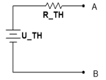
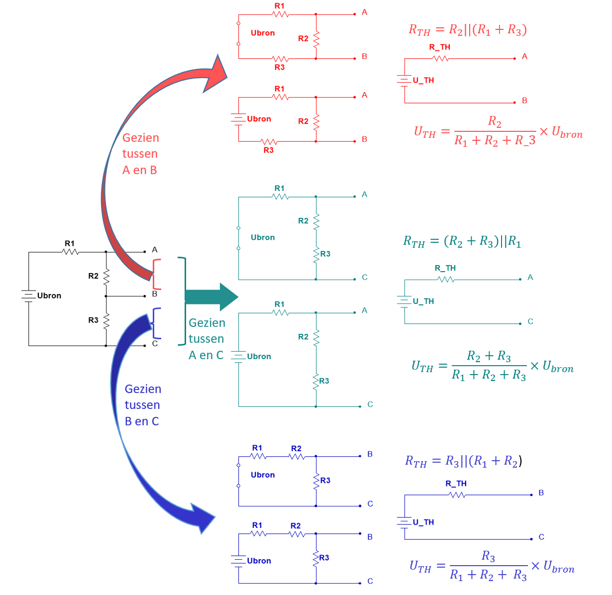
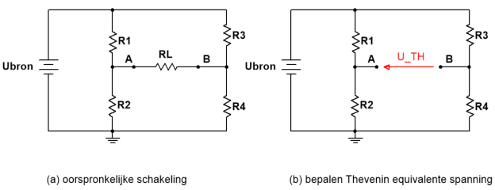

# Theorema van Thevenin

Het theorema van Thevenin of de stelling van Thevenin levert een methode om een schakeling te vereenvoudigen. In veel gevallen kan deze stelling gebruikt worden om de analyse van gemengde schakelingen te vereenvoudigen.

Wat is belangrijk?

* Je past het theorema van Thevenin toe op een schakeling.
* Je beschrijft de vorm van een Thevenin equivalente schakeling.
* Je bepaalt de spanningswaarde van de Thevenin equivalente spanningsbron.
* Je bepaalt de weerstandswaarde van de Thevenin equivalente weerstand.
* Je past het theorema van Thevenin toe op een gedeelte van een schakeling.

Het Thevenin-equivalent van een twee-terminal resistieve schakeling bestaat uit een equivalente spanningsbron $${U}_{TH}$$ en een equivalente weerstand $${R}_{TH}$$ . De waarden van $${U}_{TH}$$ en $${R}_{TH}$$ zijn afhankelijk van de waarde van componenten in de oorspronkelijke schakeling. Men kan bijgevolg een twee terminal schakeling vereenvoudigen via Thevenin ongeacht zijn complexiteit.

De Thevenin equivalente spanning $${U}_{TH}$$ is gelijk aan de open circuit \(geen belasting\) spanning tussen de gespecificeerde terminals van een schakeling. De Thevenin equivalente weerstand $${R}_{TH}$$ is gelijk aan de totale weerstand die zich voordoet tussen deze twee gespecificeerde terminals van een schakeling. Figuur 6-28 geeft een voorbeeld van de opbouw van een Thevenin equivalente schakeling.

Figuur 6-28 : Voorstelling van de algemene vorm van een Thevenin equivalent.

Een Thevenin equivalent is niet hetzelfde als de originele schakeling maar het gedraagt zich in termen van stroom en spanning exact hetzelfde als de schakeling die hiermee vervangen wordt. Bij éénzelfde belasting door beide schakelingen worden dezelfde stroom- en spanningswaarden gemeten. Deze conditie wordt soms ook benoemd als terminal equivalentie.

Hoe kan je het Thevenin equivalent bepalen? Stel de schakeling van figuur 6-29 \(a\). Het is de bedoeling dat de schakeling die zich links bevindt van de punten $$\[ A\]$$ en $$\[ B\]$$ te vervangen door zijn Thevenin equivalent.

Figuur 6-29: Procedure voor het bepalen van het Thevenin equivalent van een schakeling

Figuur 6-29 \(b\) geeft weer hoe je de Thevenin equivalente spanning kan bepalen tussen de punten $$A$$ en $$B$$ . Eerst wordt de belasting $${R}_{L}$$ verwijderd \(indien aanwezig\) zodat de terminals open zijn. De Thevenin equivalente spanning kan je nu vinden door de spanning te berekenen die tussen de vermelde punten staat. Daar $${R}_{L}$$ werd verwijderd is de stroomkring voor $${R}_{3}$$ onderbroken. Dit heeft als gevolg dat er nu geen stroom door deze weerstand kan vloeien waardoor er ook geen spanningsval over $${R}_{3}$$ kan staan \( $$U\_R3=0 V )$$ De spanning die je normaal zou meten tussen de punten $$A$$ en $$B$$ in dit voorbeeld is gelijk aan de som van de spanningsval $${U}_{R2}$$ over de weerstand $${R}_{2}$$ met de spanningsval $${U}_{R3}$$ over de weerstand $${R}_{3}$$ . Daar, zoals reeds vermeld, $${U}_{R3}$$ gelijk is aan $$0 V$$ is de Thevenin equivalente spanning $${U}_{TH}$$ gelijk aan $${U}_{R2}.$$ Deze spanning is te vinden door de spanningsdelerformule toe te passen op $${R}_{1}$$ en $${R}_{2}$$ :

$${U}_{TH}={U}_{R2}=\frac{ {R}_{2}}{ {R}_{1}+{R}_{2}}\times {U}_{bron}$$

In figuur 6-29 \(c\) zie je hoe je de Thevenin equivalente weerstand kan bepalen. Ook nu wordt eerst de belastingsweerstand $${R}_{L}$$ uit de schakeling verwijderd. Vervolgens wordt de spanningsbron $${U}_{bron}$$ kortgesloten. Dit is voorgesteld met een gesloten schakelaar in figuur 6-29 \(c\). De Thevenin equivalente weerstand vind je nu door de weerstandswaarde te berekenen die zich tussen de punten $$A$$ en $$B$$ bevind. Doordat de bron $${U}_{TH}$$ werd kortgesloten, staan de weerstanden $${R}_{1}$$ en $${R}_{2}$$ in parallel. De Thevenin equivalente weerstand $${R}_{TH }$$ tussen de punten $$A$$ en $$B$$ is dan gelijk aan :

$${R}_{TH}={R}_{AB}={R}_{3}+\left({R}_{1}\text{||}{R}_{2}\right)$$

Van zodra $${U}_{TH}$$ en $${R}_{TH}$$ gekend zijn kan de schakeling van figuur 6-29 \(a\) vervangen worden door de schakeling van figuur 6-28.

De Thevenin equivalentie is afhankelijk van de punten waartussen gekeken wordt. Bekijk hiervoor figuur 6-30 . Je kan het Thevenin equivalent bepalen tussen de punten $$A$$ en $$B$$ , $$B$$ en $$C$$ of $$A$$ en $$C$$ .

Figuur 6-30: Het Thevenin equivalent is afhankelijk van tussen welke punten naar de schakeling wordt gekeken

Het Thevenin equivalent gezien tussen de punten $$A$$ en $$B$$ levert andere waarden voor $${U}_{TH}$$ en $${R}_{TH}$$ op

dan gezien tussen de punten $$B$$ en $$C$$ of $$A$$ en $$C$$ . In figuur 6-30 zie je de uitwerking van het Thevenin equivalent telkenmale je tussen twee andere punten het equivalent bepaalt.

## Thevenin equivalent van een brugschakeling 

Figuur 6-33 toont een brugschakeling met een bepaalde belasting $${R}_{L}$$ tussen de punten $$A$$ en $$B$$ . lAls je het Thevenin equivalent bepaalt tussen deze twee punten, vervang je de ganse brugschakeling door een schakeling met één spanningsbron $${U}_{TH}$$ en een weerstand $${R}_{TH}$$ . Hierdoor wordt het gemakkelijker in te zien en te bepalen welke spanning exact over $${R}_{L}$$ staat en hoeveel stroom er door vloeit. Ook kan je dit Thevenin equivalent gebruiken om te bepalen bij welke belasting maximaal vermogensoverdracht plaatsvind. Later meer hierover.

Figuur 6-33 : Bepalen van Thevenin equivalente spanning bij een brugschakeling met belasting

Om het Thevenin equivalent te bepalen verwijder je eerst de weerstand $${R}_{L}$$ tussen de punten $$A$$ en $$B$$ . Wat overblijft is een parallelschakeling van twee spanningsdelers. Dit is weergegeven in de schakeling van figuur 6-33 \(b\). De Thevenin equivalente spanning is de spanning die tussen deze twee punten staat. Deze kan je bepalen door het verschil te nemen tussen de spanning op punt $$A$$ met de spanning op punt $$B$$ . In formulevorm:

$${U}_{TH}={U}_{A}-{U}_{B}=\frac{ {R}_{2}}{ {R}_{1}+{R}_{2}}\times {U}_{bron}-\frac{ {R}_{4}}{ {R}_{3}+{R}_{4}}\times {U}_{bron}$$

$${U}_{TH}=\left(\frac{ {R}_{2}}{ {R}_{1}+{R}_{2}}-\frac{ {R}_{4}}{ {R}_{3}+{R}_{4}}\right)\times {U}_{bron}$$

Figuur 6-34 : Bepalen van Thevenin equivalente weerstand bij een brugschakeling met belasting

Figuur 6-34 toont het stappenverloop om de Thevenin equivalente weerstand $${R}_{TH}$$ te bepalen. Om deze weerstand te bepalen wordt eerst $${R}_{L}$$ verwijdert. Vervolgens wordt de spanningsbron kortgesloten en daarna kan je de weerstandswaarde tussen de punten $$A$$ en $$B$$ bepalen. In figuur 6-34 \(c\) is de brug hertekent zodat je gemakkelijk kan inzien dat Thevenin equivalente weerstand tussen $$A$$ en $$B$$ bestaat uit een serieschakeing van twee parallelschakelingen. De waarde van $${R}_{TH}$$ is dan als volgt te bepalen:

$${R}_{TH}={R}_{AB}={R}_{1}\text{||}{R}_{2}+{R}_{3}\text{||}{R}_{4}$$

$${R}_{TH}=\frac{ {R}_{1}\times {R}_{2}}{ {R}_{1}+{R}_{2}} + \frac{ {R}_{3}\times {R}_{4}}{ {R}_{3}+{R}_{4}}$$

Figuur 6-35 geeft het uiteindelijke Thevenin equivalent weer van de brugschakeling. De belasting van dit equivalent schema is de belasting $${R}_{L}$$ die in de oorspronkelijke brugschakeling tussen de punten $$A$$ en $$B$$ stond.

Figuur 6-35 : Thevenin equivalent van een brugschakeling

## Samenvatting Theorema van Thevenin 

De stappen die je doorloopt om een Thevenin equivalent van een schakeling te bepalen zijn de volgende:

* Stap 1 : verwijder de belasting tussen de twee punten \(terminals\) vanwaar je het Thevenin equivalent wil bepalen.
* Stap 2 : Bepaal de Thevenin equivalente spanning $${U}_{TH}$$ tussen de twee open punten.
* Stap 3 : Bepaal de Thevenin equivalente weerstand $${R}_{TH}$$ met alle bronnen vervangen door hun inwendige weerstand. Bronnen die ideaal verondersteld kunnen worden hebben een inwendige weerstand gelijk aan $$0 \Omega$$ .
* Stap 4 : Verbind $${U}_{TH}$$ en $${R}_{TH}$$ in serie met elkaar om het volledige Thevenin equivalent te creëren die de oorspronkelijke schakeling vervangt.
* Stap 5 : Plaats de belasting, die in stap 1 verwijdert was, terug op zijn plaats tussen de twee beschouwde punten. Je kan nu de stroom en spanning berekenen door de belasting via de wet van Ohm. De gevonden stroom- en spanningswaarde aangaande de belasting zijn dezelfde waarden als deze die je via de oorspronkelijke schakeling had berekend.

Praktisch bepalen van het Thevenin equivalent van een schakeling:

* Haal de belasting van de schakeling.
* $${U}_{TH}$$ is de spanning die je meet tussen de twee beschouwde punten.
* $${R}_{TH}$$ kan je vinden door een potentiometer tussen de beschouwde punten te plaatsen en deze zodanig te regelen totdat de spanning hierover is gedaald tot de helft van de oorspronkelijke waarde. De weerstand die dan gemeten wordt is de Thevenin equivalente weerstand.

Het Theorema van Thevenin is een nuttige manier om lineaire circuitelementen te vervangen door een equivalente schakeling die kan worden gebruikt voor onderzoek van de invloed van diverse belastingen op het circuit. De eis dat de te vervangen elementen door een Thevenin circuit lineair moeten zijn, plaatsen enkele beperkingen op het gebruik van dit Theorema. Desondanks, als de te vervangen schakeling ongeveer lineair is, is Thevenin ’s Theorema nuttig om te gebruiken. Dit is het geval voor veel versterkercircuits die we later zullen onderzoeken.

## Test jezelf: Theorema van Thevenin 

1. Welke zijn de twee componenten van een Thevenin equivalent schema?
2. **Definieer** $${\mathit{R}}_{\mathit{T}\mathit{H}}$$ **.**
3. **Definieer** $${\mathit{U}}_{\mathit{T}\mathit{H}}$$ **.**
4. **Teken een algemeen schema van een Thevenin equivalent.**
5. **Bepaal het Thevenin equivalent schema van de schakeling van figuur 6-37.**

Figuur 6-37

