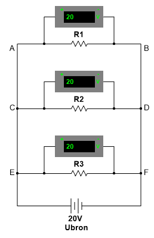

# De spanning in een parallelschakeling

De spanning over een bepaalde tak van een parallelschakeling is gelijk aan de spanning over elk van de andere takken die aanwezig zijn in deze parallelschakeling. Elk stroompad in een parallelschakeling wordt een tak \(branch\) genoemd.

Wat is belangrijk?

* Je bepaalt de spanning over iedere tak van een parallelspanning.
* Je verklaart waarom de spanning dezelfde waarde heeft over alle weerstanden die met elkaar in parallel staan.

Figuur 5-15 : de spanning over iedere tak van een parallelschakeling is gelijk aan de aangelegde spanning

Figuur 5-15 geeft een parallelschakeling met drie weerstanden weer. De punten $$A, C$$ en $$E$$ staan op hetzelfde potentiaal als de positieve klem van de spanningsbron $${U}_{bron}$$ . De punten $$B,D$$ en $$E$$ staan op een potentiaal gelijk aan de negatieve klem van $${U}_{bron}$$ . Over de drie weerstanden staat hetzelfde potentiaalverschil. In dit geval is dit gelijk aan het potentiaalverschil van $${U}_{bron}$$ en bedraagt dit $$20 V$$ .

## Test jezelf : de spanning in een parallelschakeling 

1. **Een voltmeter meet in de schakeling van figuur 5-16** over $${\mathit{R}}_{1}\mathit{ }50\mathit{ }\mathit{V}.$$ Hoeveel spanning meet de voltmeter als deze over $${\mathit{R}}_{2}$$ **geplaatst wordt?**
2. Hoe zijn spanningen over iedere tak van een parallelketen gerelateerd?
3. **Een** $$1\mathit{ }\mathit{k}\mathit{\Omega }$$ **en** $$\mathrm{2,2}\mathit{ }\mathit{k}\mathit{\Omega }$$ **weerstand zijn parallel verbonden met een spanningsbron van** $$10\mathit{ }\mathit{V}$$ **.** Hoeveel bedraagt de spanning over elke weerstand

