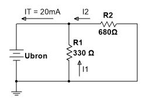

# De wet van Ohm toepassen op een parallelschakeling

De wet van Ohm kan bij analyse van een parallelschakeling worden toegepast. Dit wordt verduidelijkt aan de hand van een aantal rekenvoorbeelden.

Wat is belangrijk?

* Je berekent de totale stroom in een parallelschakeling.
* Je bepaalt de stroom in iedere tak van een parallelschakeling.

$${U}_{bron}$$

$$20 V$$ $${I}_{T}=29 mA$$

$${R}_{T}=\frac{1}{\frac{1}{ {R}_{1}}+\frac{1}{ {R}_{2}}+\frac{1}{ {R}_{3}} }=\frac{1}{\frac{1}{1 k\Omega }+\frac{1}{8 k\Omega }+\frac{1}{4 k\Omega } }=\mathrm{727,27} \Omega$$

$$\mathrm{12,6} V$$

## Test jezelf : De wet van Ohm toepassen op een parallelschakeling 

1. **Hoeveel spanning is er nodig om** $$20\mathit{ }\mathit{m}\mathit{A}$$ **te produceren in de schakeling van figuur 5-19?**

Figuur 5-19

1. **Hoeveel spanning is er nodig om** $$20\mathit{ }\mathit{m}\mathit{A}$$ **te laten vloeien door de schakeling van figuur 5-19?**
2. Hoeveel stroom vloeit er door iedere weerstand van figuur 5-19?
3. **Er staan vier gelijke weerstanden in parallel op een spanningsbron met** $$12\mathit{ }\mathit{V}$$ **spanning.** Als de bron een stroom levert van $$6\mathit{ }\mathit{m}\mathit{A}$$ **, wat is dan de weerstandswaarde van iedere weerstand?**
4. **Een** $$1\mathit{ }\mathit{k}\mathit{\Omega }$$ **en een** $$\mathrm{2,2}\mathit{ }\mathit{k}\mathit{\Omega }$$ **weerstand staan in parallel.** Door de totale parallelcombinatie vloeit een stroom van $$100\mathit{ }\mathit{m}\mathit{A}$$ **.** Hoeveel spanning staat er over iedere weerstand?

