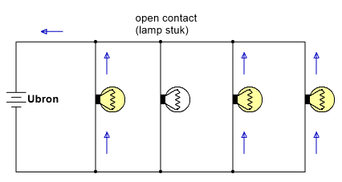

# Foutzoeken in een parallelschakeling

Een open circuit in een stroompad betekent dat er een onderbreking in dit stroompad is. Dit heeft als gevolg dat er geen stroom door dit stroompad vloeit. In deze sectie wordt besproken wat het effect is van een onderbreking in één van de stroompaden van een parallelkring.

Wat is belangrijk?

* Je bepaalt de locatie van een onderbreking in een parallelschakeling

## Een onderbreking in een parallelschakeling 

Via een schakelaar kan een open- of gesloten pad gemaakt worden in een tak van een parallelschakeling. Figuur 5-31 toont een parallelschakeling met een schakelaar in open- en gesloten toestand.

Figuur 5-31: als de schakelaar open is daalt de totale stroom door $${R}_{1}$$ tot nul en de stroom door $${R}_{2}$$ blijft hetzelfde

Wanneer de schakelaar gesloten is \(figuur 5-31 \(b\) is de totale parallelweerstand gelijk aan $$50 \Omega$$ vermits beide weerstanden een weerstandswaarde van $$100 \Omega$$ hebben. Door beide weerstanden vloeit nu een bepaalde stroom. Op het moment dat de schakelaar open gaat \(figuur 5-31 \(a\)\) kan er door $${R}_{1}$$ geen stroom meer vloeien waardoor $${R}_{1}$$ uit de keten verdwijnt. Over $${R}_{2}$$ staat nog steeds dezelfde spanning en zal dus nog steeds dezelfde stroom vloeien. Vermits beide weerstanden even groot waren vloeit er na het openen van de schakelaar nog maar de helft van de totale stroom meer door de schakeling.

Algemeen kan je concluderen dat wanneer er in een tak van een parallelschakeling een open contact komt, de totale weerstand van de parallelschakeling stijgt en de stroom door de parallelschakeling daalt met de stroomwaarde van de tak die open is. Enkel de stroom, die door de tak met het open contact vloeide, verdwijnt. In de overige takken blijft de stroom ongewijzigd.

Figuur 5-32 : Aantal lampen in parallel. De tweede lamp is stuk gegaan waardoor door de tweede tak geen stroom meer vloeit, de overige takken blijven ongewijzigd.

Stel dat er vier lampen in parallel geschakeld zijn zoals in figuur 4-32 is weergegven. Als alle lampen intact zijn vloeit er door alle lampen een bepaalde stroom. Zoals in de figuur is te zien is de tweede lamp defect. Hierdoor is er een open tak gecreëerd in de parallelschakeling van lampen en vloeit er geen stroom meer door de tweede tak. Merk op dat er nog steeds stroom vloeit in de overige takken en bijgevolg de overige lampen nog steeds branden. Ondanks het feit dat de tweede lamp is stukgegaan heeft dit geen invloed op de overige lampen. De bronspanning is bij de overige lampen nog steeds aanwezig en de stroom door de niet onderbroken takken blijft nog steeds dezelfde. Het voordeel van een parallelschakeling met lampen ten opzichte van een serieschakeling met lampen is dat als één lamp stuk gaat de overige lampen nog steeds blijven branden.

Conclusie: Als een weerstand in een parallelschakeling stuk gaat kan je deze defecte weerstand niet vinden door het meten van de spanning. De reden hiervoor is dat over alle takken dezelfde spanning staat en dus ook over de defecte tak. Als via een visuele inspectie de defecte weerstand niet zichtbaar is kan met een thermische-beeld-camera deze zichtbaar gemaakt worden. Immers de weerstanden waar nog steeds stroom doorvloeit dissiperen vermogen en worden warm. Door de defecte weerstand vloeit geen stroom meer en deze koelt af.

$$31 mA$$ Via stroom- en weerstandsmeting kan eveneens de defecte weerstand in een parallelschakeling gevonden worden. Het nadeel van deze methode is dat je de keten moet openbreken telkens je stroom- of weerstand wil meten. De keten openmaken kan gedaan worden door telkens een weerstand los te solderen.

## Kortsluiting in een tak van een parallelschakeling 

Een kortsluiting in een tak levert een veel grotere stroom op waardoor meestal een zekering stuk gaat of een bepaalde weerstand, in de keten waarin de parallelschakeling is opgenomen, stuk gaat. Meestal is het moeilijk om de kortgesloten tak te vinden. Met een pulser of current-tracer kan men deze fouten vinden. Een pulser is een penvormig instrument dat toelaat bepaalde pulsen vanaf een bepaald punt in de schakeling aan te brengen. Hierdoor worden stroompulsen gestuurd door het kortgesloten pad. Een current-tracer zet ook pulsen op een bepaald punt in de schakeling. Met de tracer kunnen de stroompulsen gevolgd worden zodat het stroompad geïdentificeerd kan worden.

## Test jezelf : foutzoeken in een parallelschakeling 

1. Als een tak in een parallelschakeling ‘open’ is, welke veranderingen kunnen er dan gedetecteerd worden in de schakeling in verband met spanningen en stromen. Er is verondersteld dat de parallelketen gevoed wordt door een constante spanningsbron.
2. Wat gebeurt er met de totale weerstand van een parallelschakeling als er een tak van open is?
3. Als verschillende lampen parallel geschakeld zijn en één van deze lampen gaat stuk, blijven de andere lampen dan branden?
4. Er vloeit 1A in iedere tak van een parallelschakeling. Als één van de takken stuk gaat, hoeveel stroom vloeit er dan nog in de andere takken?

