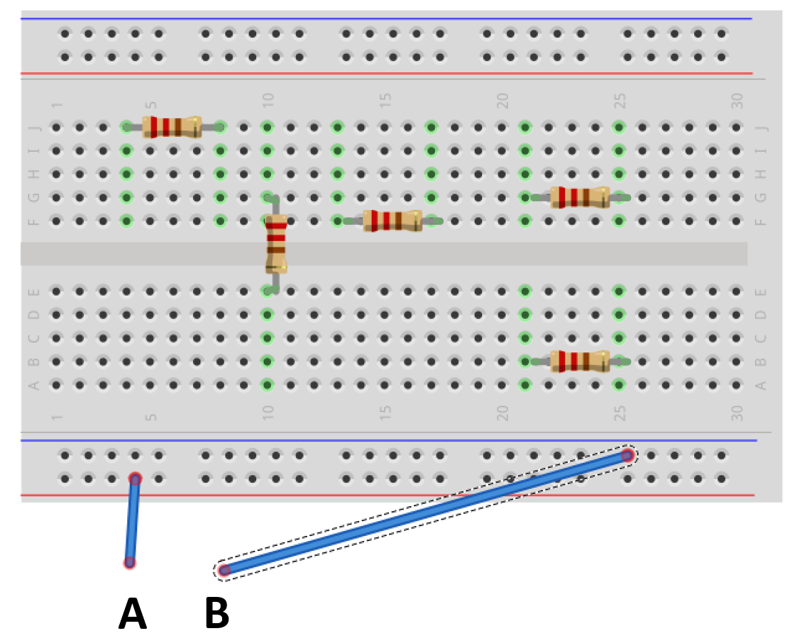
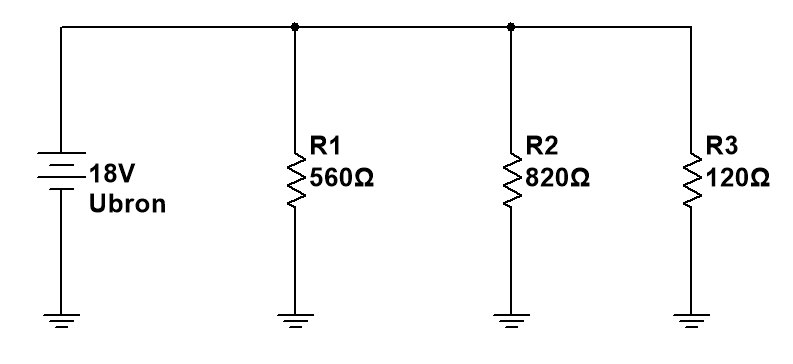
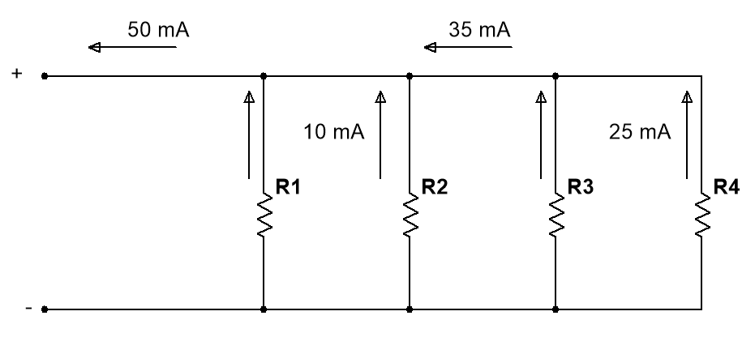
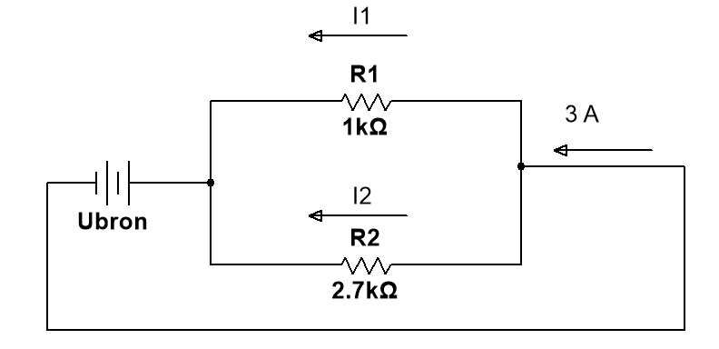
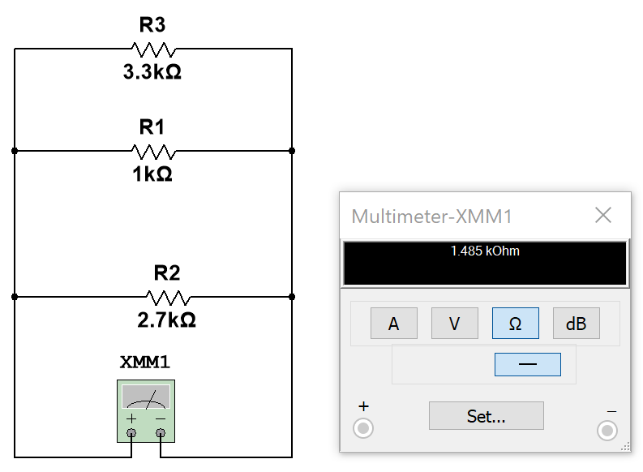
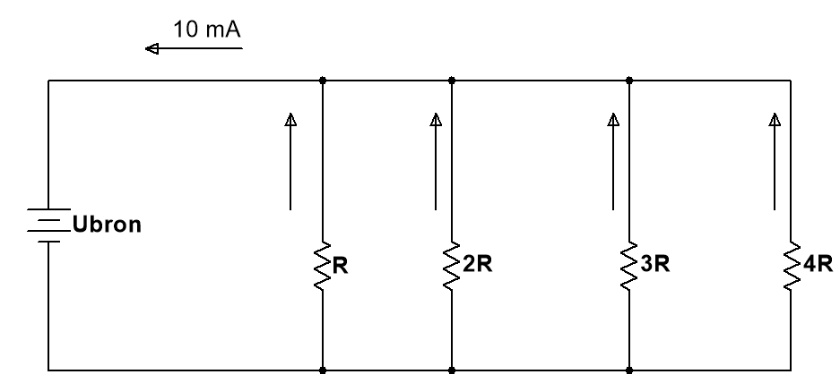
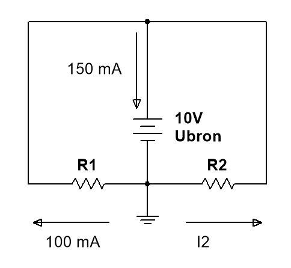
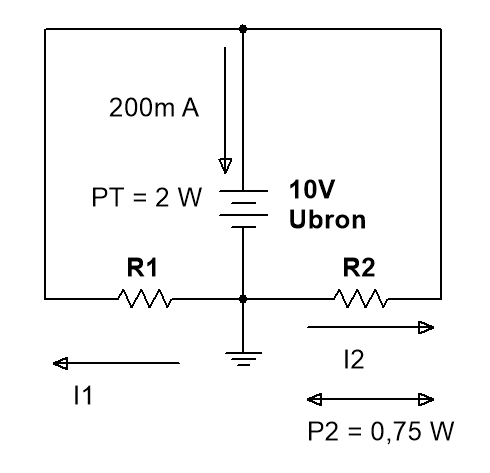

# Oefeningen

Weerstanden in parallel

1. 1. 1. 1. Verbind de weerstanden in de schakeling van figuur 5-33 in parallel tussen de punten $$A$$ en $$B$$ .

Figuur 5-33

Vervangingsweerstand van een parallelschakeling

1. 1. 1. 1. Bepaal de totale weerstand van een parallelschakeling die bestaat uit elf weerstanden van $$33 k\Omega$$ .
         2. De weerstanden $$150 \Omega , 820 \Omega$$ , $$470 \Omega$$ en $$330 \Omega$$ staan in parallel. Wat is hun vervangingsweerstand?

De spanning in een parallelschakeling

1. 1. 1. 1. Bepaal de spanning over en de stroom door een parallelschakeling die bestaat uit vier gelijke weerstanden. De spanning over de parallelschakeling is gelijk aan $$12 V$$ en de totale parallelweerstand is gelijk aan $$600 \Omega .$$

De Wet van Ohm toepassen op een parallelschakeling

1. 1. 1. 1. Bepaal de totale stroom in de schakeling van figuur 5-34.

Figuur 5-34

1. 1. 1. 1. Als de totale stroom in figuur 5-34 gelijk is aan $$100 mA$$ , hoeveel bedraagt dan de aangelegde spanning?

De stroomwet van Kirchhoff

1. 1. 1. 1. In een parallelschakeling bestaande uit drie takken worden volgende stromen in dezelfde richting gemeten: $$250 mA, 300 mA$$ en $$800 mA$$ . Welke stroom vloeit er dan door het knooppunt dat deze drie takken met elkaar verbind?
         2. Hoeveel stroom vloeit er door de weerstanden $${R}_{2}$$ en $${R}_{3}$$ van de schakeling in figuur 5-35?

Figuur 5-35

Stroomdelers

1. 1. 1. 1. Hoeveel stroom vloeit er door iedere tak van de parallelschakeling in figuur 5-36?

Figuur 5-36

Vermogen in parallelschakelingen

1. 1. 1. 1. Vijf parallelweerstanden dissiperen elk 40 mW. Wat is het totaal vermogen?
         2. Zes lampen zijn in parallel geschakeld over een spanningsbron van 230 V. Als iedere lamp een vermogen van $$75 W$$ heeft, hoeveel stroom vloeit er dan door één lamp en wat is de totale stroom door de zes lampen?

Foutzoeken in een parallelschakeling

1. 1. 1. 1. Bepaal aan de hand van de meetresultaten van de schakeling in figuur 5-37 of er een fout in de schakeling zit. Indien er een fout in zit zoek dan uit welke weerstand stuk en/of kortgesloten is.

Figuur 5-37

1. 1. 1. 1. De totale weerstand die in de parallelschakeling van figuur 5-38 wordt gemeten is gelijk aan $$1485 \Omega$$ . Welke weerstand is hier open \(stuk\)?

Figuur 5-38

Geavanceerde oefeningen

1. Bepaal de weerstanden $${R}_{2}, {R}_{3}$$ en $${R}_{4}$$ in de schakeing van figuur 5-39.

Figuur 5-39

1. De totale weerstand van een parallelschakeling is gelijk aan $$25 \Omega$$ . Als de totale stroom gelijk is aan $$100 mA,$$ hoeveel stroom vloeit er dan door een weerstand van $$220 \Omega$$ die één van de takken van de parallelschakeling vormt.
2. Bepaal de stroom door iedere weerstand van figuur 5-40. $$R$$ is de laagste weerstandswaarde en de al de andere weerstanden zijn veelvouden van de weerstandswaarde $$R$$ .

Figuur 5-40

1. Bepaal de waarde van de weerstand $${R}_{1};{R}_{2}$$en $${I}_{2}$$ in de schakeling van figuur 5-41

Figuur 5-41

1. Bepaal de waarde van $${R}_{1}, {R}_{2}, {I}_{1} en {I}_{2}$$ in de schakeling van figuur 5-42. Het totaal vermogen dat de spanningsbron levert is gelijk aan $$2 W$$ en het vermogen dat $${R}_{2}$$ dissipeert is gelijk aan $$\mathrm{0,75} W$$.

Figuur 5-42

1. Bepaal de onbekende weerstandswaarden van de schakeling in figuur 5-43.

Figuur 5-43

1. Stel dat je een meter hebt die stroom kan meten tot $$100 \mu A$$. \(volle uitslag van de meter\). De inwendige weerstand van deze meter is $$80 \Omega$$. Deze meter zou je graag willen gebruiken tot $$1 mA$$ \(volle uitslag van de meter\). Ontwerp een schakeling met shuntweerstand die dit mogelijk maakt

