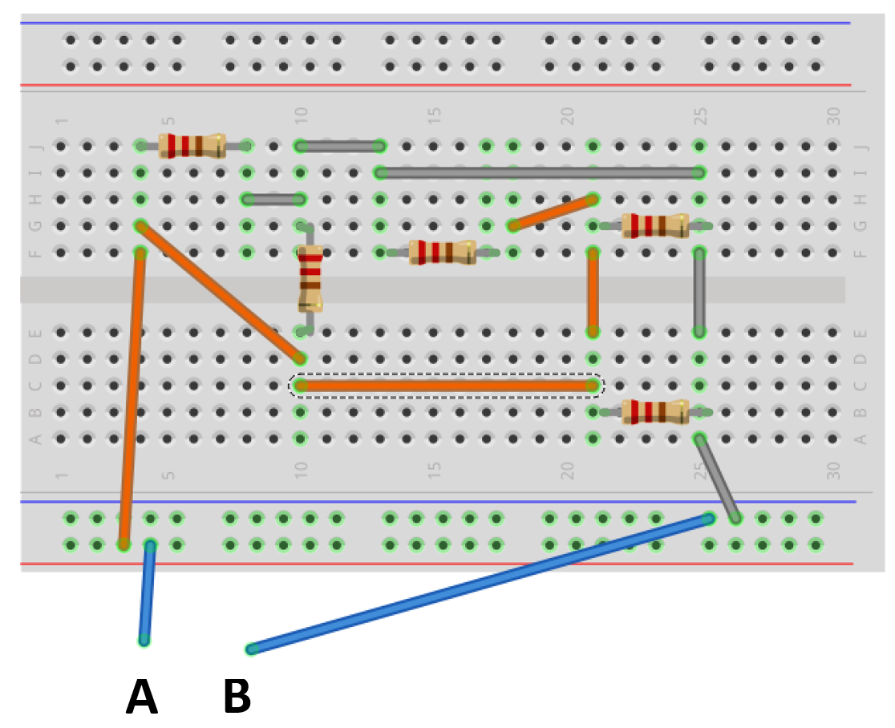

# Oplossingen

## Oplossingen Test jezelf vragen 

Test jezelf : Weerstanden in parallel

1. 1. 1. 1. Parallelweerstanden zijn verbonden tussen dezelfde twee punten \(beginpunten van de weerstanden aan elkaar en de eindpunten van de weerstanden aan elkaar\)
         2. Een parallelschakeling heeft meer dan één stroompad tussen twee gegeven punten.
         3. Zie figuur 5-44

Figuur 5-44 oplossing test jezelf van figuur 5-6

Test jezelf : Vervangingsweerstand van een parallelschakeling

1. 1. 1. 1. 1. 1. 1. Hoe meer weerstanden in parallel worden geschakeld hoe meer de vervangingsweerstand van deze parallelschakeling in weerstandswaarde daalt.
                  2. De vervangingsweerstand van een parallelschakeling is steeds kleiner dan de kleinste weerstandswaarde van een tak die tot deze parallelschakeling toebehoort.

Test jezelf : Spanning in een parallelschakeling

1. 1. 1. 1. 1. 1. 1. $${U}_{R2}=50 V$$
                  2. De spanning over iedere tak van een parallelschakeling heeft dezelfde spanningswaarde en is gelijk aan de aangelegde spanning over deze parallelschakeling.
                  3. De spanning over iedere weerstand bedraagt $$10 V$$ .

Test jezelf : De wet van Ohm toepassen op een parallelschakeling

1. 1. 1. 1. $${U}_{bron}=\mathrm{4,44} V ({I}_{T}\times {R}_{T}=20 mA \times 222 \Omega )$$
         2. $${I}_{R1}=\frac{\mathrm{4,44} V}{330 \Omega }=\mathrm{13,45} mA; {I}_{R2}= \frac{\mathrm{4,44} V}{680 \Omega }=\mathrm{6,53} mA$$
         3. $$R=4\times \left(\frac{12 V}{6 mA}\right)=8 k\Omega$$
         4. $${U}_{R}=\left(1 k\Omega \text{|| }\mathrm{2,2} k\Omega \right)\times 100mA=\mathrm{68,8} V$$

Test jezelf : De stroomwet van Kirchhoff

1. 1. 1. 1. 1. 1. 1. Stroomwet van Kirchhoff : de algebraïsche som van alle stromen bij een knooppunt is gelijk aan nul; De som van de inkomende stromen aan een knooppunt is gelijk aan de som van de uitgaande stromen van dat knooppunt.
                  2. $$3 A$$
                  3. $$10 A$$
                  4. $${I}_{T}=\mathrm{2,5} A;{I}_{3}=\mathrm{1,5} A$$

Test jezelf : Stroomdelers

1. 1. 1. 1. Door de $$22 \Omega$$ gaat de meeste stroom; door de $$220 \Omega$$ gaat de kleinste stroom
         2. $${I}_{R1}=\frac{ {R}_{T}}{330 \Omega } \times 10 mA=\mathrm{6,73} mA; {I}_{R2}= \frac{ {R}_{T}}{680 \Omega } \times 10 mA=\mathrm{3,27} mA$$
         3. $${I}_{R3}=\frac{ {R}_{T}}{ {R}_{3}} \times 10 mA=\mathrm{2,42} mA$$

Test jezelf : Vermogen in parallelschakelingen

1. 1. 1. 1. 1. 1. 1. Door al de afzonderlijke vermogens van de weerstanden samen te tellen.
                  2. De normale stroom : $$I=\frac{P}{U}=\frac{100 W}{\mathrm{12,6} V}=\mathrm{7,9} A=&gt;7.9 \times \mathrm{1,2}=\mathrm{9,48} A$$ $$=&gt;$$ kies een zekering van $$10 A$$ .
                  3. $${P}_{T}={\left(1 mA\right)}^{2}\times {R}_{T}=615 \mu W$$
                  4. $${P}_{T}=1 W+2 W+5 W+8 W=16 W$$

Test jezelf : Foutzoeken in een parallelschakeling

1. 1. 1. 1. 1. 1. 1. Als een tak opent, is er geen verandering in de spanning over de parallelschakeling maar de totale stroom erdoor daalt.
                  2. Als een tak van een parallelschakeling open is, zal de totale weerstand ervan verhogen.
                  3. Ja alle anderen lampen blijven branden.
                  4. De stroom in iedere tak die niet open is blijft op $$1 A$$ . De totale stroom zal wel met $$1 A$$ verminderen.

## Oplossingen waar/niet-waar vragen 

1. 1. 1. 1. 1. 1. 1. Waar 2. Waar 3. Niet waar 4. Niet waar 5. Niet waar
2. 1. 1. 1. 1. 1. 1. Waar 7. Waar 8. Waar 9. Niet waar 10. Niet waar

## Multiple choice test 

1. 1. 1. 1. \(b\) 2. \(c\) 3. \(b\) 4. \(d\) 5.\(a\) 6. \(c\) 7. \(c\)
2. \(c\) 9. \(c\) 10. \(d\) 11. \(a\) 12.\(d\) 13. \(c\) 14. \(b\)

## Oplossing oefeningen 

Weerstanden in parallel

1. 1. 1. 1. 1. 1. 

Figuur 5-45 : een mogelijke oplossing om de weerstanden in parallel te verbinden

Vervangingsweerstand van een parallelschakeling

1. 1. 1. 1. $$3 k\Omega$$
         2. $${R}_{T}=\mathrm{76,66} \Omega$$

De spanning over een parallelschakeling

1. 1. 1. 1. $$12 V; 5 mA$$

De Wet van Ohm toepassen op een parallelschakeling

1. 1. 1. 1. $${I}_{T}= \mathrm{204,1} mA$$
         2. $${U}_{bon}=\mathrm{8,82} V$$

De stroomwet van Kirchhoff

1. 1. 1. 1. $$1350 mA$$
         2. $${I}_{R1}=5 mA;{I}_{R3}=$$ 10 mA

Stroomdelers

1. 1. 1. 1. $${I}_{1}=\mathrm{2,19} A; {I}_{2}=811 mA$$

Vermogen in parallelschakelingen

1. 1. 1. 1. $$200 mW$$
         2. $${I}_{lamp}=\mathrm{326,09} mA;{I}_{T}=\mathrm{1,96} A$$

Foutzoeken in een parallelschakeling

1. 1. 1. 1. De weerstand $${R}_{3} \left(62 k\Omega \right)$$ is open \(of stuk\)
         2. De weerstand $${R}_{1}\left(1 k\Omega \right)$$ is stuk/open

Geavanceerde oefeningen

1. $${R}_{2}=25 \Omega ;{R}_{3}=100 \Omega ;{R}_{4}=\mathrm{12,5} \Omega$$
2. $${I}_{220 \Omega }=\mathrm{11,36} mA$$
3. $${I}_{R}=\mathrm{4,8} A; {I}_{2R}=\mathrm{2,4} A; {I}_{3R}=\mathrm{1,6} A; {I}_{4R}=\mathrm{1,2} A$$
4. $${R}_{1}=100 \Omega ; {R}_{2}=200 \Omega ;{I}_{2}=50 mA$$
5. $${I}_{1}=125 mA;{I}_{2}=75 mA;{R}_{1}=80 \Omega ;{R}_{2}=\mathrm{133,33} \Omega$$
6. $${R}_{2}=750 \Omega ;{R}_{4}=423 \Omega$$
7. $${R}_{shunt}=\mathrm{8,9} \Omega$$ en staat parallel over de meter tijdens het $$1 mA$$ -bereik

