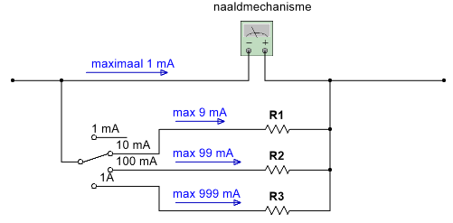
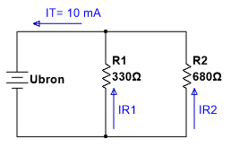
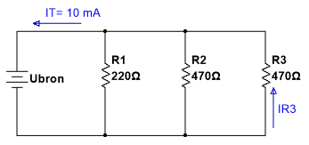

# Stroomdelers

Een parallelschakeling gedraagt zich als een stroomdeler als de stroom die op het knooppunt van de verschillende in parallel staande stroomtakken zich verdeelt in deze verschillende in parallel staande stroomtakken.

Wat is belangrijk?

* Je gebruikt een parallelschakeling als stroomdeler.
* Je berekent de onbekende stroom in een bepaalde paralleltak.

Aangezien bij een parallelschakeling dezelfde spanning staat over de weerstanden die in parallel staan, verhouden de stromen door de takken zich in functie van de weerstandswaarden. Meer bepaald zal de totale stroom zich verdelen langs de parallelweerstanden in stromen die omgekeerd evenredig zijn met de weerstandswaarden. Dit betekent dat de takken met de grootste weerstanden de laagste stroom hebben en de takken met de laagste weerstand de grootste stroom. Als alle takken dezelfde weerstand hebben zijn de stromen in de takken aan elkaar gelijk.

## Formule voor de stroomdeler 

Via de wet van Ohm kan je de stroom bepalen over een willekeurige parallelweerstand. Stel $${U}_{bron}$$ is de spanning van de spanningsbron, $${I}_{x}$$ de stroom door een bepaalde parallelweerstand en $${R}_{x}$$ de weerstandswaarde van die bepaalde parallelweerstand.

Figuur 5-24: Een parallelschakeling met n takken

Voor figuur 5-24 geldt algemeen:

$${I}_{x}=\frac{ {U}_{bron}}{ {R}_{x}}$$

De bronspanning $${U}_{bron}$$ is gelijk aan :

$${U}_{bron}={I}_{T}\times {R}_{T}$$

Met $${R}_{T}$$ de totale vervangingsweerstand van de parallelschakeling. Vullen we de vergelijking van $${U}_{bron}$$ in de vergelijking van $${I}_{x},$$ dan verkrijgen we:

$${I}_{x}=\frac{ {I}_{T}\times {R}_{T}}{ {R}_{x}}$$

Of :

$${\mathit{I}}_{\mathit{x}}=\frac{ {\mathit{R}}_{\mathit{T}}}{ {\mathit{R}}_{\mathit{x}}}\mathit{ }\times {\mathit{I}}_{\mathit{T}}$$ _**\(5-5\)**_

$${R}_{T}=\frac{1}{\frac{1}{220 \Omega }+\frac{1}{330 \Omega }+\frac{1}{680 \Omega } }=111 \Omega$$ De stroom $${I}_{x}$$ door een bepaalde tak is gelijk aan de verhouding van de totale parallelweerstand $${R}_{T}$$ op de weerstand $${R}_{x}$$ van de beschouwde tak, vermenigvuldigt met de totale stroom $${I}_{T}$$ die toekomt op het knooppunt van de paralleltakken.

Als de parallelschakeling uit twee weerstanden bestaat, kan de stroomdelerformule als volgt bepaald worden :

$${I}_{1}=\frac{ {R}_{T}}{ {R}_{1}}.\mathrm{ }{I}_{T}$$ = $$\frac{\frac{ {R}_{1}.\mathrm{ }{R}_{2}}{ {R}_{1}+{R}_{2}}}{ {R}_{1}}\mathrm{ }.\mathrm{ }{I}_{T}$$

Verder uitwerken levert volgende formule op:

$${\mathit{I}}_{1}=\frac{ {\mathit{R}}_{2}}{ {\mathit{R}}_{1}+{\mathit{R}}_{2}}.\mathit{ }{\mathit{I}}_{\mathit{T}}$$ **\(vgl 5-6\)**

$${\mathit{I}}_{2}=\frac{ {\mathit{R}}_{1}}{ {\mathit{R}}_{1}+{\mathit{R}}_{2}}.\mathit{ }{\mathit{I}}_{\mathit{T}}$$ **\(vgl 5-7\)**

$${I}_{R1}=\frac{330 \Omega }{560 \Omega +330 \Omega } \times 10 mA=\mathrm{3,71} mA$$

## Gebruik van een shunt 

Veel systemen gebruiken ampèremeters in controlepanelen om een visuele indicatie van de stroom te kunnen weergeven. Veel ampèremeters zijn zodanig opgebouwd dat ze meer dan één schaal weergeven. Dikwijls is de meter gevoelig en wordt deze vernietigd als er grote stromen doorgaan. Het mechanisme dat de naald laat bewegen is dikwijls verbonden met een beweegbare spoel. Deze verdraaid in een magnetisch veld afhankelijk van de stroomdoorgang door de spoel.

Om toch grotere stromen te kunnen meten en weergeven wordt parallel aan het naaldmechanisme een weerstand geplaatst. Deze is zodanig gedimensioneerd dat bij grotere stromen het veruit de meeste stroom door deze weerstand gaat en zo het naaldmechanisme beschermd. De parallelweerstand vormt een aftakking of “shunt” op dit naaldmechanisme.

Stel dat bij een bepaalde ampèremeter het naaldmechanisme een weerstand heeft van $$50 \Omega$$ . Veronderstel eveneens dat de meter bij stroomdoorgang van $$1 mA$$ volledig uitslaat en dus zijn maximale waarde weergeeft. Dit betekent dat de naald stromen tot 1 mA stroomdoorgang kan weergeven. Stel dat we deze meter willen aanpassen om stromen tot $$10 mA$$ te kunnen weergeven. Dit kunnen we doen door een weerstand parallel \(shunt\) op het naaldmechanisme te plaatsen. Deze weerstand moet zodanig gedimensioneerd worden dat bij volle naalduitslag $$9 mA$$ door deze shuntweerstand gaat en $$1 mA$$ door het naaldmechanisme.

Figuur 5-27 : gebruik van shunt-weerstanden in een A-meter

De nodige weerstandswaarden voor de shuntweerstanden kunnen gevonden worden via de stroomdelerformule. Zo is voor een schaal van $$10 mA$$ de maximale shuntstroom gelijk aan:

$${I}_{\mathrm{max}\left(shunt\right)}={I}_{T}-{I}_{meter}=10 mA-1 mA=9 mA$$

Om de shuntweerstand voor de schaal van $$10 mA$$ te vinden moet je eerst de totale weerstand vinden van de parallelschakeling die is opgebouwd met naaldmechanisme en de schuntweerstand voor de schaal $$10 mA$$ . Deze kan je vinden via de stroomdelerformule:

$${\mathrm{I}}_{\mathrm{x}}=\frac{ {\mathrm{R}}_{\mathrm{T}}}{ {\mathrm{R}}_{\mathrm{x}}}\mathrm{ }\times {\mathrm{I}}_{\mathrm{T}}$$

De gekende waarden invullen:

$$1 mA=\frac{ {\mathrm{R}}_{\mathrm{T}}}{50\mathrm{ }\mathrm{\Omega }}\mathrm{ }\times 10\mathrm{ }\mathrm{m}\mathrm{A}$$

Omvormen naar $${\mathrm{R}}_{\mathrm{T}} :$$

$${R}_{T}=\frac{1 mA}{10 mA}\times 50\mathrm{ }\mathrm{\Omega }=5\mathrm{ }\mathrm{\Omega }$$

Nu $${R}_{T}$$ gekend is kan je deze invullen in de stroomdelerformule en $${\mathrm{I}}_{\mathrm{x}}$$ is nu de stroom door de shunt:

$$9 mA=\frac{5 \Omega }{ {\mathrm{R}}_{\mathrm{s}\mathrm{h}\mathrm{u}\mathrm{n}\mathrm{t}\left(10\mathrm{ }\mathrm{m}\mathrm{A}\right)}}\mathrm{ }\times 10\mathrm{ }\mathrm{m}\mathrm{A}$$

$${\mathrm{R}}_{\mathrm{s}\mathrm{h}\mathrm{u}\mathrm{n}\mathrm{t}\left(10\mathrm{ }\mathrm{m}\mathrm{A}\right)}=\frac{10 mA}{9 mA }\times 5 \Omega =\mathrm{5,56} \Omega$$

Voor de schaal van $$100 mA$$ en $$1 A$$ kan je analoge redenering volgen. Voor de schaal van $$100 mA$$ :

$${R}_{T}=\frac{1 mA}{100 mA}\times 50\mathrm{ }\mathrm{\Omega }=\mathrm{0,5}\mathrm{ }\mathrm{\Omega }$$

$${\mathrm{R}}_{\mathrm{s}\mathrm{h}\mathrm{u}\mathrm{n}\mathrm{t}\left(100\mathrm{ }\mathrm{m}\mathrm{A}\right)}=\frac{100 mA}{99 mA }\times 0.5 \Omega =\mathrm{0,51} \Omega$$

Voor de schaal van $$1 A$$ :

$${R}_{T}=\frac{1 mA}{1000 mA}\times 50\mathrm{ }\mathrm{\Omega }=\mathrm{0,05}\mathrm{ }\mathrm{\Omega }$$

$${\mathrm{R}}_{\mathrm{s}\mathrm{h}\mathrm{u}\mathrm{n}\mathrm{t}\left(1000\mathrm{ }\mathrm{m}\mathrm{A}\right)}=\frac{1000 mA}{999 mA }\times 0.05 \Omega =\mathrm{0,05005} \Omega$$

## Test jezelf : Stroomdelers 

1. Een schakeling heeft volgende weerstanden in parallel op een spanningsbron: $$220\Omega$$, $$100 \Omega$$, $$68 \Omega$$, $$56 \Omega$$ en $$22 \Omega$$. Door welke weerstand gaat de meeste stroom door? Door welke weerstand de kleinste stroom?
2. Bepaal de stroom door elke weerstand van figuur 5-28.

Figuur 5-28

1. Bepaal de stroom door de weerstand $${R}_{3}$$ in figuur 5-29.

Figuur 5-29

