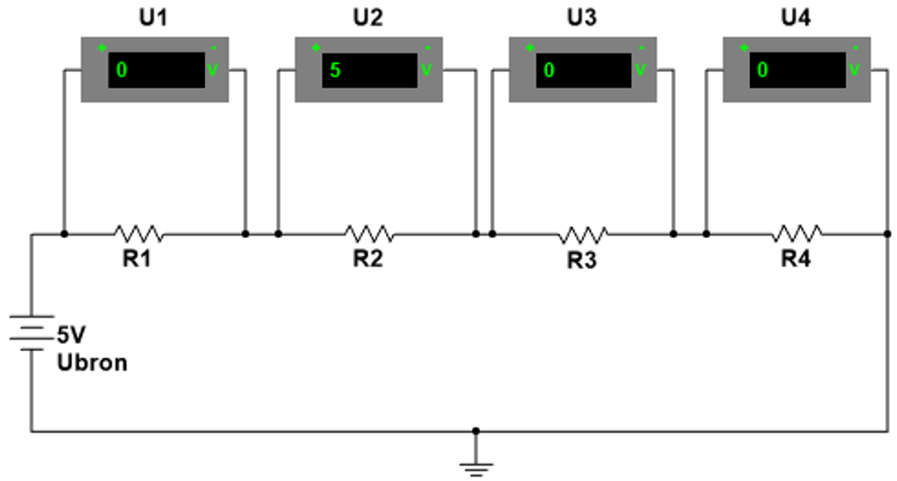
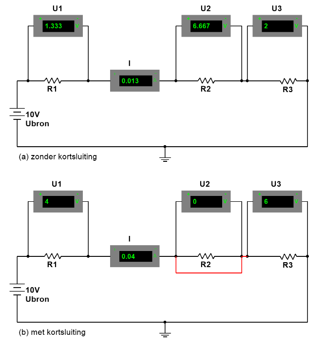

# Foutzoeken in een serieschakeling

Open componenten of contacten en kortsluitingen tussen geleiders zijn veel voorkomende problemen in een schakeling. Een open component of contact veroorzaakt een oneindige weerstand en een kortsluiting produceert een weerstandswaarde van nagenoeg $$0 \Omega$$ _._

Wat is belangrijk?

* Je kan een open contact lokaliseren in een serieschakeling.
* Je kan een kortsluiting lokaliseren in een serieschakeling.

## Onderbreking in de schakeling 

Wanneer er een onderbreking is in een serieschakeling staat over deze onderbreking de volledige bronspanning. Dit is vergelijkbaar met een open schakelaar waar ook de volledige bronspanning over staat. Een onderbreking komt overeen met een open circuit.

Figuur 4-41: Over een open circuit staat de volledige spanning. In deze figuur is R2 stuk.

In figuur 4-41 staan vier weerstanden in serie. De weerstand $${R}_{2}$$ is in deze schakeling onderbroken. Deze weerstand is stuk en gedraagt zich als een open keten. Dit betekent dat over deze weerstand de volledige bronspanning komt te staat en over de andere weerstanden geen of nagenoeg geen spanningsval. De weerstand die stuk is kan je dus ontdekken via spanningsmeting over de weerstanden uit te voeren. Voor de schakeling in figuur 4-41 geldt:

$${U}_{bron}={U}_{R1}+{U}_{R2}+ {U}_{R3}+{U}_{R4}$$

$${U}_{R2}={ {U}_{bron}- U}_{R1}- {U}_{R3}-{U}_{R4}$$

$${U}_{R2}=5 V-0 V-0 V-0 V$$

$${U}_{R2}={U}_{bron}=5 V$$

## Kortsluiting in de schakeling 

Een kortsluiting in een schakeling veroorzaakt meer stroom. Mogelijkheden op kortsluiting zijn :

* Wireclipping : de draad van de weerstand op een PCB is te lang en maakt ongewenst contact met een andere weerstand.
* Kortgesloten draden of printbanen
* Soldeer splash : een stuk \(gemorst\) soldeersel ligt op de PCB of een te dikke soldering.

De kenmerken van een kortsluiting is dat er geen spanning staat over het kortgesloten gedeelte en dat de kortsluiting een weerstand heeft van nagenoeg _0 Ω._

Figuur 4-42: De gevolgen van een kortsluiting op spanning en stroom in de schakeling.

Stel een schakeling zoals in figuur 4-42 \(a\) is weergegeven. Deze bestaat uit een serieschakeling van drie weerstanden. De spaningsval over de weerstanden en de stroom door deze weerstanden is eveneens in de figuur weergegeven. In figuur 4-42 \(b\) is de weerstand $${R}_{2}$$ kortgesloten. Aangezien een kortsluiting een weerstand heeft van nagenoeg $$0 \Omega$$, zal de spanningsval over $${R}_{2}$$ ook $$0 V$$ worden. Dit betekent dat de weerstandswaarde tussen de aansluitpunten van $${R}_{2}$$ door de kortsluiting herleid is tot ongeveer $$0 \Omega$$. Hierdoor is de totale weerstand in de serieketen met de weerstandswaarde $${R}_{2}$$ vermindert. Dit leidt tot een grotere totale stroom door de schakeling waardoor de spanningsvallen over de andere weerstanden verhoogd is. Een kortsluiting in een serieketen kan je herkennen door de verhoogde totale stroomwaarde. Je kan een kortsluiting in een schakeling gemakkelijk vinden via een weerstandsmetingen met een Ohmmeter of spannigsmetingen over de componenten.

## Test jezelf aangaande foutzoeken in een serieschakeling 

1. Definieer een open circuit
2. Definieer een kortgesloten schakeling
3. Wat gebeurt er als er een onderbreking komt in een serieschakeling?
4. **De totale spanning over een serieschakeling van een aantal weerstanden bedraagt** $$25\mathit{ }\mathit{V}$$ **.** Als een van de weerstanden onderbroken is, hoeveel spanning staat er over elke goede weerstand? Hoeveel spanning staat er over de onderbroken weerstand?

