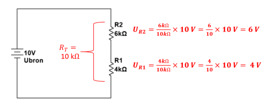
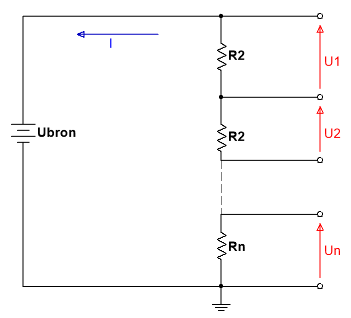
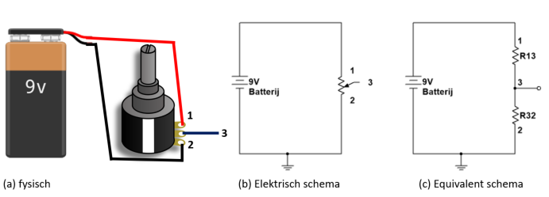
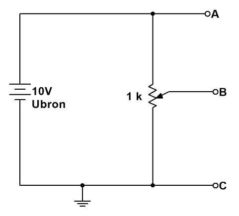

# Spanningsdelers

Een serieschakeling gedraagt zich als een spanningsdeler. De spanningsdeler is een belangrijke toepassing van de serieschakeling.

Wat is belangrijk?

* Je zegt de spanningsdelerformule op en past hem toe.
* Je gebruikt een potentiometer als spanningsdeler en stelt hem als zodanig in.
* Je beschrijft enkele spannigsdelertoepassingen.

Figuur 4-30 : voorbeeld van een spanningsdeler met twee weerstanden

Een serieschakeling die bestaat uit weerstanden gedraagt zich als een spanningsdeler. De totale spanningsval over een enkel gesloten stroompad is afhankelijk en recht evenredig met de waarden van de serieweerstanden in dit stroompad. De kleinste weerstand heeft de kleinste spanningsval en de grootste weerstand heeft de grootste spanningsval. In figuur 4-30 zie je dat van de spanningsval over $${R}_{2}$$ staat en van de spanningsval over $${R}_{1}$$. De reden hiervoor is dat de som van de twee weerstanden gelijk is aan $$10 k\Omega$$ \($$6 k\Omega +4 k\Omega$$\). $${R}_{1}$$is van de totale weerstand en $${R}_{2}$$ . Dit heeft als gevolg dat over van de totale spanning staat en over $${R}_{2}$$ staat van de totale spanning.

## Formule van de spanningsdeler 

Figuur 4-31 toont een algemeen schema van een spanningsdeler met $$n$$ weerstanden.

Figuur 4-31 : algemeen schema van een spanningsdeler met n weerstanden

Stel dat $$\[ {U}_{x}\]$$ één van de spanningsvallen is van de weerstanden in figuur 4-31 en dat $$\[ {R}_{x}\]$$ de specifieke weerstand is waarover deze spanningsval staat. Volgens de wet van Ohm geldt:

$$\[ {U}_{x}=I\text{ }\times {R}_{x}\]$$ \(a\)

Hierin is $$\[ I\]$$ de totale stroom die door alle weerstanden vloeit. Deze stroom is gelijk aan :

$$\[ I=\frac{ {U}_{bron}}{ {R}_{T}}=\frac{ {U}_{bron}}{ {R}_{1}+{R}_{2}+\dots +\text{ }{R}_{x}+\dots +{R}_{n}}\]$$ \(b\)

Vervang nu in vergelijking \(a\) de stroom $$\[ I\]$$ door vergelijking \(b\) :

$$\[ {U}_{x}=I\text{ }\times {R}_{x}=\frac{ {U}_{bron}}{ {R}_{T}}\text{ }\times {R}_{x}\]$$

Anders gerangschikt :

$$\[ {U}_{x}=\frac{ {R}_{x}}{ {R}_{T}}\text{ }\times \text{ }{U}_{bron}\text{ }\text{ }\text{ }\text{ }\text{ }(4-5)\]$$

$${U}_{1}$$ De spanningsval over eender welke weerstand van een combinatie van weerstanden in een serieschakeling is gelijk aan de verhouding van deze weerstand op de totale weerstand, vermenigvuldigt met de bronspanning.

$${R}_{T}$$ $${U}_{1}=\frac{ {R}_{1}}{ {R}_{T}}\times {U}_{bron}=\frac{200\Omega }{1000\Omega } \times 10 V=2 V$$

$${R}_{T}=200\Omega +500\Omega +300\Omega =1000\Omega$$

## $${R}_{T}={R}_{1}+{R}_{2}+{R}_{3}=1 k\Omega +\mathrm{8,2} k\Omega +\mathrm{3,3} k\Omega =\mathrm{12,5} k\Omega$$ De potentiometer als regelbare spanningsdeler 

Door de loper \(wiper\) te verdraaien in figuur 4-35 wordt, afhankelijk van de richting waarin je deze verdraaid, ofwel de weerstand $${R}_{13}$$ groter en de weerstand $${R}_{32}$$ kleiner of omgekeerd. De respectievelijke spanningsvallen over deze twee weerstanden veranderen recht evenredig met de verdraaiing van de loper \(wiper\).

Figuur 4-35 : De potentiometer als spanningsdeler

$${U}_{out}$$ In figuur 4-35 kan je de spanning $${U}_{3}$$ , welke overeenkomt met de spanning over de weerstand $${R}_{32}$$ , als volgt berekenen:

$${U}_{3}=\frac{ {R}_{32}}{\begin{array}{c}{R}_{13}+{R}_{32}\\ \end{array}} \times {U}_{Batterij}$$

## Test jezelf aangaande spanningsdelers 

1. Wat is een spanningsdeler?
2. Hoeveel weerstanden kunnen er in een serie spanningsdelercircuit?
3. Wat is de algemene formule voor de spanningsdeler?
4. **Als** 2 weerstanden in serie dezelfde waarde hebben en verbonden zijn met een spanningsbron van $$20\mathit{ }\mathit{V},$$ **hoe groot is dan de spanning over elke weerstand?**
5. **Een** $$56\mathit{ }\mathit{k}\mathit{\Omega }$$ **weerstand en een** $$82\mathit{ }\mathit{k}\mathit{\Omega }$$ **weerstand** staan verbonden als spanningsdeler. Stel dat de bronspanning gelijk is aan 10 V; teken dan het circuit en bepaal de spanning over elk van de weerstanden.
6. **De schakeling van figuur 4-37 bestaat uit een lineaire potentiometer van** $$1\mathit{ }\mathit{k}\mathit{\Omega }.$$ Op welke weerstandswaarde moet je de weerstand tussen $$\mathit{A}$$ **en** $$\mathit{B}$$ **afregelen zodat** $$\mathrm{7,5}\mathit{ }\mathit{V}\mathit{ }$$ **staat tussen de punten** $$\mathit{B}$$ **en** $$\mathit{C}$$ **?**

Figuur 4-37

