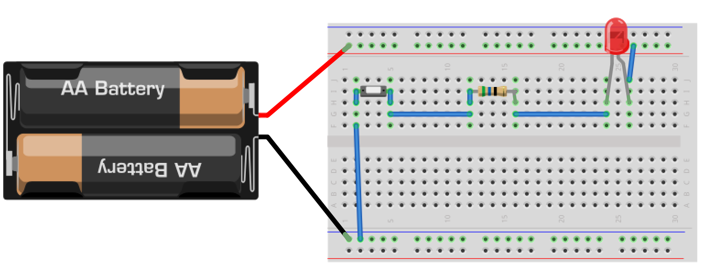
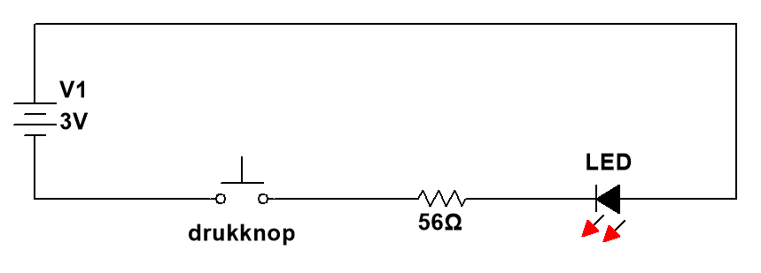
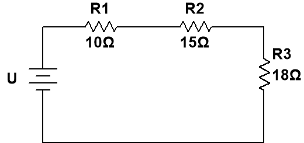

# Toepassingen op de wet van Ohm

De basisconcepten van serieschakelingen en de wet van Ohm kunnen gebruikt worden voor analyse van een serieschakeling.

Wat is belangrijk?

* Je kan de stroom bepalen door een serieschakeling.
* Je kan de spanning over elke weerstand in een serieschakeling bepalen.

Vooraleer je start met de analyse van een serieschakeling is het belangrijk om volgende zaken te weten:

* De stroom door eender welk van de serieweerstanden is gelijk aan de totale stroom door de schakeling
* Volgens de wet van Ohm geldt: $${I}_{T}= \frac{ {U}_{T}}{ {R}_{T}}$$
* Als je de spanningsval over een weerstand $${R}_{x}$$ kent, dan is : $${I}_{T}= \frac{ {U}_{x}}{ {R}_{x}}$$
* Als je de totale stroom kent, dan is de spanningsval over een weerstand $${R}_{x}$$ : $${U}_{x}={I}_{T}. {R}_{x}$$
* De polariteit van een spanningsval over een weerstand is het positiefst aan het uiteinde van de weerstand die het dichts bij de positieve klem is van de spanningsbron \(voeding\)
* De stroom door een weerstand vloeit van de aansluitdraad van de weerstand die het negatiefst is naar de aansluitdraad van de weerstand die het positiefst is.
* $${R}_{T}$$

  Een opening in een serieschakeling \(vb. open schakelaar\) voorkomt dat er stroom door de schakeling vloeit. Dit houdt in dat over elke serieweerstand geen spanning staat en dat de volledige bronspanning over de opening \(open schakelaar\) staat.

$$U$$ $${R}_{T}$$ $$I=\frac{U}{ {R}_{T}}= \frac{620 V}{\mathrm{1,76} M\Omega }=352 \mu A$$

$$U$$

**Voorschakelweerstand**

Indicatielicht wordt gebruikt om een bepaalde toestand van een machine, relais of schakeling weer te geven. Bijvoorbeeld als je de geluidsversterker van een audio-installatie aanschakelt, begint een indicatie-LED te branden om weer te geven dat de versterker aan staat. Een LED is een elektronische halfgeleidercomponent \(diode\) die licht uitstraalt als er een elektrische stroom in doorlaat doorheen stroomt. Het halfgeleidermateriaal wordt ingebouwd in een kleine doorzichtige behuizing van een paar millimeter groot dat tevens als lens wordt gebruikt. LED staat voor **l** icht **e** mitterende **d** iode of licht uitstralende diode. Gloeilampindicatorlampen zijn eveneens beschikbaar voor spanningen van $$240 V, 120 V, 480 V$$ en $$600 V.$$

LE²D’s zijn een goede keuze voor het aangeven van een bepaalde conditie zoals het opzetten van de labovoeding. Over een typische LED staat $$\mathrm{1,7} V$$ . Deze spanning is wel afhankelijk van het gebruikte materiaal waarmee de LED is opgebouwd. Meer hierover in het OLOD electronic devices. Afhankelijk van de gewenste lichtsterkte moet een bepaalde stroom door de LED vloeien zodat deze voldoende licht geeft. Meestal wordt bij berekeningen hiervoor $$20 mA$$ gekozen. Een stroombegrenzingsweerstand wordt meestal gebruikt in serie met de LED. Deze serieweerstand heeft als functie de stroom door deze LED te beperken.

|  |  |
| :--- | :--- |

Figuur 4-18: voorbeeld van gebruik van een serieweerstand om een LED te laten oplichten bij een bepaalde spanning

Voorbeeld 4-10

Om de lichtsterkte van een LED aan zijn omgeving te kunnen aanpassen is de schakeling van figuur 4-19 ontworpen. De rheostaat _R\_\_1_ wordt gebruikt om het licht van de LED te kunnen dimmen.

$$R1$$

## Test jezelf : Toepassingen op de wet van Ohm 

1. **Een** _**6 V**_ **batterij is verbonden over een serieschakeling van drie weerstanden met waarde** _**100**_ **\*\***_Ω_ ****.\*\* Bepaal de stroom door iedere weerstand.
2. **Hoeveel spanning is er nodig om** _**5 mA**_ **stroom te produceren in de schakeling van figuur 4-20?**

Figuur 4-20

1. **Hoeveel spanning staat er over iedere weerstand van figuur 4-20 als de stroom gelijk is aan** $$5\mathit{ }\mathit{m}\mathit{A}$$ **?**
2. **Vier gelijke weerstanden staan in serie en zijn verbonden met een bron met spanning** $$5\mathit{ }\mathit{V}$$ **.** De gemeten stroom is gelijk aan $$\mathrm{4,63}\mathit{ }\mathit{m}\mathit{A}$$ **.** Wat is de weerstandswaarde van elke weerstand in deze schakeling?
3. **Een rode LED en een weerstand staan in serie.** Als de aangelegde spanning gelijk is aan $$3\mathit{ }\mathit{V}$$ **, bepaal dan de weerstandswaarde van deze weerstand om de stroom door de LED te beperken tot** _**10 mA**_ **.** Veronderstel dat de spanningsval over de LED gelijk is aan $$\mathrm{1,7}\mathit{ }\mathit{V}$$ **.**

