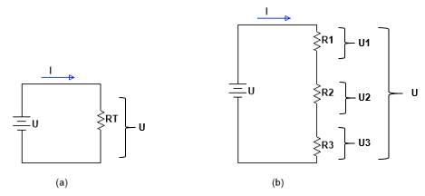
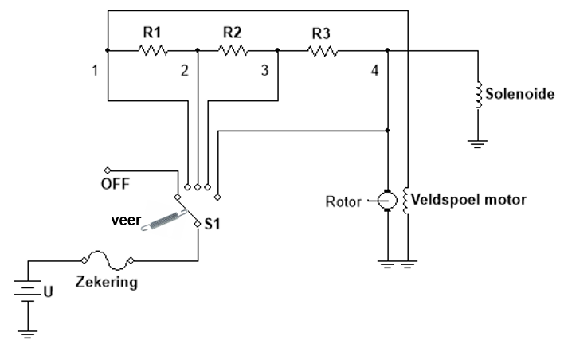

# Totale weerstand

De totale weerstand van een serieschakeling is gelijk aan de som van elke weerstandswaarde die in serie staat.

Wat wordt er van je verwacht?

* Je bepaalt de totale serieweerstand.
* Je legt uit waarom de serieweerstand verhoogt telkens je een weerstand in serie bijschakelt.
* Je past de formule voor serieweerstand toe.

## Toevoegen van een serieweerstand 

Als bij een aantal weerstanden die in serie staan een weerstand wordt toegevoegd, stijgt de totale weerstandswaarde. Waarom? Iedere weerstand biedt een bepaalde weerstand aan de stroom. Voeg je een weerstand toe dan vergroot het verzet tegen de stroom. Hoe meer verzet er ontstaat tegen de stroom, hoe hoger de totale weerstandswaarde wordt.

Figuur 4-6 : Hoe meer weerstanden in serie, hoe groter de totale weerstandswaarde

## Bepalen van de totale serieweerstand RT 

Beschouw figuur 4-7\(b\). Hierin staan drie weerstanden in serie. We willen deze schakeling vervangen door de schakeling van figuur 4-7\(a\) maar de totale weerstandswaarde moet hetzelfde blijven.

Figuur 4-7 : De totale weerstandswaarde in een serieschakeling is gelijk aan de som van de weerstanden in serie

Als de totale weerstandswaarde $${R}_{T}$$ hetzelfde moet zijn als de totale weerstandswaarde van figuur 4-7\(b\), betekent dit dat de totale stroom $$I$$ in beide schakelingen even groot moet zijn. De stromen die door de drie weerstanden $${R}_{1}, {R}_{2}$$ en $${R}_{3}$$ vloeien zijn gelijk aan elkaar en eveneens gelijk aan de totale stroom $$I$$ . Bijgevolg vloeit er door iedere weerstand de stroom $$I$$ _. De_ spanningsval over $${R}_{T}$$ moet eveneens even groot zijn als de som van de spanningsvallen over $${R}_{1}, {R}_{2}$$ en $${R}_{3}$$ . Enkel als aan die voorwaarden voldaan is, is de weerstandswaarde $${R}_{T}$$ even groot als de totale weerstandswaarde in figuur 4-7\(b\). In formulevorm :

$${U= U}_{1}+{U}_{2}+{U}_{3}$$

Vervangen we de spanning door het product weerstand maal stroom dan verkrijgen we :

$$I \times {R}_{T}=I \times {R}_{1} + I \times {R}_{2} +I \times {R}_{3}$$

$$I \times {R}_{T}=I ({R}_{1}+{R}_{2}+{R}_{3})$$

Vermits de stroom in beide schakelingen gelijk is kunnen we deze wegdelen en bekomen we :

$${R}_{T}={R}_{1}+{R}_{2}+{R}_{3}$$

Als er _n_ weerstanden in serie staan is de totale serieweerstand van die schakeling gelijk aan :

$${\mathit{R}}_{\mathit{T}}={\mathit{R}}_{1}+{\mathit{R}}_{2}+{\dots +\mathit{ }\mathit{R}}_{\mathit{n}} (4-1)$$

$${R}_{T}={R}_{1}+{R}_{2}+{R}_{3}+{R}_{4}+{R}_{5}$$ Merk op dat de volgorde waarin de weerstanden van figuur 4-7\(b\) worden opgeteld niet van belang is. Men kan de weerstandsposities fysiek veranderen in het circuit zonder dat de totale weerstand of stroom wordt beïnvloed.

$${R}_{T}$$

## $${R}_{T}={R}_{1}+{R}_{2}+{R}_{3}+{R}_{4}$$ $${R}_{T}$$ Serieschakeling van _n_ gelijke weerstanden 

In een serieschakeling die bestaat uit een aantal weerstanden met dezelfde weerstandswaarde kan de totale weerstandswaarde ook berekend worden door de weerstandswaarde van één weerstand te vermenigvuldigen met het aantal weerstanden in de serieschakeling.

In formu levorm :

$${R}_{T}=n \times R (4-2)$$

Hierin is _n_ het aantal weertanden met dezelfde waarde in de serieschakeling.

$${R}_{T}$$

## Systeemvoorbeeld 

Een shuntmotor is een type motor dat een koppel-snelheidskarakteristiek heeft dat over een groot bereik kan variëren maar toch zijn hoge efficiëntie blijft behouden voor variabele belastingen zoals bv. een elektrische takelmotor. Het voordeel van een DC shunt motor is dat deze toelaat controle te hebben over zowel koppel als snelheid. De snelheid wordt door de spanning gecontroleerd en het koppel door de stroom. Een shuntmotor heeft twee interactie elektromagneten: een veldspoel en een draaiende elektromagneet. Wanneer de volledige spanning zonder stroombegrenzer op de motor wordt aangelegd kan de initiële stroom hoog oplopen. Hierdoor ontstaat er een risico dat de motor verbrand of een overbelasting op de elektrische stroomtoevoer ontstaat en een zekering springt. Om dit te voorkomen wordt de shuntmotor gestart met weerstanden om de stroom te beperken.

Figuur 4-12 : manuele motorstarter voor een DC shuntmotor

In figuur 4-13 is een motorstartercircuit weergegeven waarmee een motor kan opgestart worden met weerstanden. Wanneer de motor wordt aangeschakeld, wordt de schakelaar in stand $$1$$geplaatst. Hierdoor wordt de stroom beperkt tijdens het opstarten. Naarmate de motor begint te draaien wordt de schakelaar doorgeschakeld naar de volgende standen waardoor de stroom vergroot. De schakelaar wordt via een elektromagneet op zijn plaats gehouden. Als de spanning wegvalt brengt de veer de schakelaar in de positie $$OFF$$. Het doel hiervan is de motor te beschermen tegen het eventueel terug opstarten zonder dat de aanloopweerstanden zijn ingeschakeld.

## Test jezelf aangaande de totale serieweerstand 

1. **De volgende weerstanden staan in serie : één van** $$100\mathit{ }\mathit{\Omega },$$ **twee van** $$47\mathit{ }\mathit{\Omega }$$ **en één van** $$330\mathit{ }\mathit{\Omega }.$$ Wat is de totale weerstandswaarde?
2. **Stel dat je beschikt over de volgende weerstanden :** $$1\mathit{ }\mathit{k}\mathit{\Omega },\mathit{ }\mathrm{2,7}\mathit{ }\mathit{k}\mathit{\Omega },\mathit{ }\mathrm{3,3}\mathit{ }\mathit{k}\mathit{\Omega }\mathit{ }$$ **en** **\*\***$$\mathrm{1,8}\mathit{ }\mathit{k}\mathit{\Omega }$$ ****_._ **\*\*Om een totale weerstandswaarde van** $$10\mathit{ }\mathit{k}\mathit{\Omega }$$ **\*\***te\*\* bekomen heb je nog een weerstand nodig. Welk is zijn waarde?

