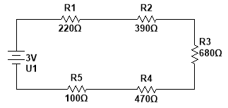

# Weerstanden in serie

Als weerstanden in serie worden geschakeld vormen ze een soort rij waarin weerstanden achter elkaar zijn geplaatst. Een belangrijk kenmerk van de serieschakeling is dat er tussen twee punten maar één stroompad aanwezig is.

Wat is belangrijk?

* Je kan een serieschakeling van weerstanden herkennen.
* Je kan een fysische opstelling van weerstanden \(PCB, breadboard, …\) weergeven in een elektrisch schema.

Figuur 4-2 toont een aantal stroompaden waarin telkens een aantal weerstanden in serie staan geschakeld.

Figuur 4-1 : serieschakeling van drie weerstanden tussen de punten A en B

Zoals reeds aangehaald zie je dat telkens tussen de punten _A_ en _B_ maar één stroompad aanwezig is. Dit is typisch voor een serieschakeling. Door het feit dat er maar één stroompad aanwezig is betekent dit dat de stroom door alle in serie geschakelde weerstanden gelijk is. In figuur 4-1 betekent dit dat $${I}_{R1} = {I}_{R2} = {I}_{R3} .$$

Een serieschakeling hoeft niet persé een rechte lijn te vormen zoals in figuur 4-2. Voorwaarde is dat er maar een stroompad mogelijk is tussen de twee punten waartussen de serieschakeling zich bevind. In figuur 4-2 zijn een aantal mogelijke vormen van een serieschakeling weergegeven.

Figuur 4-2 : Voorbeelden van serieschakelingen. De stroom is overal gelijk en vloeit van A naar B \(elektronenzin\)

$${R}_{2}, {R}_{3}, {R}_{4}$$

b\) Figuur 4-5 toont het elektrisch schema van de breadbaordschakeling van figuur 4-4. Merk op dat een elektrisch schema niet noodzakelijk de fysische voorstelling van de weerstanden moet bevatten. Het schema toont de symbolen van de componenten en geeft weer hoe de componenten onderling elektrisch zijn verbonden. De figuur 4-4 daarentegen geeft de fysische voorstelling weer hoe de schakeling in werkelijkheid zou opgebouwd kunnen worden.

Figuur 4-5

## Test jezelf : weerstanden in serie 

1. Hoe zijn weerstanden met elkaar verbonden in een serieschakeling?
2. Hoe kan je een serieschakeling herkennen?

