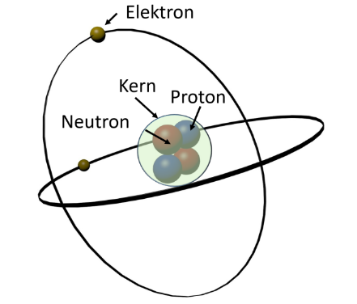
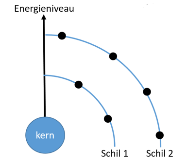
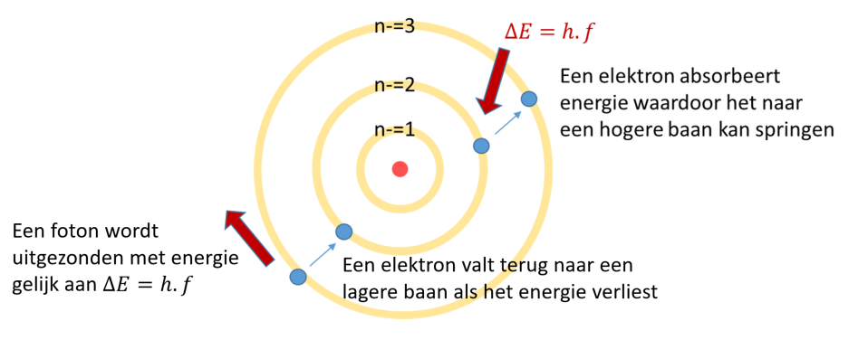
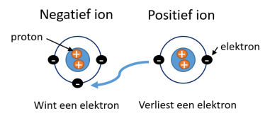
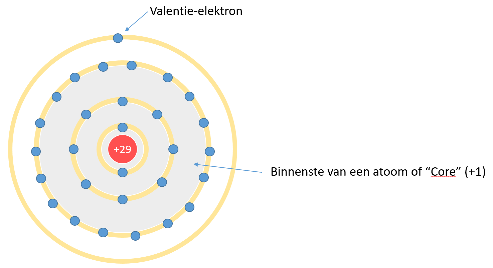
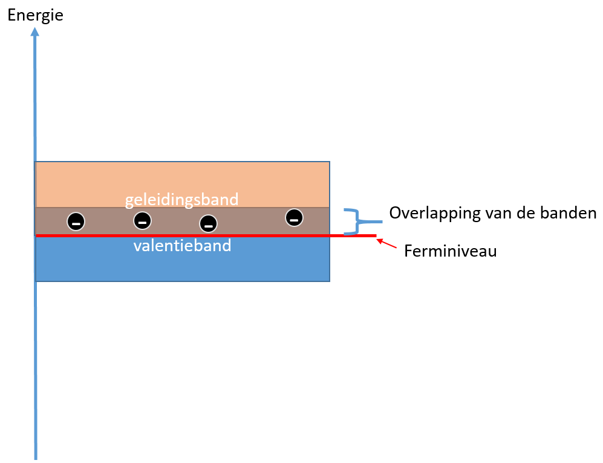
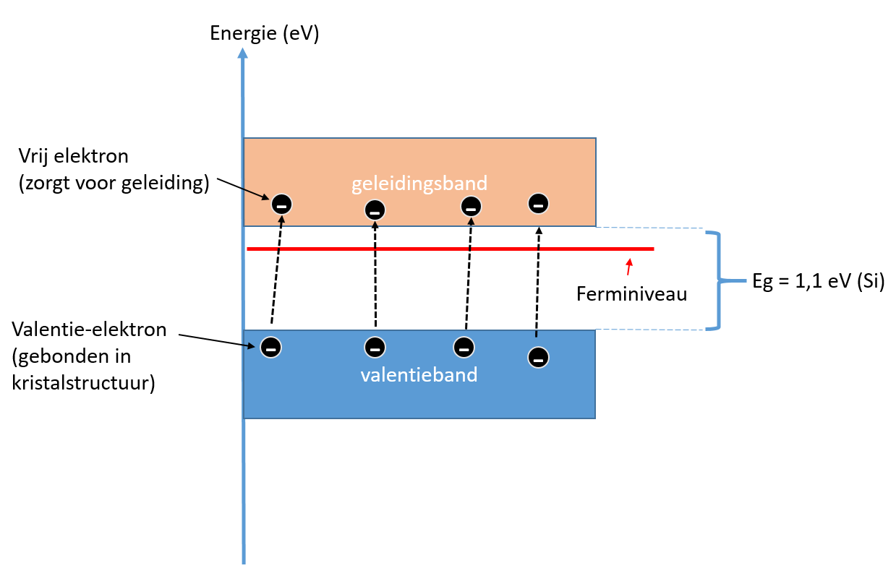
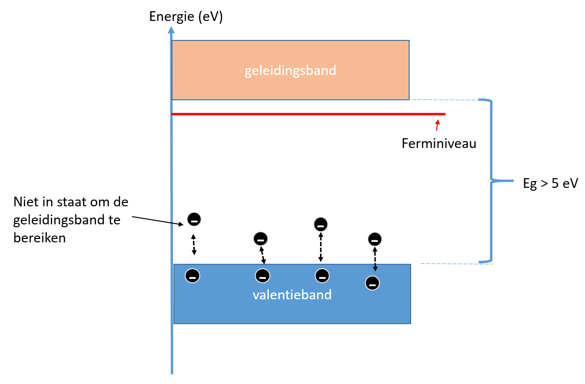

# Atomen

Waarom starten met een sectie over atomen en elektronen? Zoals je weet bestaat alle materie uit atomen en alle atomen bestaan ​​uit elektronen, protonen en neutronen. De configuratie van een aantal elektronen in een atoom is de belangrijkste factor bij het bepalen van hoe goed een geleidend- of halfgeleidend materiaal elektrische stroom kan geleiden.

Wat onthoud je best na deze sectie?

* **De beschrijving van de basisstructuur van een atoom.**
* **De definities van kern, proton, neutron en elektron.**
* **Definitie van atoomnummer.**
* **De definitie van een schil \(shell\) \(rond een atoom\).**
* **De beschrijving van een valentie elektron.**
* **De beschrijving wat ionisatie inhoud.**
* **De verklaring van wat een vrij elektron is.**
* **De definities van geleider halfgeleider en isolator.**

_Figuur 2-1: Bohr-model van helium_

 Een atoom is het kleinste deeltje van een element dat nog alle eigenschappen van dat element bevat. Elk van de 118 bekende elementen bevatten atomen die verschillend zijn van de atomen van de andere elementen. Hierdoor heeft elk element zijn eigen unieke atoomstructuur. Figuur 2-1 toont het Bohr-model van Helium. Dit model stelt de atoomstructuur voor als een soort zonnestelsel waarbij in het midden zich de kern bevind en de elektronen er rond bewegen als planeten rond de zon. De kern bestaat uit positieve deeltjes die protonen worden genoemd en neutrale deeltjes die neutronen worden genoemd. Een elektron heeft een negatieve elektrische lading die gelijk gesteld wordt aan -1. Een proton heeft een positieve elektrische lading die gelijk is aan +1. De neutronen in de kern beschikken over geen elektrische lading en zijn bijgevolg elektrisch neutraal. Het heliumatoom van figuur 2-1 beschikt over 2 protonen en 2 elektronen en is bijgevolg elektrisch neutraal.

## Atoomnummer 

Alle elementen zijn gerangschikt in het periodiek systeem van de elementen in volgorde van hun atoomnummer. Het atoomnummer is gelijk aan het aantal protonen in de kern. Om die reden heeft bijvoorbeeld waterstof het atoomnummer 1 gekregen en helium het atoomnummer 2. In hun normale \(of neutrale\) toestand hebben alle atomen van een bepaald element evenveel elektronen als protonen. De positieve ladingen annuleren bijgevolg de negatieve ladingen. Het atoom heeft een netto lading van nul, waardoor het elektrisch in evenwicht is. Informatie over de atomen in het periodiek systeem wordt meestal als volgt weergegeven :

$${}_{a}{}^{m}X$$

Hierbij is _X_ het symbool voor het atoom, _m_ het massagetal gelijk aan het aantal protonen plus het aantal neutronen in de kern en _a_ het atoomnummer, welk overeenkomt met het aantal protonen in de kern.

## Elekronenschil en banen 

Elektronen bewegen rondom de kern van een atoom en bevinden zich op bepaalde afstanden van de kern. De elektronen dichtbij de kern beschikken over minder energie dan de elektronen die zich bevinden op verder weggelegen banen. Het is bekend dat slechts discrete \(afzonderlijke en verschillende\) waarden van elektronenergieën bestaan binnen atomaire structuren. Daarom bewegen elektronen enkel in een baan die zich op een bepaalde discrete afstand bevindt van de kern.

Energieniveaus

Elke discrete afstand \(baan\) van de kern komt overeen met een bepaald energieniveau. In een atoom worden de banen gegroepeerd in energiebanden \(energy bands\); beter bekend als schillen \(shells\). Een gegeven atoom heeft een vast aantal schillen. Elke schil heeft een vast maximum aantal elektronen op toegestane energieniveaus \(banen\). De schillen zijn aangewezen met 1, 2, 3, enzovoort, waarbij 1 het dichtst bij de kern. \(figuur 2-2 die twee energieniveaus toont\).

Figuur 2-2 : Energieniveaus stijgen als de afstand tot de kern vergroot

Het aantal schillen is verschillend van element tot element. Het aantal elektronen in iedere schil kan bepaald worden volgens een voorspelbaar patroon. Dit patroon kan bepaald worden volgens de formule _2N_ _2_ , waarbij N het nummer is van de schil. Op de eerste schil van een atoom \( _N = 1_ \) kunnen maximaal twee elektronen \( 2.1 2 = 2 \) aanwezig zijn. Op de tweede schil kunnen er maximaal 8 elektronen \( _N = 2 =&gt; 2.2_ _2_ _= 8_ \) aanwezig zijn. Op de derde schil tot 18 elektronen en de vierde schil tot 32 elektronen. In veel elementen beginnen de elektronen reeds met het vullen van de vierde schil nadat er acht elektronen in de derde schil aanwezig zijn.

## Valentie-elektronen 

Elektronen die zich in banen verder van de kern bevinden, hebben een hogere energie en zijn minder stevig gebonden aan het atoom dan dichter bij de kern. Dit komt doordat de aantrekkingskracht tussen de positief geladen kern en de negatief geladen elektronen afneemt met toenemende afstand van de kern. Elektronen met de hoogste energie zijn aanwezig in de buitenste schil van een atoom en zijn relatief zwak gebonden aan het atoom. Deze buitenste schil is bekend als de **valentieband** en de elektronen in deze schil worden **valentie-elektronen** genoemd. Deze valentie-elektronen dragen bij aan chemische reacties en binding binnen de structuur van een materiaal. Ze bepalen eveneens de elektrische eigenschappen van dit materiaal

## Vrije elektronen en ionen 

Als een elektron energie absorbeert verhoogt zijn energietoestand waardoor het beweegt naar een hogere baan rondom de kern. De energietoename van het elektron kan bekomen worden via omgevingswarmte, een externe spanningsbron, …. of licht dat invalt op het elektron. Wanneer door bijvoorbeeld via lichtinval een elektron een foton absorbeert met voldoende energie kan het elektron voldoende energie bekomen om uit het atoom te ontsnappen. Men spreekt in dat geval van een **vrij elektron** .

Figuur 2-3 : door toevoeging van energie gaat een elektron zich in een hogere baan bewegen terwijl door energie-afname het elektron zich in een lagere baan gaat bewegen

Elke keer dat bij een atoom, of groep van atomen, een elektron vertrekt of een vreemd elektron bijkomt, wordt het atoom, of groep van atomen, **een ion** . Als een elektron ontsnapt uit het neutrale waterstofatoom \(symbool H\) blijft het waterstofatoom achter met één netto positieve lading \(proton\) in de kern. Dit waterstofatoom is hierdoor een **positief ion** geworden, aangeduid door H + . In andere gevallen kan een atoom, of groep van atomen, een of meerdere vrije elektronen aantrekken. Hierdoor zijn er bij dit atoom, of groep van atomen, meer elektronen aanwezig dan protonen. Men spreekt in dat geval van een negatief ion. Figuur 2-4 geeft een positief en negatief ion weer.

Figuur 2-4 : ontstaan van een positief en negatief ion

## Het koperatoom 

Koper is het meest gebruikte metaal in elektrische installaties. Het koperatoom heeft 29 elektronen die om de kern cirkelen in vier schillen, zoals weergegeven in figuur 2-5. Merk op dat de vierde of de buitenste schil, de valentieband, maar één valentie-elektron bezit. De binnenste schillen worden de “core” genoemd.

Wanneer het valentie-elektron in de buitenste schil van het koperatoom voldoende thermische energie krijgt, kan het uit het “ouder”-atoom breken en wordt het een vrij elektron. In een stuk koper is bij kamertemperatuur een "zee" van deze vrije elektronen aanwezig. Deze elektronen zijn niet gebonden aan een bepaald atoom, maar zijn vrij om te bewegen in het koper materiaal. Vrije elektronen maken van koper een uitstekende geleider en zij maken het vloeien van elektrische stroom mogelijk.

Figuur 2-5 : Het koperatoom

## Indeling van de gebruikte materialen 

Drie categorieën van materialen worden gebruikt in de elektronica: geleiders, halfgeleiders en isolatoren.

**GELEIDERS \(CONDUCTORS\)**

Geleiders zijn materialen waardoor gemakkelijk stroom kan vloeien. Ze hebben een groot aantal vrije elektronen en worden gekenmerkt door één tot drie valentie elektronen in hun structuur. De meeste metalen zijn goede geleiders. Zilver en goud zijn de beste geleiders en koper is de volgende. Koper is het meest gebruikte geleidend materiaal omdat het goedkoper is dan zilver. Koperdraad wordt vaak gebruikt als een geleider in elektrische circuits.

Wanneer een elektron voldoende energie bevat kan het van de valentieband overgaan naar de geleidingsband. De geleidingsband kan aanzien worden als de volgende schil rond het atoom waarin in eerste instantie geen elektronen aanwezig zijn. Bij het absoluut nulpunt bevinden alle valentie-elektronen zich in de valentieband. Door het stijgen van de energie \(bv. door het toevoegen van omgevingswarmte\) worden de elektronen beweeglijker en de energietoename zorgt ervoor dat ze zich verder van de kern bewegen. Bij geleiders overlappen de valentieband en de geleidingsband elkaar. Als de elektronen voldoende energie bevatten, overstijgen ze een bepaald niveau dat Ferminiveau wordt genoemd. Het Ferminiveau komt overeen met de hoeveelheid energie een elektron moet hebben om van de valentieband naar de geleidingsband te kunnen bewegen. Bij geleiders is het ook de grens tussen de valentieband en de geleidingsband. Wanneer een elektron zich in de geleidingsband bevindt, is het zodanig ver weg van de kern dat het elektron geen invloed \(aantrekkingskracht\) meer ondervind. Het elektron is dan een vrij elektron en kan zich vrij binnen de geleider bewegen.

Figuur 2-6 : Bij een geleider overlapt de geleidingsband met de valentieband zodat bij kamertemperatuur reeds voldoende vrije elektronen aanwezig zijn om voor geleiding te zorgen

HALFGELEIDERS \(SEMICONDUCTORS\)

Halfgeleiders worden onder de geleiders ingedeeld in hun vermogen om stroom te geleiden maar hebben minder vrije elektronen dan de geleiders. Halfgeleiders bezitten vier valentie elektronen in hun atomaire structuren. Vanwege hun unieke eigenschappen worden sommige halfgeleidermaterialen gebruikt als de basis voor elektronische apparaten zoals de diode, transistor en geïntegreerde schakeling. Silicium en germanium zijn vaak gebruikte halfgeleidermaterialen.

Figuur 2-7 : Bij een halfgeleider is er een \(relatief kleine\) energiegap \(Eg\) tussen valentieband en geleidingsband. Om een vrij elektron te bekomen moet er energie aan de valentie-elektronen toegevoegd worden groter dan deze Eg-waarde.

Zoals in figuur 2-7 te zien is, is er een zekere afstand tussen de valentieband en de geleidingsband. Dit betekent dat de elektronen een zekere energiehoeveelheid moeten overbruggen alvorens ze in de geleidingsband kunnen terechtkomen. Afhankelijk van het halfgeleidermateriaal verschilt de afstand tussen geleidingsband en valentieband. Zo is er voor silicium de afstand in energie tussen de valentieband en de geleidingsband gelijk aan 1.1 eV. De eenheid eV staat voor elektronvolt en geeft weer de hoeveelheid energie die een deeltje, met lading gelijk aan de lading van 1 elektron, moet bezitten om in een elektrisch veld een weg af te leggen tussen twee punten waartussen een potentiaalverschil staat van 1 V. Voor germanium is dit 0.67 eV \(elektronvolt\) en voor galiumarsenide 1,43 eV. Dit betekent dat om geleiding te bekomen in silicium er een energiehoeveelheid moet toegevoegd worden van minstens 1,1 eV om een valentie-elektron te laten bewegen naar de geleidingsband toe. In tegenstelling tot geleiders is er bij halfgeleiders maar pas echt sprake van geleiding als een bepaalde hoeveelheid energie wordt toegevoegd. Deze toegevoegde energie moet groter zijn dan het aantal eV tussen de twee banden. Deze energiehoeveelheid staat bekend als Eg \(energy gap of bandafstand\)

ISOLATOREN \(INSULATORS\)

Isolatoren zijn niet-metalen materialen die slechte geleiders van elektriciteit zijn. Ze worden gebruikt om te verhinderen dat er stroom zou vloeien daar waar het niet gewenst is. Isolatoren hebben geen vrije elektronen in hun structuur. De valentie elektronen worden gebonden aan de kern en niet beschouwd als zijnde “vrij”. Hoewel niet-metalen elementen in het algemeen worden beschouwd als isolatoren zijn, de meeste praktische isolatoren die in elektrische en elektronische systemen gebruikt worden, verbindingen zoals glas, porselein, teflon, en polyethyleen.

Figuur 2-8 : Bij een isolator is de energy-gap zodanig groot dat bij normale omstandigheden de valentie-elektronen onvoldoende energie bezitten om de afstand tussen valentieband en geleidingsband te overbruggen waardoor ze niet \(of sterk onvoldoende\) in de geleidingsband terecht komen en bijgevolg geen geleiding ontstaat.

Bij een isolator is de energy gap tussen valentieband en geleidingsband groter dan 5 eV. Dit betekent dat de elektronen redelijk wat energie moeten toegevoerd krijgen alvorens ze uit de valentieband losgerukt kunnen worden zodat ze zich begeven naar de geleidingsband. Hieruit kan je afleiden dat een isolator niet in alle gevallen een isolator blijft. Als er voldoende energie is toegevoerd, kan dit isolatiemateriaal een perfecte geleider worden. Om te voorkomen dat dit bewust gebeurt is het begrip nominale isolatiespanning ingevoerd. Als de nominale isolatiespanning van een bepaald toestel 5 kV is betekent dit dat de behuizing \(isolatie\) van dit toestel tot 5 kV zich gedraagt als een goede isolator maar als de spanning hoger wordt dan 5 kV, kan dit isolerend materiaal geleidend worden. Dit komt dat bij die spanning de valentie-elektronen voldoende energie hebben om in de geleidingsband te geraken waardoor het materiaal geleidend wordt voor elektrische stroom.

## Test jezelf aangaande Atomen 

1. 1. Wat is het elementair deeltje van negatieve lading?
   2. Definieer een atoom.
   3. Uit wat bestaat een atoom?
   4. Definieer atoomnummer
   5. Hebben alle elementen dezelfde soorten atomen?
   6. Wat is een vrij elektron?
   7. Wat is een schil \(shell\) in de atomaire structuur?
   8. Noem twee geleidende materialen.

