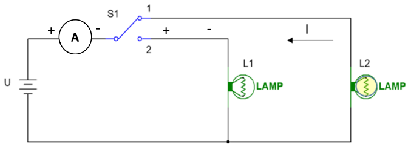
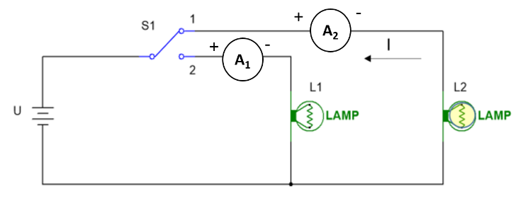
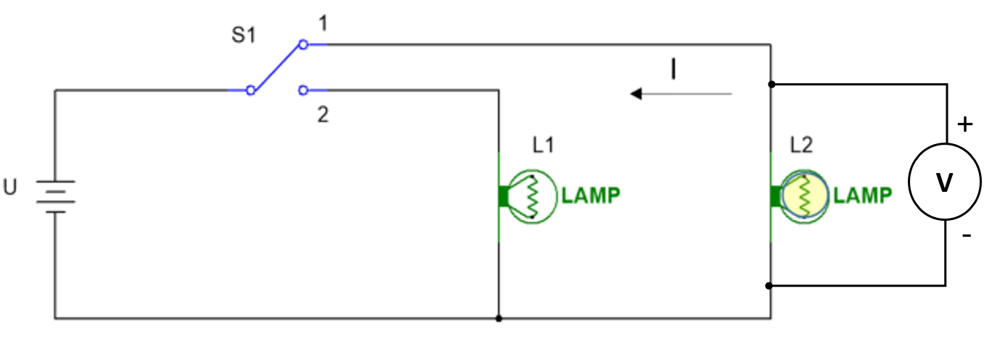
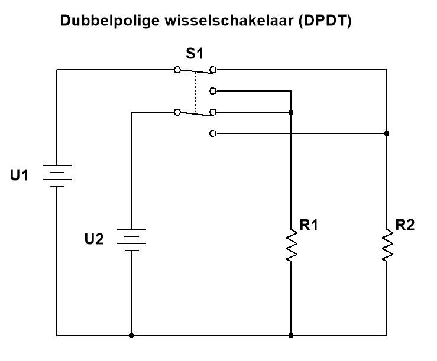

# Oplossingen

## Oplossingen Test jezelf vragen 

Sectie 2-1 Atomen

1. Een elektron is het elementaire deeltje van negatieve lading
2. Een atoom is het kleinste deeltje van een element dat nog alle eigenschappen van dit element bevat.
3. Een atoom bestaat uit een kern met positieve ladingen en neutronen. Daarrond bewegen elektronen in bepaalde banen.
4. Een atoomnummer geeft het aantal protonen in een kern weer.
5. Neen, ieder element heeft zijn eigen specifiek atoom.
6. Een vrij elektron is een elektron dat zich buiten een schil \(shell\) bevind en zich verwijdert heeft van het “ouder-atoom”.
7. Een schil bestaat uit energiebanden waarin elektronen zich in een baan rondom de kern van een atoom kunnen bewegen.
8. Koper en zilver

Sectie 2-2 Elektrische lading

1. _Q_ is het symbool voor lading.
2. Coulomb is de eenheid van lading en _C_ is het symbool voor coulomb.
3. Positieve lading en negatieve lading.

Sectie 2-3 Spanning

1. Spanning is energie per eenheid lading
2. De eenheid van spanning is volt \( _V_ \)
3. $$U= \frac{W}{Q}= \frac{24 J}{10 C}=\mathrm{2,4} V$$
4. Batterij, brandstofcel, voeding \(power supply\), zonnecel, generator, thermokoppel en piëzo-elektrische sensoren
5. Oxidatie-reductie reacties.

**Sectie 2-4 Stroom**

1. Stroom is de stroomsnelheid \(debiet\) van lading; de eenheid van stroom is de ampère \(_A_\)
2. Er zijn _6,25 . 10\_\_18_ elektronen in _1 C_.
3. $$I= \frac{Q}{t}= \frac{20 C}{4 s}=5 A$$

Sectie 2-5 Weerstand

1. Weerstand is het verzet tegen stroom. De eenheid van weerstand is ohm \(Ω\).
2. De vaste en variabele weerstanden zijn de twee grootste categorieën van weerstanden. De waarde van een vaste weerstand kan niet worden veranderd terwijl dit wel kan bij een variabele weerstand.
3. Eerste ring geeft het eerste cijfer van de weerstand, de tweede ring het tweede cijfer, de derde ring de vermenigvuldigingsfactor \(of het aantal nullen volgend achter de eerste twee cijfers\), de vierde ring het percentage van tolerantie op de weerstandswaarde.
4. \(a\) 4,7 kΩ ± 5%
5. 62 k kΩ ± 10%
6. 18 Ω ± 5%
7. 22,6 k kΩ ± 0,5 %

5. \(a\) 33 Ω

\(b\) 5600 Ω

\(c\) 900 Ω

1. \(d\) 6,8 MΩ

6. Een rheostaat heeft twee aansluitpennen en wordt gebruikt om stroom te regelen. Een potentiometer heeft drie aansluitpennen en wordt gebruikt om spanning te regelen.

7. Thermistor – temperatuur; Rekstrookje – kracht; fotocel \(bv. LDR\) – licht

Sectie 2-6 Elektrische schakeling

1. De basiselementen van een elektrische schakeling zijn de spanningsbron, een stroompad tussen een belasting en de spanningsbron.
2. Een open circuit is een circuit waar geen stroompad aanwezig is voor de stroom \(met andere woorden er kan geen stroom vloeien\).
3. Een gesloten circuit bevat een volledig stroompad. \(met andere woorden door een gesloten circuit vloeit stroom\)
4. Een ideale open schakelaar heeft een weerstand gelijk oneindig en een ideale gesloten schakelaar heeft een weerstand gelijk aan _0_ _Ω._
5. Een zekering wordt gebruikt om een schakeling te beschermen tegen een te grote stroomdoorgang.
6. Eens een zekering doorbrandt, moet deze door een andere vervangen worden. Als een stroomonderbreker afschakelt, kan deze gereset worden en terug gebruikt worden.
7. De massa is het referentiepunt met spanningswaarde _0 V_ ten opzichte van de andere punten in de schakeling.

Sectie 2-7 Stroom- en spanningsmetingen in elektrische schakelingen

1. Ampèremeter meet stroom, voltmeter meet spanning en Ohmmeter meet weerstand
2.  Meten van de stroom met _2 A_-meters en met _1 A_-meter :

Figuur 2-66 : links : plaatsen van 2 A-meters om de stroom door iedere lamp te meten; rechts plaatsen van 1 A-meter om de stroom door iedere lamp te meten

1. Aansluiten van voltmeter om spanning over _L2_ te meten :

Figuur 2-67 meten van de spanning over de lamp L2

1. Twee display-typen voor DMM zijn het LED-display en het LCD-display. Het LCD-display vereist weinig stroom maar is moeilijk af te lezen bij weinig omgevingslicht. Het LED-display kan ook in het donker worden afgelezen en het reageert veel sneller. Het LED-display verbruikt wel meer stroom dan het LCD-display.
2. De resolutie is de kleinste stijging van een hoeveelheid dat de meter kan meten.

## Oplossingen waar / niet waar vragen 

1. Niet waar
2. Niet waar
3. Waar
4. Waar
5. Niet waar
6. Niet waar
7. Waar
8. Waar
9. Niet waar
10. Waar

## Oplossingen multiple choice test 

1. \(b\)2. \(a\)3. \(c\)4. \(c\)5. \(b\)6. \(b\)7. \(c\)8. \(d\)9. \(d\)10. \(b\)11. \(b\)

12 \(e\)13. \(b\)14. \(b\)15. \(c\)

## Oplossing oefeningen 

## Sectie 2-2 : elektrische lading 

1. _80 x 10_ _12_ _C_
2. _4_ _,64 x 10_ _-18_ _C_

## Sectie 2-3 : spanning 

1. \(a\) _6 V_ \(b\) _4 V_ \(c\) _20 V_
2. 20 V
3. 12,5 V

Sectie 2-4 : stroom

1. \(a\) _8,1 A_ \(b\) _20 A_ \(c\) _2,5 A_
2. _20 mA_
3. _4 s_

Sectie 2-5 : Weerstand

1. \(a\) 6,2 kΩ± 5%
2. 47 kΩ± 5%
3. 2,2kΩ ± 10%
4. 120 Ω ± 5%
5. 5,6 Ω ± 5%
6. 820 kΩ± 5%
7. 9,1 MΩ ± 5%

10. Oranje Wit Bruin Goud

11. \(a\) 100 Ω± 5% \(b\) 510 k Ω± 5% \(c\) 68 kΩ± 10%

1 2. \(a\) 24 kΩ ± 1% \(b\) 60,4 Ω ±1% \(c\) 9,31 k Ω ± 1%

Sectie 2-6 : De elektrische schakeling

1. De draaischakelaar staat in stand _2_ en drukknop _3_ wordt ingedrukt \(dit is de derde drukknop te beginnen met de bovenste drukknop\). De lampen _L2_ en deze voor “ _juist_ ” branden dan.

Sectie 2-7 : stroom- en spanningsmetingen in elektrische schakelingen

1. Ampèremeter wordt in de stroomketen in serie met de weerstanden _R\_\_1_ en _R\_\_2_ geplaatst. De positieve aansluiting van de meter \(rood meetsnoer\) wordt geplaatst aan de zijde van de positieve pool van de spanningsbron Ubronen de negatieve aansluiting \(zwart meetsnoer\) gericht naar de negatieve pool van de spanningsbron. De spanningsmeter wordt over R1 geplaats met de het rode meetsnoer aan de zijde van de positieve pool en het zwart meetsnoer tussen de twee weerstanden in.
2. \(a\) Positie _1_ : _V_ _1_ = _0 V_ en _V_ _2_ = $${U}_{bron}$$ Positie _2_ : _V_ _2_ = $${U}_{bron}$$ en _V_ _1_ = _0 V_
3. 1. De stroommeter wordt geplaatst tussen $${U}_{bron}$$en schakelaar _S1_.
4. Zie figuur 2-68

Figuur 2-68

