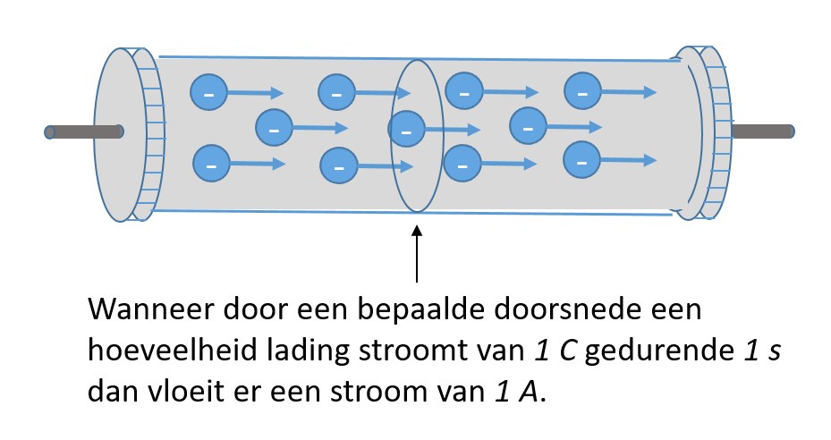
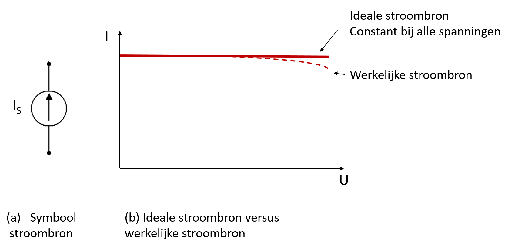
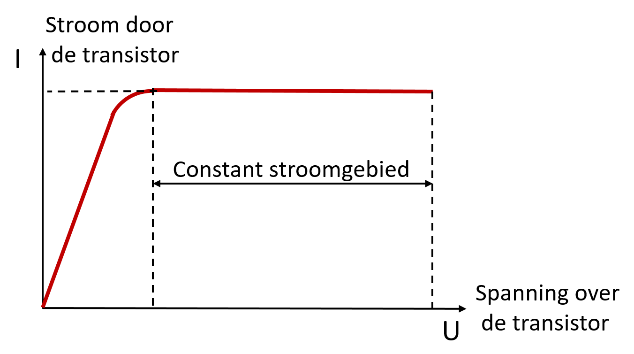

# Stroom

Spanning geeft energie die elektronen in staat stelt om door een elektrische schakeling te bewegen. Deze beweging van elektronen wordt stroom genoemd. Dit resulteert in arbeid \( _W_ \) dat verricht wordt in een elektrisch systeem.

Wat onthoud je best?

* De definitie van stroom en zijn kenmerken.
* De verklaring aangaande de beweging van elektronen.
* De formule voor stroom.
* De eenheid van stroom.

In alle geleidende en halfgeleidende materialen zijn elektronen aanwezig. In de buitenste- of valentieschil driften de elektronen schijnbaar willekeurig in alle richtingen. Van atoom tot atoom bewegen vrije elektronen in de structuur van het materiaal zoals in figuur 2-18 is weergegeven.

Figuur 2-18 : beweging van vrije elektronen in een geleidend materiaal

In figuur 2-18 \(a\) zijn vrije elektronen weergegeven in een stukje metaal. De elektronen worden losjes gebonden met de positieve metaalionen in het materiaal. Vanwege de thermische energie bewegen ze vrij over de kristalstructuur van het materiaal.

Als er een spanning wordt aangebracht aan een geleidend of halfgeleidend materiaal, wordt een uiteinde positief en het ander negatief. De afstotende kracht die door de negatieve spanning aan de linkerzijde wordt veroorzaakt, doet de vrije elektronen \(negatieve ladingen\) verplaatsen naar rechts. De aantrekkingskracht door de positieve spanning aan de rechterzijde trekt de vrije elektronen naar rechts. Het resultaat is een netto beweging van de vrije elektronen van het negatieve uiteinde van het materiaal naar het positieve uiteinde zoals in de figuur 2-18 is weergegeven.

De verplaatsing van vrije elektronen van het negatieve uiteinde van een materiaal naar het positieve uiteinde is de elektrische stroom, voorgesteld door _I_ . De elektrische stroom is een maat voor hoe snel lading door een materiaal vloeit. De stroom in een geleidend materiaal wordt gemeten door het aantal elektronen \(hoeveelheid van lading\) te meten dat in een bepaalde tijdseenheid vloeit door een bepaald punt. In formulevorm :

$$\mathit{I}=\mathit{ }\frac{\mathit{Q}}{\mathit{t}}$$ \(2-3\)

Hierbij is _I_ de stroom in ampère \( _A_ \), _Q_ de lading van de elektronen in coulomb \( _C_ \) en _t_ de tijd in seconden \( _s_ \).

Als een eenvoudige analogie kan je de elektrische stroom vergelijken met water dat beweegt in een communicerend vatensysteem. De stroom is dan het debiet \(hoeveelheid water per tijdseenheid\) van het water dat door deze buis stroomt. De spanning is dan het drukverschil in de vaten om het water te laten circuleren in de leiding. Zolang er drukverschil is zal er water blijven vloeien. Wanneer de druk in beide vaten gelijk is, staat het water in beide vaten even hoog en is er geen waterstroom meer. Zo zal ook bij een elektrische schakeling enkel stroom vloeien tussen twee punten als er een spanningsverschil is tussen deze twee punten. Van zodra de spanning op beide punten dezelfde waarde heeft, vloeit er geen stroom meer tussen deze twee punten.

Figuur 2-19 : analogie tussen stromend water en elektrische stroom

## Eenheid van stroom : Ampère 

Elektrische stroom wordt gemeten in een eenheid die ampère wordt genoemd en gesymboliseerd door _A_ . Per definitie is één ampère \( _1 A_ \) de hoeveelheid stroom die ontstaat wanneer er een aantal elektronen met een totale lading van één coulomb \( _1 C_ \) zich door een bepaalde dwarsdoorsnede verplaatst in één seconde \( _1 s_ \).

Figuur 2-20 : omschrijving van een stroomsterkte van 1 A

$$I= \frac{Q}{\mathrm{t}}= \frac{20 C}{5 s}=4 A$$

## De stroombron 

### De ideale stroombron 

Een ideale stroombron zorgt voor een constante spanning ongeacht de belasting op deze bron. Net zoals er geen ideale spanningsbron bestaat, bestaat er ook geen ideale stroombron. Een werkelijke stroombron benadert wel een ideale stroombron in de praktijk. Ook hier nemen we aan dat een werkelijke stroombron ideaal is tenzij anders vermeld.

Het symbool voor een stroombron is in figuur 2-21\(a\) vermeld. De grafiek voor een ideale stroombron is een horizontale lijn zoals in figuur 2-21\(b\) is weergegeven. Bij een niet-ideale stroombron daalt de stroom zoals getoond door de stippellijn.

Figuur 2-21 : symbool en stroom-spanningskarakteristiek van een stroombron

### Werkelijke stroombron 

Elektrische voedingen worden normaal gezien als spanningsbronnen vermits zijn de meest voorkomende vorm als bron voor elektrische energie zijn in het laboratorium. Echte stroombronnen zijn echter een heel ander type voeding. Stroombronnen kunnen worden gebruikt als “stand-alone” instrumenten of kunnen worden gecombineerd met andere instrumenten zoals een DC-spanningsbron, digitale multimeter \(DMM\) of een functiegenerator. Voorbeeld van combinatietoestellen zijn bronmetingseenheden. Deze eenheden kunne worden ingesteld als spannings- of stroombron en bevatten een ingebouwde digitale multimeter en eventueel nog andere meetinstrumenten. Deze toestellen worden voornamelijk gebruikt voor het testen van transistoren en andere halfgeleiders.

 In de meeste schakelingen met een transistor fungeert deze transistor als stroombron. Dit komt omdat een gedeelte van de uitgangskarakteristiek van een transistor horizontaal verloopt \(zie figuur 2-22\).

_Figuur 2-22 : gedeelte van de uitgangskarakteristiek van een transistor met het constante stroomgedeelte aangeduid._

Het vlakke gedeelte van de grafiek geeft aan waar de transistor constante stroom levert over een bereik van spanningen. Dit constante stroomgebied kan worden gebruikt om een constante stroombron te vormen.

## Test jezelf aangaande stroom 

1. Definieer stroom en geef zijn eenheid.
2. **Hoeveel elektronen zorgen samen voor** _**1 C**_ **lading?**
3. **Wat is de stroom in ampère als** _**20 C**_ **stroomt door een punt in de draad in** _**4 s**_ **?**

