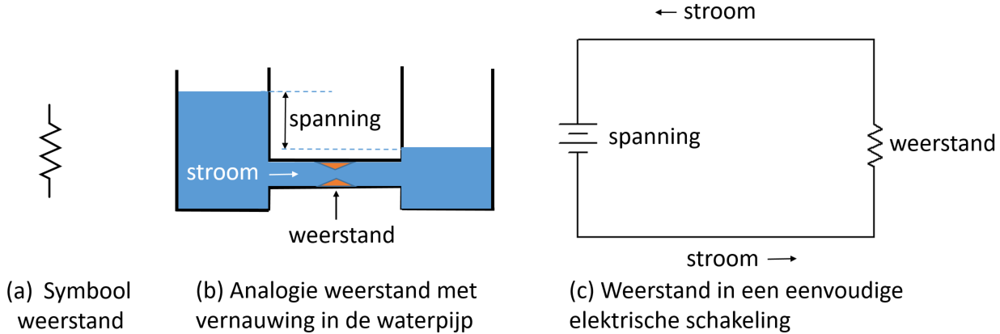
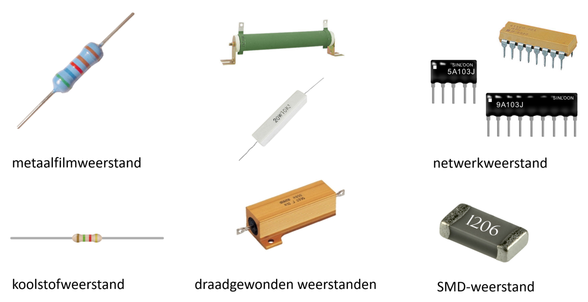
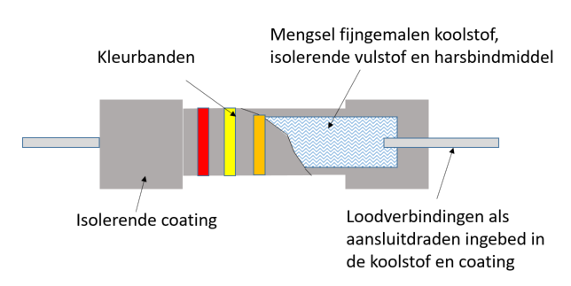
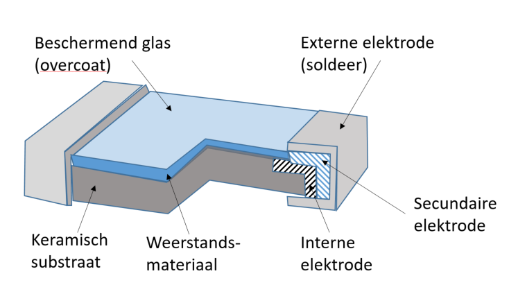
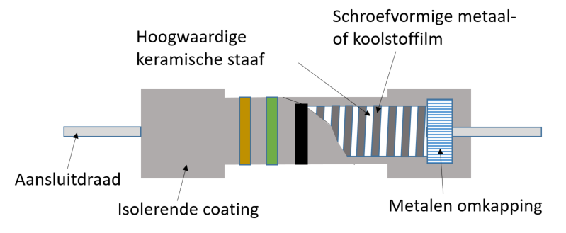
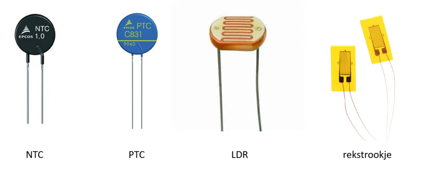
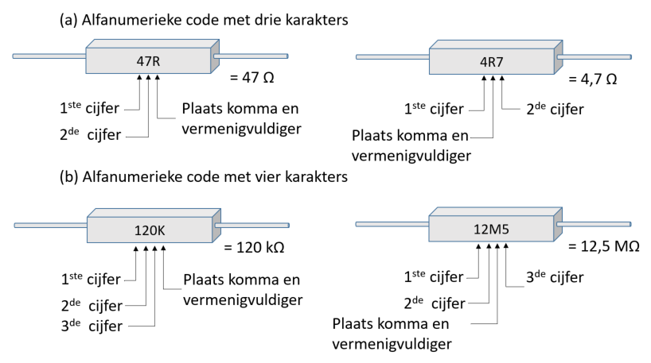

# Weerstand

Wanneer er stroom door een materiaal vloeit bewegen de vrije elektronen door het materiaal. Soms botsen deze vrije elektronen met atomen. Deze botsingen zijn de oorzaak dat elektronen een deel van hun energie verliezen en bijgevolg hun beweging beperkt. Hoe meer botsingen, hoe meer de stroom van elektronen beperkt zal worden. Deze beperking varieert en is afhankelijk van het type materiaal. De eigenschap van een materiaal die de stroom van elektronen beperkt wordt resistentie genoemd en aangeduid met _R_ .

Wat onthoud je best?

* De definitie van weerstand en de kenmerken van weerstand.
* Noem en definieer de eenheid van weerstand.
* De beschrijving van de basistypen van weerstanden.
* Hoe je een weerstandswaarde volgens kleurcode of via codelabeling kan bepalen.

Weerstand is het verzet tegen stroom. In figuur 2-23 is het schemasymbool voor weerstand weergegeven. Als er stroom vloeit door materiaal biedt dat een zekere weerstand biedt wordt warmte geproduceerd in dit materiaal. Deze warmte wordt veroorzaakt door botsingen van vrije elektronen met atomen. Dit is de reden waarom een geleider \(elektriciteitsdraad\), die typisch een zeer kleine weerstand heeft, warm of zelfs heet kan worden als er voldoende stroom kan vloeien. Om die reden steek je nooit een opgerolde elektriciteitsdraad in het stopcontact. De warmteontwikkeling in de opgerolde draad kan onvoldoende weggeventileerd worden waardoor het maximaal dissipeerbaar vermogen van deze draad zal \(gevoelig\) dalen.

Figuur 2-23 : \(a\) symbool; \(b\) en \(c\) analogie weerstand met water

Weerstand kan je vergelijken met een klep in de waterleidingbuis of een vernauwing. Als de klep meer geopend wordt is er minder weerstand en zal de waterstroom toenemen. Als de klep meer gesloten wordt, stijgt de weerstand en gaat de waterstroom door de leiding afnemen.

## De eenheid van weerstand : Ohm 

De weerstand _R_ wordt uitgedrukt in de eenheid ohm. Deze eenheid wordt gesymboliseerd door de Griekse hoofdletter omega \( Ω \). Eén ohm \( _1_ Ω\) is de weerstandswaarde wanneer er een stroom van één ampère \( _1 A_ \) door de weerstand vloeit terwijl er een spanningsval van één volt \( _1 V_ \) over deze weerstand staat.

Geleiding

De omgekeerde waarde van weerstand wordt geleiding genoemd. Geleiding wordt voorgesteld door _G_ . Het is een maat van gemak waarmee stroom kan vloeien door een materiaal. De formule voor geleiding is :

$$\mathit{G}=\mathit{ }\frac{1}{\mathit{R}}$$ \(2-4\)

$$G= \frac{1}{\mathrm{R}}= \frac{1}{22 k\Omega \mathrm{ }}=45.5 \mu S$$ De eenheid van geleiding is Siemens, symbool _S_ . Af en toe vind je ook de verouderde eenheid _mho_ voor geleiding nog terug.

## Indeling van weerstanden 

Onderdelen die specifiek ontworpen zijn om een bepaalde weerstand te bieden aan elektrische stroom worden weerstanden genoemd. De belangrijkste toepassing van weerstanden zijn het beperken van stroom, het verdelen van spanning en genereren in sommige toepassingen het genereren van warmte. Hoewel er verschillende soorten van weerstanden zijn in allerlei verschillende maten kunnen ze allemaal worden geplaatst in één van de twee belangrijkste categorieën van weerstanden. Namelijk de vaste weerstanden en de variabele weerstanden.

### Categorie vaste weerstanden 

Vaste weerstanden zijn beschikbaar met een grote selectie van resistentiewaarden die ingesteld worden tijdens de productie. Deze resistentiewaarden kunnen niet gemakkelijk worden verandert. Vandaar de benaming vaste weerstanden. Er bestaan verschillende soorten vaste weerstanden. Elke soort bestaat uit een specifiek materiaal en wordt volgens een bepaalde werkwijze gefabriceerd. Figuur 2-24 toont een aantal voorkomende soorten.

Figuur 2-24 : typische vaste weerstanden

Koolstofweerstand

Een veel voorkomende vaste weerstand is de koolstofweerstand. Deze is gemaakt van een mengsel fijngemalen koolstof, isolerende vulstof en een harsbindmiddel. De verhouding koolstof ten opzichte isolerende vulstof bepaalt de weerstandswaarde. Het mengsel wordt gevormd in staafjes die worden gesneden in korte stukken waaraan twee loodverbindingen als aansluitdraden worden bevestigd. De gehele weerstand wordt vervolgens ingekapseld in een isolerende coating voor bescherming.

Figuur 2-25 : samenstelling koolstofweerstand

Chipweerstand

De chipweerstand is een ander soort vaste weerstand en valt onder de categorie van SMT \(oppervlakte-mount-technologie\) componenten. De chipweerstand heeft het voordeel van een zeer kleine grootte voor compacte samenstellingen. De kleine-waarde chip weerstand \( _\_\_Ω_ \) kan worden gemaakt met zeer nauwkeurige toleranties \( _± 0,5 %_ \) en worden gebruikt voor stroommeting \(current-sensing\) weerstanden. Chipweerstanden zijn opgebouwd uit een keramisch substraat als drager. Daarop ligt een dunne laag weerstandsmateriaal dat afgedekt is met een beschermende glazen overcoat. Aan beide zijden zijn electroden aangebracht.

Figuur 2-26 : opbouw chipweerstand

\(Metaal\)filmweerstand

Een filmweerstand bestaat uit resistief materiaal dat gelijkmatig is afgezet op een hoogwaardige keramische staaf. De resistieve film kan koolstof \(carbon folie\) of nikkel chroom \(metaalfilm\) zijn. Bij dit soort weerstanden wordt de gewenste weerstandswaarde verkregen door het verwijderen van het weerstandsmateriaal in een spiraalvormig patroon langs de stang met een spiraalvormige techniek. Met deze methode kunnen zeer nauwe toleranties worden bereikt.

Figuur 2-27 : samenstelling \(metaal\)filmweerstand

Metaalfilmweerstanden zijn ook beschikbaar in de vorm van een weerstandsnetwerk. Een weerstandsnetwerk bestaat uit een aantal dezelfde weerstandswaarden die langs één zijde met elkaar verbonden zijn. Er bestaan ook weeerstandsnetwerken in IC-vorm. Hier gaat het over een aantal dezelfde weerstandswaarden die gewoon naast elkaar zijn weergegeven in het IC.

Draadgewonden weerstanden

De draadgewonden weerstanden zijn weerstanden die opgebouwd zijn met een resistieve draad die opgewonden is rond een isolerende staaf en daarna verzegeld. Draadgewonden weerstanden worden gebruikt wanneer de weerstanden bestand moeten zijn tegen relatief hoge vermogens. Omdat ze opgebouwd zijn met een opgerolde draad hebben ze een significante inductie. Dit houdt in dat ze bij hogere frequenties niet bruikbaar zijn omwille van dit inductief karakter.

### Categorie variabele weerstanden 

Variabele weerstanden zijn zodanig ontworpen dat hun weerstandswaarde gemakkelijk kan worden veranderd. Twee fundamentele toepassingen van variabele weerstanden zijn het verdelen van spanning en het controleren van stroomsterkte. De variabele weerstand die gebruikt wordt om een spanning te verdelen wordt potentiometer genoemd. Men spreekt van een rheostaat als een variabele weerstand gebruikt wordt om de stroom te regelen. Schematische symbolen voor deze typen zijn weergegeven in figuur 2-28.

Figuur 2-28 : schemasymbolen voor potentiometer en rheostaat

De potentiometer is een drie-aansluitingen inrichting zoals aangegeven in figuur 2-28\(a\). Tussen de aansluitingen _1_ en _2_ bevindt zich een vaste weerstand. Aansluiting _3_ is verbonden met een bewegend contact dat loper, wisser of wiper wordt genoemd. De weerstandswaarde tussen aansluiting _3_ en _1_ of tussen aansluiting _3_ en _2_ kan verschillend zijn door de verschillen in afstand tussen de uiteinden en het contact met de loper.

Figuur 2-29: voorbeelden van potentiometers en reostaten

Potentiometers en reostaten kunnen een lineair of logaritmisch verloop hebben. Dit wordt geïllustreerd in figuur 2-29.

Figuur 2-30: voorbeeld weerstandsverloop bij lineair- en logaritmische potentiometer

In figuur 2-30 zie je een potentiometer met een totale weerstand van _1000_ _Ω._ Figuur 2-29\(a\) toont een lineaire potentiometer. Bij een lineaire potentiometer verloopt de weerstand lineair tussen een aansluiting en het bewegend contact. In figuur 2-30\(b\) zie je een logaritmische potentiometer met totale weerstandswaarde _1000_ _Ω._ De weerstand varieert nu niet-lineair met de positie van het bewegend contact zodat een halve omwenteling \(½ toer\) niet noodzakelijk gelijk is aan de helft van de totale weerstandswaarde. Er kunnen speciale vormen van niet-lineaire potentiometers bestaan maar meestal wordt voor een niet-lineaire potentiometer een logaritmische potentiometer gebruikt.

In het algemeen wordt een potentiometer gebruikt als een component waarmee de spanning regelbaar gemaakt kan worden. Wanneer een vaste spanning is toegepast op beide eind-aansluitingen, wordt een variabele spanning verkregen bij het beweegbaar contact \(of loper\) ten opzichte van één van de twee eind-aansluitingen. Bij een regelbare weerstand die wordt gebruikt als stroomregelaar wordt de stroom verandert door het veranderen van het regelbaar contact \(loperpositie\)

In het algemeen wordt een potentiometer gebruikt als een component waarmee de spanning regelbaar gemaakt kan worden. Wanneer een vaste spanning is toegepast op beide eind-aansluitingen, wordt een variabele spanning verkregen bij het beweegbaar contact \(of loper\) ten opzichte van één van de twee eind-aansluitingen. Bij een regelbare weerstand die wordt gebruikt als stroomregelaar wordt de stroom verandert door het veranderen van het regelbaar contact \(loperpositie\)

### Niet lineaire weerstanden 

Veel sensoren werken volgens het begrip variabele weerstand waarbij een fysieke hoeveelheid de elektrische weerstand verandert. Afhankelijk van de sensor en de meting die wordt gedaan, kan de verandering in weerstand direct of indirect worden bepaald aan de hand van een variatie in spanning of stroom. Voorbeelden van weeerstandsensoren zijn thermistoren, fotocellen en rekstrookjes.

Bij een thermistor verandert de elektrische weerstand met de temperatuursverandering. Ze worden vaak in thermostaten gebruikt. Men onderscheid hierin weerstanden waarbij de weerstandswaarde daalt bij stijgende temperatuur en weerstanden waarbij de weerstandswaarde stijgt bij temperatuurstijging. In het eerste geval spreekt men van weerstanden met een **n** egatieve **t** emperatuurs **c** oëfficiënt of NTC. Stijgt de weerstand met de temperatuur dan heeft men te maken met weerstanden met een **p** ositieve **t** emperatuurs **c** oëfficiënt of PTC.

Fotocellen zijn lichtafhankelijke weerstanden of LDR \(Light Dependent Resistor\). Hierbij verandert de weerstand in functie van het licht. Als het donker is, is de weerstandswaarde van een LDR zeer hoog en hoe meer licht er op de LDR valt, hoe kleiner de weerstandswaarde ervan wordt. LDR’s kunnen onder andere gebruikt worden om verlichting automatisch aan en uit te schakelen.

Rekstrookjes zijn sensoren waarbij de weerstand verandert in functie van de kracht die er op wordt toegepast. Ze worden onder andere gebruikt bij weegbruggen voor vrachtwagens en brievenweegschalen.

Figuur 2-31 : voorbeelden van niet-lineaire weerstanden

## Codering van weerstanden 

### Kleurencode voor weerstanden 

Kleurencode met 4 ringen

Vooral koolstofweerstanden met een tolerantie van 5% en 10 % maken gebruik van de kleurencode. Deze weerstand heeft op zijn behuizing vier ringen. De kleurencode met vier ringen wordt in tabel 2-1 weergegeven. De banden staan steeds dichter bij één van de twee uiteinden van de weerstanden. De eerste ring is de ring die het dichtst bij een weerstandsuiteinde staat. Afhankelijk van de kleur stelt ring 1 het eerste beduidend cijfer voor van de weerstandswaarde. Dit kan het cijfer 1 tot en met 9 zijn. Ring 2 stelt het tweede beduidend cijfer voor en kan de waarden 0 tot en met 9 bevatten \(afhankelijk van de kleur\). De derde ring is een vermenigvuldigingsfactor. Deze geeft aan met welke macht van 10 je de eerste twee cijfers moet vermenigvuldigen om de totale weerstandswaarde te verkrijgen. Tot slot stelt ring 4 de tolerantie voor. Als de tolerantiewaarde 5% is, is deze ring goudkleurig. Bij 10% tolerantie is de ring 4 zilverkleurig.

Figuur 2-32 : 4-ring codering bij weerstanden

| kleur | Ring 1 | Ring 2 | Ring 3 | Ring 4 |  |
| :--- | :--- | :--- | :--- | :--- | :--- |
|  | Cijfer | Cijfer | vermenigvuldiging | tolerantie |  |
| Zwart |  |  | 0 | X10 0 |  |
| Bruin |  | 1 | 1 | X10 1 |  |
| Rood |  | 2 | 2 | X10 2 |  |
| Oranje |  | 3 | 3 | X10 3 |  |
| Geel |  | 4 | 4 | X10 4 |  |
| Groen |  | 5 | 5 | X10 5 |  |
| Blauw |  | 6 | 6 | X10 6 |  |
| Violet |  | 7 | 7 | X10 7 |  |
| Grijs |  | 8 | 8 | X10 8 |  |
| Wit |  | 9 | 9 | X10 9 |  |
| Goud |  |  |  | X10 -1 | 5% |
| Zilver |  |  |  | X10 -2 | 10% |

Tabel 2-1 : kleurcodering voor weerstanden met 4 ringen

De weerstandswaarde van figuur 3-33 kan als volgt worden gevonden: ring 1 heeft een rode kleur dit staat voor het cijfer _2_ . Ring 2 heeft de gele kleur en staat voor het cijfer _4_ . Ring 3 heeft een oranje kleur waardoor de vermenigvuldigingsfactor _10_ _3_ of _1000_ wordt. Ring 4 is goudkleurig waardoor de tolerantie gelijk is aan 5%. De totale weerstandswaarde is bijgevolg _24000_ _Ω_ of _24 k_ _Ω_ met _5%_ tolerantie.

Voorbeeld 2-5

Bepaal de weerstandswaarden van onderstaande weerstanden.

Oplossing

* \(a\) bruin zwart rood zilver : 20 x 102 = 1000 Ω of 1 kΩ10% tolerantie
* \(b\) rood violet goud goud : 27 x 10-1 = 2,7 Ω 5% tolerantie
* \(c\) oranje oranje geel zilver : 33 x 104 = 330000 Ω of 330 kΩ5% tolerantie

Kleurencode met 5 ringen

Metaalfilmweerstanden kunnen met een grotere nauwkeurigheid gefabriceerd worden dan composietweerstanden. Hierdoor zijn met dit type van weerstanden ook speciale weerstandswaarden te fabriceren. Om deze speciale weerstandswaarden te kunne weergeven is de codering van dit type weerstand met 5 ringen in plaats van 4 ringen. De eerste drie ringen geven de beduidende cijfers weer, de vierde ring de vermenigvuldigingsfactor en de vijfde ring de tolerantie.

Figuur 2-33 : 5-ring codering van een 194 kΩ - 0,5 % tolerantie weerstand

| kleur | Ring 1 | Ring 2 | Ring 3 | Ring 4 | Ring 5 |  |
| :--- | :--- | :--- | :--- | :--- | :--- | :--- |
|  | Cijfer | Cijfer | Cijfer | vermenigvuldiging | tolerantie |  |
| Zwart |  |  | 0 | 0 | X10 0 |  |
| Bruin |  | 1 | 1 | 1 | X10 1 | 1% |
| Rood |  | 2 | 2 | 2 | X10 2 | 2% |
| Oranje |  | 3 | 3 | 3 | X10 3 |  |
| Geel |  | 4 | 4 | 4 | X10 4 |  |
| Groen |  | 5 | 5 | 5 | X10 5 | 0.5% |
| Blauw |  | 6 | 6 | 6 | X10 6 | 0.25% |
| Violet |  | 7 | 7 | 7 | X10 7 | 0.1% |
| Grijs |  | 8 | 8 | 8 | X10 8 |  |
| Wit |  | 9 | 9 | 9 | X10 9 |  |
| Goud |  |  |  |  | X10 -1 | 5% |
| Zilver |  |  |  |  | X10 -2 | 10% |

Tabel 2-2 : kleurcodering voor weerstanden met 5 ringen

Voorbeeld 2-6

Bepaal de weerstandswaarden van onderstaande weerstanden.

Oplossing

* \(a\) oranje wit zwart zwart bruin: 390 x 100 = 390 Ω1% tolerantie
* \(b\) blauw grijs zwart oranje rood : 680 x 103 = 680 kΩ 2% tolerantie
* \(c\) bruin groen rood zwart violet : 152 x 100 = 152 Ω 0,1% tolerantie

Kleurencode met 6 ringen

Weerstanden met een kleurencodering met 6 ringen hebben de temperatuurscoëfficiënt als extra ring ten opzichte van de kleurencodering met 5 ringen. De temperatuurscoëfficiënt geeft aan met hoeveel µΩ per Ω weerstandswaarde de verandering van de weerstand zal plaatsvinden als de temperatuur met 1°C verandert. Stel een weerstand van _1000_ Ω met een temperatuurscoëfficiënt van _100 µ_ Ω/Ω°C bij 25°C. Als de temperatuur stijgt met 2 °C dan is de weerstandsstijging van deze weerstand gelijk aan _1000_ Ω . _2°C . 100 . 10_ _-6_ _Ω/Ω°C = 0,2_ Ω.

Figuur 2-33 : 6-ring codering van een 194 kΩ weerstand met 0,5 % tolerantie en 5 µΩ/Ω°C temperatuurscoëfficiënt

| kleur | Ring 1 | Ring 2 | Ring 3 | Ring 4 | Ring 5 | Ring 6 |  |
| :--- | :--- | :--- | :--- | :--- | :--- | :--- | :--- |
|  | Cijfer | Cijfer | Cijfer | Vermenigvuldiging | Tolerantie | Temcoëff. |  |
| Zwart |  |  | 0 | 0 | X10 0 |  | 200 µΩ/Ω°C |
| Bruin |  | 1 | 1 | 1 | X10 1 | 1% | 100 µΩ/Ω°C |
| Rood |  | 2 | 2 | 2 | X10 2 | 2% | 50 µΩ/Ω°C |
| Oranje |  | 3 | 3 | 3 | X10 3 |  | 15 µΩ/Ω°C |
| Geel |  | 4 | 4 | 4 | X10 4 |  | 25 µΩ/Ω°C |
| Groen |  | 5 | 5 | 5 | X10 5 | 0.5% | 10 µΩ/Ω°C |
| Blauw |  | 6 | 6 | 6 | X10 6 | 0.25% | 5 µΩ/Ω°C |
| Violet |  | 7 | 7 | 7 | X10 7 | 0.1% |  |
| Grijs |  | 8 | 8 | 8 | X10 8 |  | 1 µΩ/Ω°C |
| Wit |  | 9 | 9 | 9 | X10 9 |  |  |
| Goud |  |  |  |  | X10 -1 | 5% |  |
| Zilver |  |  |  |  | X10 -2 | 10% |  |

Tabel 2-3 : kleurcodering voor weerstanden met 6 ringen

Voorbeeld 2-7

Bepaal de weerstandswaarde, tolerantie en temperatuurscoëfficiënt van onderstaande weerstanden.

Oplossing

* \(a\) groen blauw zwart zwart bruin bruin : 560 x 100 = 5600 Ω1% tolerantie 100 µΩ/Ω°C
* \(b\) grijs rood zwart oranje rood geel : 820 x 103 = 820 kΩ 2% tolerantie 25 µΩ/Ω°C
* \(c\) bruin groen rood goud blauw oranje : 152 x 10-1 = 15,2 Ω 0.25% tolerantie 15 µΩ/Ω°C0,1% tolerantie

### Label codering voor weerstanden 

Niet alle weerstanden zijn in kleur gecodeerd. Vooral weerstanden met een groot vermogen en SMD-weerstanden maken gebruik van een typografische markering om de weerstandswaarde en tolerantie aan te geven. Deze labelcodes bestaan uit alle cijfers \(numeriek\) of een combinatie van cijfers en letters \(alfanumeriek\). In sommige gevallen wanneer het lichaam van de weerstand groot genoeg is, wordt de weerstandswaarde en tolerantie gestempeld in standaardvorm. Zo kan bijvoorbeeld een _33000_ Ω weerstand als _33 k_ Ω worden geëtiketteerd.

Numeriek label

De numerieke labeling gebruikt twee, drie of vier cijfers voor de aanduiding van de weerstandswaarde. De eerste twee cijfers geven de eerste twee cijfers van de weerstandswaarde en het derde cijfer geeft de vermenigvuldigingsfactor weer of het aantal nullen dat de eerste twee cijfers volgen. Deze code wordt beperkt tot waarden van _10_ Ω en meer. Numerieke labels zijn terug te vinden op SMD-weerstanden.

Figuur 2-34 : \(a\) 120 Ω weerstand 3-cijfer code; \(b\) 1250 Ω weerstand 4-cijfercode

Voor weerstanden met een weerstandswaarde lager dan _10_ Ω wordt er geen derde cijfer als vermenigvuldiger in de code opgenomen. Naast de numerieke code met drie cijfers bestaat er ook een nu merieke code met vier cijfers. Bij deze code stellen de eerste drie cijfers de drie eerste cijfers van de weerstandswaarde voor en is het vierde cijfer de vermenigvuldigingsfactor.

Alfanumeriek label

Een ander veel voorkomende vorm van markering is een drie of vier karakter label dat zowel gebruik maakt van cijfers en letters is het zogenaamde alfanumeriek label. Een alfanumeriek label maakt gebruik van twee of drie cijfers en een van de letter _R_ , _K_ of _M_ .

De letter stelt een prefix voor en geeft weer met hoeveel vermenigvuldigt moet worden. De positie van de letter geeft weer waar de komma geplaatst moet worden. De letter _R_ duidt op een vermenigvuldiging met 1. Bij deze letters worden er dus geen nullen geplaatst achter de vermelde cijfers. De letter _K_ duidt op een vermenigvuldiging van 1000 of het plaatsen van drie nullen achter de cijfers. De letter _M_ duidt op een vermenigvuldiging van 1000000 of zes nullen achter de cijfers. Alfanumerieke code komt vooral voor bij vermogenweerstanden.

Figuur 2-35 : Enkele voorbeelden van alfanumerieke labels

Voorbeeld 2-8

Interpreteer de volgende alfanumerieke labels :

1. 470 \(b\) 8R2 \(c\) 9K1 \(d\) 15M \(e\)15R

Oplossing

1. 470= 470 Ω
2. 8R2 = 8,2 Ω
3. 9K1 = 9100 Ω of 9,1 kΩ
4. 15M = 15 MΩ
5. 15R = 15 Ω

## Test jezelf aangaande weerstand 

1. Definieer weerstand en noem zijn eenheid.
2. Wat zijn de twee grootste categorieën van weerstanden? Beschrijf kort hun verschillen.
3. Geef aan waarvoor iedere ring staat in een 4-ring kleurencode voor weerstanden.
4. Bepaal de weerstandswaarde en tolerantie van elk van volgende weerstanden:
   1. 1. Geel violet rood goud
      2. Blauw rood oranje zilver
      3. Bruin grijs zwart goud
      4. Rood rood blauw rood groen
5. Welk is de weerstand die weergegeven is op ieder alfanumeriek label?
   1. 1. 33R
      2. 5K6
      3. 900
      4. 6M8
6. Wat is het verschil tussen een rheostaat en een potentiometer?
7. Noem drie weerstandsensoren en de fysische grootheid die invloed heeft op hun weerstandswaarde.

