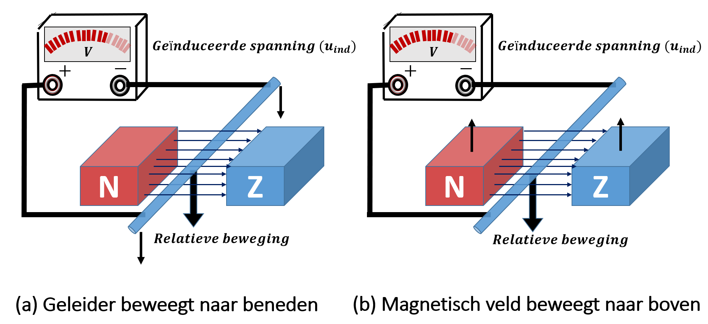
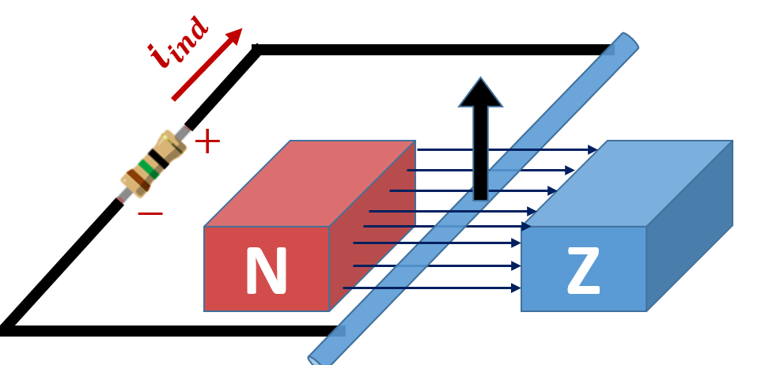
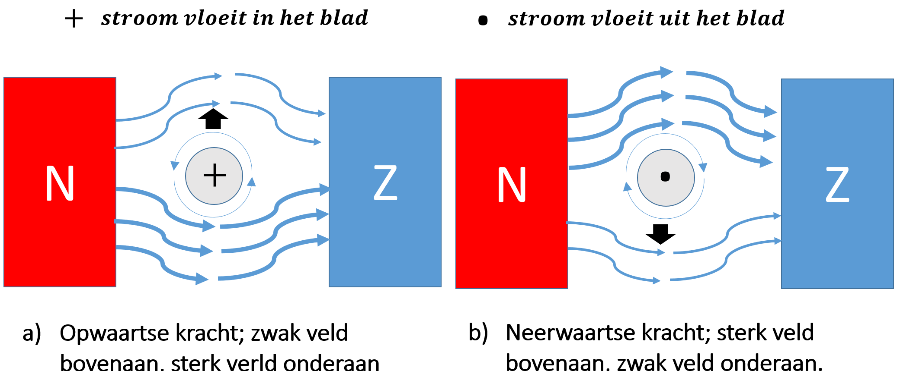

# Elektromagnetische inductie

In dit gedeelte maakt je kennis met elektromagnetische inductie. Elektromagnetische inductie is dat wat onder andere het mogelijk maakt om via een transformator een transformatie van spanningen te maken, elektrische motoren en generatoren te laten werken en nog vele andere apparaten.

Wat is belangrijk?

* Je verklaart het principe van magnetische inductie.
* Je verklaart hoe spanning kan worden opgewekt in een geleider in een magnetisch veld.
* Je bepaalt de polariteit van een geïnduceerde spanning.
* Je verklaart het principe van hoe krachten op een geleider ontstaan en deze laat bewegen.

## Relatieve beweging 

Wanneer een rechte geleider loodrecht beweegt in een magnetisch veld is er een relatieve beweging tussen de geleider en het magnetisch veld. Evenzo, indien een magnetisch veld langs een stationaire geleider wordt bewogen, is er relatieve beweging. In beide gevallen resulteert deze relatieve beweging in een geïnduceerde spanning \( $${u}_{ind}$$ \) over de geleider, zoals figuur 9-5 aangeeft. Dit principe staat bekend als elektromagnetische inductie **.** De kleine letter $$u$$ staat voor ogenblikkelijke spanning. De grootte van de geïnduceerde spanning is afhankelijk van de snelheid waarmee de geleider en het magnetisch veld bewegen ten opzichte van elkaar: hoe sneller de relatieve beweging, hoe groter de geïnduceerde spanning.

Figuur 9-5: relatieve beweging tussen een rechte geleider en een magnetisch veld

## Polariteit van de geïnduceerde spanning 

Wanneer de geleider \(zie figuur 9-6\) in een magnetisch veld eerst naar beneden wordt bewogen en dan naar boven, zal een omkering van de polariteit van de geïnduceerde spanning worden waargenomen. Wanneer de relatieve beweging van de geleider naar beneden is, wordt een spanning geïnduceerd met de polariteit zoals in figuur 9-6 \(a\). Wanneer de relatieve beweging van de geleider omhoog is, wordt de polariteit zoals aangegeven in 9-6 \(b\).

Figuur 9-6 : de polariteit van de geïnduceerde spanning is afhankelijk van de richting van de beweging van de geleider ten opzichte van het magnetisch veld.

Een rechte geleider die loodrecht in een constant magnetisch veld beweegt wekt volgende inductiespanning op:

$${\mathit{u}}_{\mathit{i}\mathit{n}\mathit{d}}={\mathit{B}}_{\perp }\times \mathit{l}\times \mathit{v}\mathit{ }\mathit{ }\mathit{ }\mathit{ }\mathit{ }\mathit{ }\mathit{ }\mathit{ }\mathit{ }\mathit{ }\left(9-5\right)$$

Hierbij is:

* $${u}_{ind}$$ : geïnduceerde spanning in Volt
* $${B}_{\perp }$$ : component van de magnetische fluxdichtheid dat loodrecht op de bewegende geleider staat; wordt uitgedrukt in Tesla
* $$l$$ : de lengte van het deel van de geleider dat zich in het magnetisch veld bevindt
* $$v$$ : de snelheid waarmee de geleider beweegt in m/s

## Geïnduceerde stroom 

Wanneer een belastingsweerstand is verbonden met de geleider in figuur 9-6, zal de spanning, veroorzaakt door de relatieve beweging tussen de geleider en het magnetisch veld, in de belasting een stroom veroorzaken, zoals getoond in figuur 9-7.

Figuur 9-7 : geïnduceerde stroom in een belasting op het moment dat de geleider beweegt tussen het magnetisch veld

Deze stroom wordt de geïnduceerde stroom $${i}_{ind}$$ genoemd. De kleine letter $$i$$ staat voor ogenblikkelijke stroom. Het produceren van een spanning en een stroom in een belasting door verplaatsing van een geleider in een magnetisch veld is de basis voor elektrische generatoren **.** Een enkele geleider zal een kleine geïnduceerde stroom veroorzaken . Wanneer een spoel met veel wikkelingen wordt gebruikt, zijn er veel geleiders in het magnetisch veld waardoor een hogere spanning kan worden opgewekt. Praktische generatoren maken gebruik van spoelen met veel wikkelingen. Het principe van een geleider in een bewegend magnetisch veld is eveneens fundamenteel voor het concept van inductantie in een elektrische schakeling.

## Krachten op een stroomvoerende geleider in een magnetisch veld 

Figuur 9-8 : kracht op een stroomvoerende geleider in een magnetisch veld

Figuur 9-8 \(a\) toont de stroom die naar binnen gaat door een draad in een magnetisch veld.

Het elektromagnetische veld van de geleider komt in wisselwerking met het permanente magnetische veld. Hierdoor hebben de permanente krachtlijnen boven de draad de neiging te worden afgebogen omdat ze haaks op de elektromagnetische veldlijnen van de geleider komen te staan. Daarom wordt de flux boven de geleider verminderd en het magnetische veld verzwakt.

De fluxdichtheid onder de geleider wordt verhoogd, en het magnetische veld wordt versterkt. Een opwaartse kracht op de geleider is hierdoor het resultaat en de geleider neigt te bewegen naar het zwakkere magnetisch veld.

Fig-9-8 \(b\) toont de stroom die naar ons toe is gericht. Hierdoor ontstaat er een kracht op de geleider in de neerwaartse richting. Deze opwaartse en neerwaartse krachten op een geleider zijn de basis voor elektrische motoren. De kracht op een stroomvoerende geleider wordt gegeven door de vergelijking:

$$F=B\times I\times l \left(9-6\right)$$

Met :

* $$F$$ : de kracht in Newton \(N\)
* $$B$$ : de magnetische fluxdichtheid
* $$l$$ : de lengte van de geleider in het magnetisch veld
* $$I :$$ de stroom door de geleider

## Test jezelf : elektromagnetische inductie 

1. Wat is de geïnduceerde spanning over een stationaire geleider in een stationair magnetisch veld?
2. Stel dat de snelheid waarmee een geleider door een magnetisch beweegt wordt verhoogd. Neemt dan de geïnduceerde spanning toe, af of blijft deze hetzelfde?
3. Wat gebeurt er wanneer er stroom door een geleider vloeit in een magnetisch veld?

