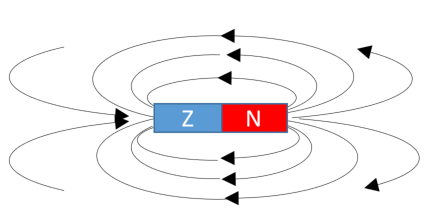
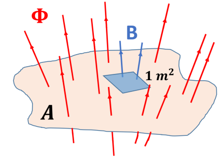
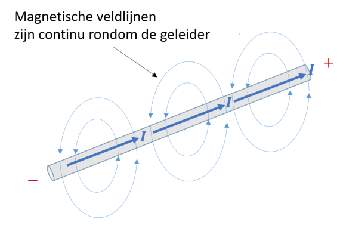
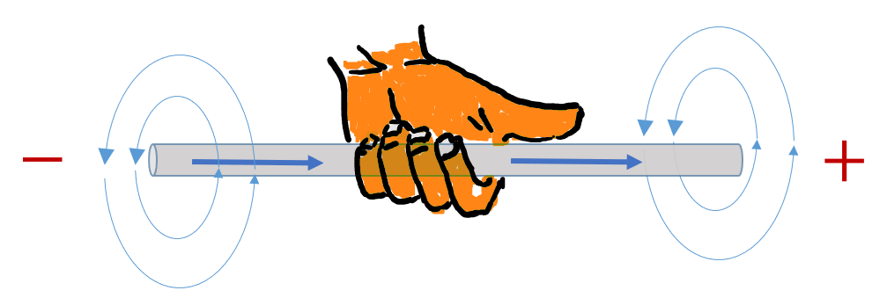

# Elektromagnetisme

Elektromagnetisme kan samengevat worden als het genereren van een magnetisch veld door een stroom door een geleider te sturen.

Wat is belangrijk?

* Je bepaalt de richting van de magnetische veldlijnen \(krachtlijnen\).
* Je zegt de definitie van permeabiliteit op.
* Je zegt de definitie van reluctantie op.
* **Je past de linkerhandregel toe \(elektronenzin** \)

## Magnetische flux $$\mathit{\varphi }$$ 

De groep krachtlijnen die zich bewegen van de Noordpool van een magneet naar de Zuidpool wordt de magnetische flux genoemd. De magnetische flux wordt voorgesteld door de Griekse letter $$\varphi$$ \(“phi”\). Een sterker veld resulteert in meer krachtlijnen. Er zijn verschillende factoren die de kracht van een magneet bepalen. Onder deze factoren bevinden zich de aard van het materiaal, de fysische geometrie en de afstand waar de krachtlijn zich bevind ten opzichte van de magneet. Proeven hebben aangetoond dat magnetische veldlijnen meer geconcentreerd zijn rondom de polen.

Figuur 9-1 : voorstelling van krachtlijnen \($$\varphi$$\) rondom een magneet

De eenheid van magnetische flux is Weber \( $$Wb$$ \). $$1 Wb$$ komt overeen met $${10}^{8}$$ veldlijnen. De Weber is een grote eenheid. In vele praktische situaties zal eerder $$\mu Wb$$ gebruikt worden. $$1 \mu Wb$$ komt overeen met $$100$$ veldlijnen van de magnetische flux.

## Magnetische fluxdichtheid $$\mathit{B}$$ 

De magnetische fluxdichtheid is de hoeveelheid flux per oppervlakte-eenheid loodrecht op het magnetische veld. Het symbool van de magnetische fluxdichtheid is $$B$$ en de eenheid hiervan is de Tesla \( $$T$$ \). $$1 T$$ komt overeen met . In formulevorm:

| $$B=\frac{\varphi }{A} \left(9-1\right)$$ |  |
| :--- | :--- |
|  | Figuur 9-2 : voorstelling magnetische fluxdichtheid $$B$$ |

Hierin is $$\varphi$$ de flux in Weber en $$A$$ de doorsnede in vierkante meter van het magnetische veld.

## Elektromagnetisch veld 

De stroom door een geleider produceert een magnetisch veld rondom de geleider. Dit wordt een elektromagnetisch veld genoemd. De vorm van het magnetisch veld is weergegeven in figuur 9-3.

Figuur 9-3 : Magnetisch veld rondom een stroomvoerende geleider; de blauwe pijlen geven de richting van de stroom aan in elektronenzin.

De onzichtbare magnetische krachtlijnen \(veldlijnen\) vormen een concentrisch cirkelvormig patroon rondom de geleider. Dit patroon verschijnt over de gehele lengte van een stroomvoerende geleider. De magnetische veldlijnen zijn tegen de klok in gericht in de richting van de stroom volgens elektronenzin. \(Indien conventionele stroomzin wordt gebruikt zijn de veldlijnen in de richting van de klok gericht\).

Hoewel het magnetisch veld niet kan worden gezien, kan het zichtbare effecten produceren. De veldlijnen kunnen zichtbaar gemaakt worden door een blad te nemen waardoor in het midden een stroomvoerende geleider gaat. Door ijzervijlsel te strooien op het blad zal dit ijzervijlsel zichzelf cirkelvormig plaatsen rondom de geleider. Hierdoor zijn de magnetische veldlijnen rondom de geleider zichtbaar gemaakt. Brengt men een kompas in dit magnetisch veld dan kan men vaststellen dat het veld sterker wordt naarmate je het kompas dichter bij de geleider brengt.

Wanner je de richting van het magnetisch veld rondom een geleider kent, kan je eenvoudig bepalen welke de stroomzin is door deze geleider. Wanneer gebruik gemaakt wordt van de elektronenzin kan je via je linkerhand eenvoudig deze stroomzin bepalen. Dit doe je als volgt: neem de geleider denkbeeldig met je linkerhand vast en krom je vingers in de richting van het magnetisch veld rondom. Je gestrekte duim geeft nu de richting van de stroom aan \(elektronenzin\).

Figuur 9-4 : Voorbeeld van gebruik van linkerhandregel. De linkerhandregel wordt gebruikt bij een elektronenstroom gaande van de negatieve klem naar de positieve klem van de aangelegde spanningsbron.

## Elektromagnetische eigenschappen 

### Permeabiliteit $$\left(\mathit{\mu }\right)$$ 

Het gemak waarmee een magnetisch veld zich kan vestigen in een gegeven materiaal wordt weergegeven door de permeabiliteit van dat materiaal. Hoe hoger de doorlaatbaarheid van magnetische veldlijnen, hoe gemakkelijker een magnetisch veld kan zich kan vestigen in dat specifiek materiaal.. Het symbool van permeabiliteit is $$\mu$$ \(\(de Griekse letter mu\) en wordt uitgedrukt in Weber per Ampèretoeren meter \( $$\frac{Wb}{At\times m}$$ \) De permeabiliteit van een materiaal hangt af van het soort materiaal. Als referentie wordt de permeabiliteit van een vacuüm \( $${\mu }_{0}$$ \) gebruikt. De formule van $${\mu }_{0}$$ is de volgende:

$${\mu }_{0}= 4\times \pi \times {10}^{-7}\frac{Wb}{At \times m} \left(9-2\right)$$

Ferromagnetische materialen hebben doorgaans doorlaatbaarheden die honderden keren groter zijn dan die van een vacuüm. Dit betekent dat een magnetisch veld relatief eenvoudig in ferromagnetische materialen kan worden opgesteld. Ferromagnetische materialen omvatten ijzer, staal, nikkel, kobalt en hun legeringen. De relatieve permeabiliteit \( $${\mu }_{r}$$ van een materiaal is de verhouding van de absolute permeabiliteit \( $$\mu$$ \) op de doorlaatbaarheid van een vacuüm \( $${\mu }_{0}$$ \). In formulevorm:

$${\mu }_{r}=\frac{\mu }{ {\mu }_{0}} \left(9-3\right)$$

$${\mu }_{r}$$ heeft geen eenheid vermits het een verhoudingsfactor is. Materialen met een hoge permeabiliteit kunnen een relatieve permeabiliteit hebben van $$100.000$$ .

### Reluctantie \($$\mathcal{R}$$\) 

De reluctantie is een mate van weerstand dat geboden wordt in een materiaal tegen een magnetisch veld. De waarde van de reluctantie $$\mathcal{R}$$ is recht evenredig met de lengtre van het magnetisch pad en omgekeerd evenredig met de permeabiliteit $$\mu$$ en de doorsnede $$A$$ van het materiaal. In formulevorm:

$$\mathcal{R}=\frac{l}{\mu \times A} \left(9-4\right)$$

De eenheid van reluctantie is:

$$\mathcal{R}=\frac{m}{\frac{Wb}{At\times m}\times {m}^{2}}=\frac{At}{Wb}$$

Merk op dat de vergelijking 10-4 analoog is aan de soortelijke weerstandsformule. Deze is gelijk aan:

$$R= \rho \times \frac{l}{A}$$

Het tegenovergestelde van de soortelijke weerstand $$\rho$$ is de geleidbaarheid $$\sigma .$$ Hierdoor wordt volgende formule verkregen voor de weerstand:

$$R= \frac{l}{\sigma \times A}$$

Wanneer je de formule voor weerstand in functie van de geleidbaarheid vergelijkt met de formule voor de reluctantie kan je concluderen dat de geleidbaarheid in een elektrische schakeling analoog is aan de permeabiliteit in een magnetisch circuit. De reluctantie van een magnetisch circuit is typisch $$50000\frac{At}{Wb}$$ of meer. Dit is vooral afhankelijk van de grootte en het type materiaal waarlangs de magnetische veldlijnen moeten passeren.

## Test jezelf : elektromagnetisme 

1. Wat is het verschil tussen de magnetische flux en magnetische fluxdichtheid?
2. Welk is de eenheid om de magnetische fluxdichtheid te meten?
3. Hoe groot is de magnetische fluxdichtheid als de flux $$\varphi =\mathrm{4,5} \mu Wb$$ en het oppervlak $$A=5\times {10}^{-3} {m}^{2}$$ ?
4. Wat gebeurt er met het magnetisch veld rondom een geleider als de stroom door deze geleider wordt omgekeerd?
5. Wat wordt verstaan onder permeabiliteit?
6. Wat wordt verstaan onder reluctantie?

