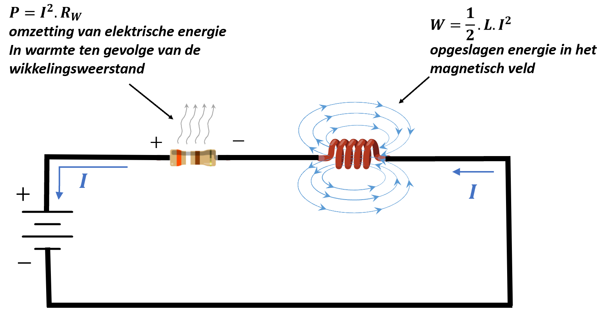
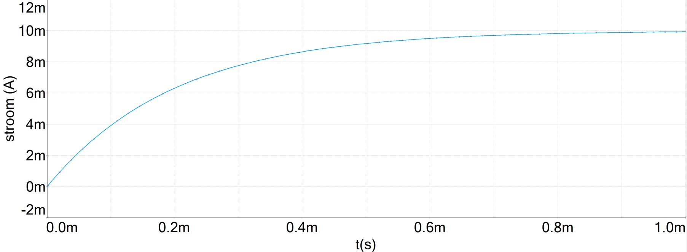
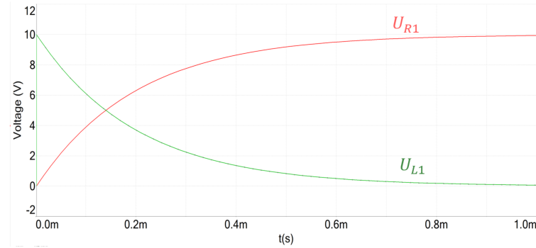
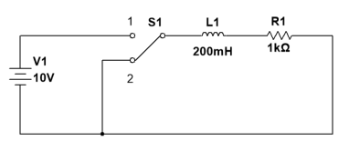
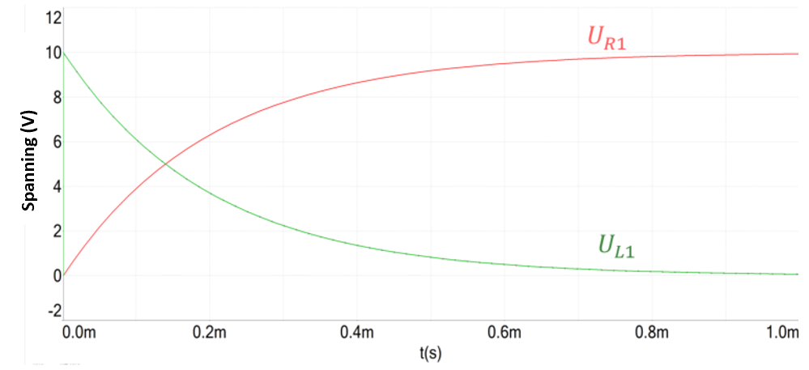

# Het gedrag van een  spoel op gelijkstroom

Wanneer een spoel is aangesloten op een gelijkspanning wordt energie in het elektromagnetische veld van een spoel opgeslagen. De opbouw van stroom door de spoel gebeurt op een voorspelbare manier afhankelijk van de tijdconstante van de schakeling. De tijdconstante wordt bepaald door de inductantie en de weerstand in de schakeling.

Wat is belangrijk?

* **Je definieert de** $$\mathit{R}\mathit{L}$$ **-tijdsconstante.**
* Je beschrijft het stijgen en dalen van de stroom in een spoel.
* **Je beschrijft de toename en afname van de** stroom in een spoel.
* **Je beschrijft het verband tussen de tijdsconstante met het bekrachtigen en ontkrachtigen van een spoel.**
* **Je beschrijft de inductiespanning.**
* **Je schrijft de exponentiële vergelijkingen voor de stroom in een spoel**

## Gedrag van een spoel op gelijkspanning 

Wanneer er constante gelijkstroom door een spoel stroomt, is er geen geïnduceerde spanning.

Er is echter wel een spanningsval over de spoel als gevolg van de windingsweerstand van de spoel.

De inductantie zelf gedraagt zich als een kortsluiting voor gelijkspanning. De energie wordt opgeslagen in het magnetische veld volgens de formule:

$$W=\frac{1}{2}L{i}^{2}$$

De enige energieomzetting in warmte vindt plaats in de windingsweerstand. Het gedissipeerd vermogen in de windinsweerstand kan bepaald worden met volgende formule:

$$P = {I}^{2}Rw$$

Deze toestand is geïllustreerd in 9-22

Figuur 9-22 : energieopslag en warmtedissipatie in een spoel

## De $$\mathit{R}\mathit{L}$$-tijdsconstante 

Omdat de basisactie van de inductantie van een spoel het ontwikkelen is van een spanning die tegengesteld is aan de stroomverandering, volgt hieruit dat de stroom in eerste instantie niet kan veranderen in een spoel. Er is een bepaalde tijd nodig voor de stroom te laten variëren van de ene waarde naar de andere. De snelheid waarmee de stroom kan veranderen wordt bepaald door de RL-tijdconstante. De $$RL$$ -tijdsconstante is een vast tijdsinterval dat gelijk is aan de verhouding van de inductantie tot de weerstand. In formulevorm :

$$\tau =\frac{L}{R} (9-12)$$

Hierbij is $$\mathit{\tau }$$ uitgedrukt in seconden, $$L$$ in Henry en $$R$$ in Ohm.

## Laden en ontladen van een spoel 

Beschouw de schakeling van figuur 9-23. Stel dat er geen spanning aangesloten is en de schakelaar in positie $$1$$ staat. Er is bijgevolg geen spanning over de spoel en over de weerstand. Vanaf het moment dat de spanningsbron wordt opgezet, zal de stroom vanaf waarde nul naar zijn regimewaarde stijgen. Een verandering van nul naar een bepaalde waarde is de maximale verandering die een stroom kan maken. Bijgevolg zal bij het opzetten van de spanningsbron de stroom maximaal veranderen. Deze maximale verandering betekend dat een zelfinductiespanning in de spoel wordt opgewekt die zijn oorzaak tegenwerkt. Hierdoor wordt de stroom in eerste instantie tegengehouden en staat de volle bronspanning over de spoel.

Figuur 9-23 : schakeling om het laad- en ontladingsverloop van een spoel te bepalen

$${I}_{max}=\frac{ {U}_{bron}}{ {R}_{1}}$$

Naarmate de tijd vordert, verkleind de stroomverandering waardoor de opgewekte zelfinductie ook vermindert. Hierdoor gaat er meer en meer stroom vloeien in de schakeling met als gevolg dat de stroom stijgt. Van zodra de stroomwaarde constant is, wordt er geen zelfinductiespanningn meer opgewekt.. De spanning over de spoel wordt gelijk aan nul en over de weerstand staat de volledige voedingsspanning. De stroom die dan door de schakeling vloeit is de maximale stroom. Deze is gelijk aan :

$${I}_{max}=\frac{ {U}_{bron}}{ {R}_{1}}$$

Van zodra de stroomverandering kleiner wordt begint er stroom door de schakeling te vloeien en komt er ook een spanningsval over de weerstand te staan. Deze spanningsval kan gevonden worden via het spanningsverschil tussen bronspanning en spoelspanning. In formulevorm:

$$i=\frac{ {U}_{bron}-{U}_{L}}{R}$$

Verder uitwerken:

$$i=\frac{ {U}_{bron} -L \frac{dI}{dt}}{R}=\frac{ {U}_{bron}}{R}-\frac{L}{R}.\frac{dI}{dt}={I}_{max}-$$ $$\frac{L}{R}.\frac{dI}{dt}$$

Na verdere wiskundige uitwerking wordt volgende stroomformule bekomen:

$$i={I}_{max}\times \left(1-{e}^{-\frac{L}{R}\times t}\right) (9-13)$$

Net als bij de condensator is de stroom op ieder moment in de schakeling afhankelijk van de tijdsconstante . In een serie $$RL-$$ circuit neemt de stroom toe naar ongeveer 63% van zijn volledige waarde na één tijdsconstante interval. Deze opbouw van stroom volgt een exponentiële curve en bereikt zijn maximale stroomwaarde na ongeveer vijf keer de tijdsconstante. Figuur 9-24 toont het stroomverloop door de schakeling.

Figuur 9-24 : stroomverloop door een serieschakeling van $$L$$ en $$R$$ na het aanschakelen van de bron

### Bepalen van het spanningsverloop over de spoel en de weerstand tijdens het laden. 

De spanning over de spoel is als volgt te bepalen:

$${u}_{L1}={U}_{bron} -{U}_{R1}$$

$${u}_{L1}={U}_{bron} -{R}_{1}\times$$ $${I}_{max} \times (1-{e}^{-\frac{R}{L}t})$$

$${u}_{L1}={U}_{bron} -{U}_{bron} \times (1-{e}^{-\frac{R}{L}t}$$

$${u}_{L1}={U}_{bron}(1 -(1-{e}^{-\frac{R}{L}t})$$ \)

$${u}_{L1}={U}_{bron} \times {e}^{-\frac{R}{L}t} (9-14)$$

Dit spanningsverloop over de spoel en weerstand is in figuur 9-25 weergegeven.

Figuur 9-25 : spanningsverloop over spoel en weerstand tijdens het laadproces

De spanning over de weerstand kan met volgende formule berekend worden:

$${u}_{R1}={U}_{bron} \times \left(1-{e}^{-\frac{R}{L}t}\right) (9-15)$$

### Bepalen van het spanningsverloop over de spoel en weerstand tijdens het onladen 

Op het moment dat de schakelaar in stand 2 wordt geschakeld, vloeit er een bepaalde stroom door de serieschakeling. Doordat de spanningsbron wordt kortgesloten ontstaat er een stroomverandering die een zelfinductiespanning opwekt in de spoel. Aangezien de stroom naar nul gaat, wordt er een zelfinductiespanning opgewekt die negatief is. Vermits de voedingsspanning is weggevallen klapt het magnetisch veld in waardoor de polariteit van de inductiespanning over de spoel negatief wordt.

Het inklappen van het magnetisch veld onderhoudt de stroom in dezelfde richting tot het magnetisch veld verdwenen is.

Figuur 9-26 : schakeling tijdens het ontladen

De spanning over de spoel op het moment dat de schakelaar in stand 2 wordt geplaatst is gelijk aan:

$${u}_{L1}= -{U}_{R1 max}$$ $${\times e}^{-\frac{R}{L}t} (9-16)$$

Hierbij is $${U}_{R1max}$$ de spanning over $${R}_{1}$$ op het moment dat de schakelaar in stand 2 wordt geschakeld.

De spanning over $${R}_{1}$$ kan als volgt worden bepaald:

$${u}_{R1}= {U}_{R1 max}$$ $${\times e}^{-\frac{R}{L}t} (9-17)$$

Figuur 9-27 laad- en ontlaadverloop bij een spoel

De stroom door de schakeling tijdens het ontladen wordt als volgt berekend:

$$i=\frac{ {U}_{R1Max}}{ {R}_{1}}$$ $${\times e}^{-\frac{R}{L}t} (9-18)$$

## Test jezelf : Het gedrag van een spoel op gelijkstroom 

1. **Door een spoel met zelfinductie gelijk aan** $$15\mathit{ }\mathit{m}\mathit{H}$$ **en een windingsweerstand gelijk aan** $$10\mathit{ }\mathit{\Omega }$$ **vloeit een constante stroom gelijk aan** $$10\mathit{ }\mathit{m}\mathit{A}$$ **.** Hoeveel bedraagt de spanningsval over deze spoel?
2. **Een spanningsbron met** $$20\mathit{ }\mathit{V}$$ $$\mathit{D}\mathit{C}$$ **staat aangesloten op een** $$\mathit{R}\mathit{L}$$ **-serieschakeling.** Op het moment dat de spanningsbron wordt opgezet wat zijn dan de waarden van $$\mathit{i}$$ **en** $${\mathit{u}}_{\mathit{L}}$$ **?**
3. **Dezelfde schakeling als in vraag 2.** Wat is de spanningswaarde van $${\mathit{u}}_{\mathit{L}}$$ **na een tijdsinterval gelijk aan** $$5\mathit{\tau }$$ **?**
4. **Een serieschakeling bestaat uit een spoel met** $$\mathit{L}=500\mathit{ }\mathit{\mu }\mathit{H}$$ **en een weerstand met** $$\mathit{R}=1\mathit{ }\mathit{ }\mathit{k}\mathit{\Omega }$$ **.** Wat is de tijdsconstante van deze schakeling? Bepaal de stroom door de serieschakeling op het moment $$\mathrm{0,25}\mathit{ }\mathit{\mu }\mathit{s}$$ **nadat een schakelaar de serieschakeling verbonden heeft met een spanningsbron van** $$10\mathit{ }\mathit{V}$$ **.**

