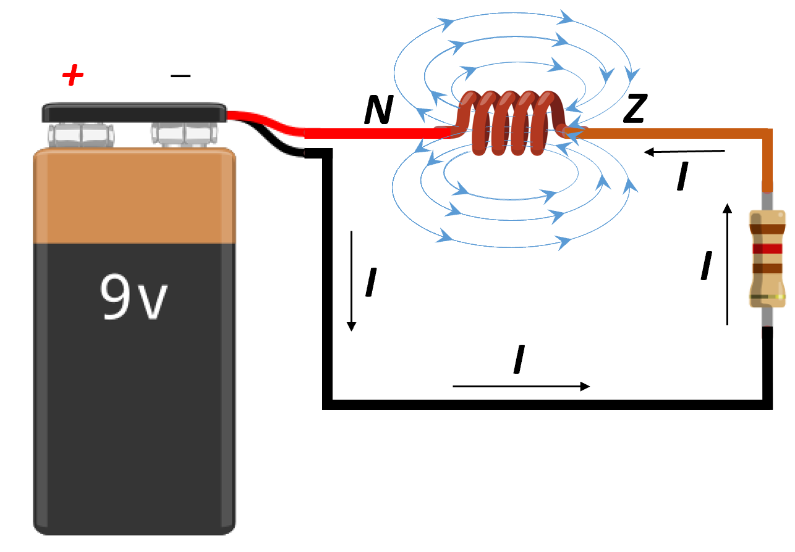
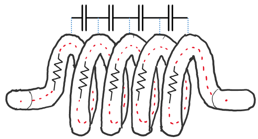
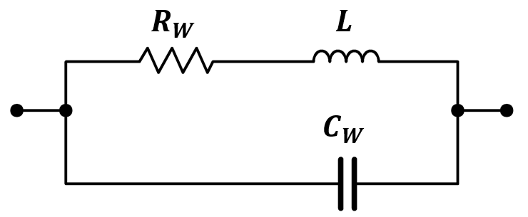
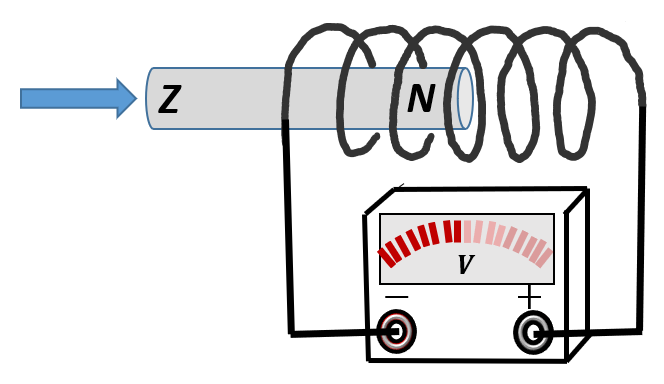
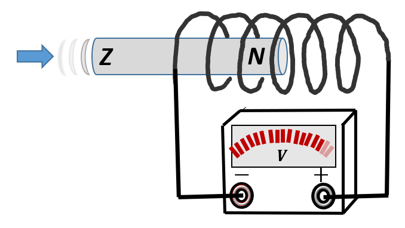
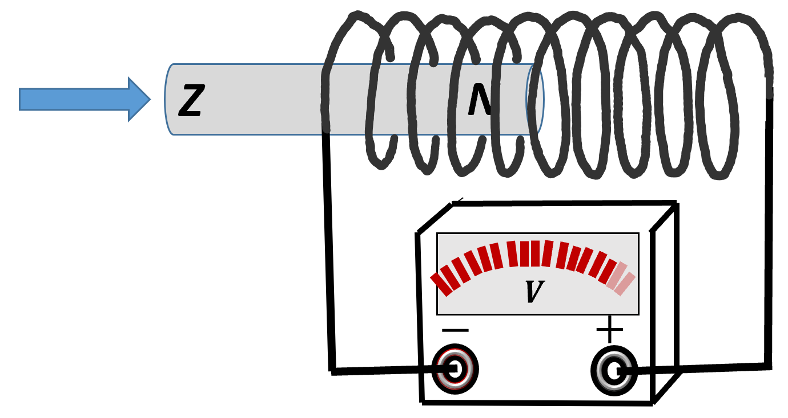
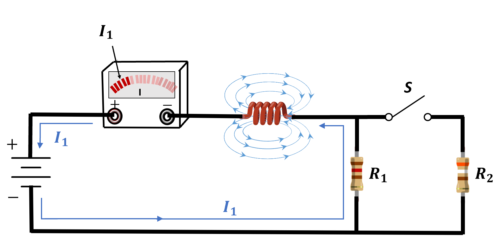
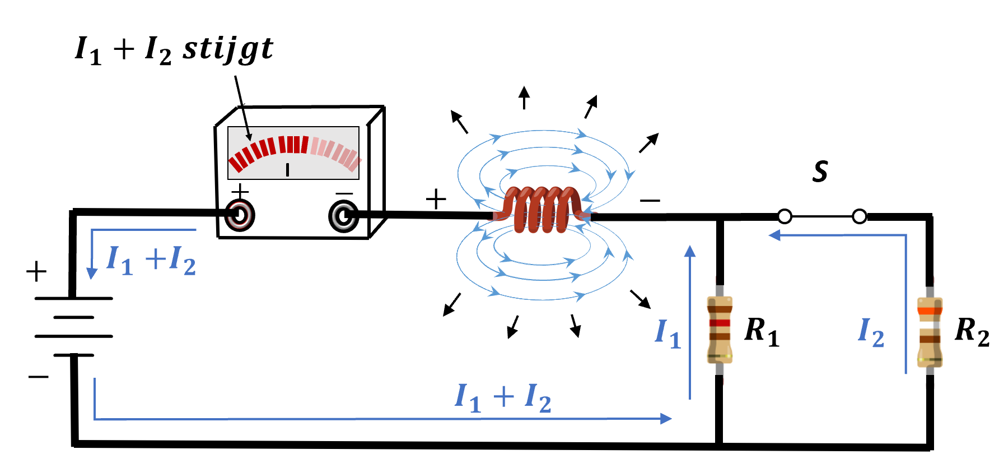
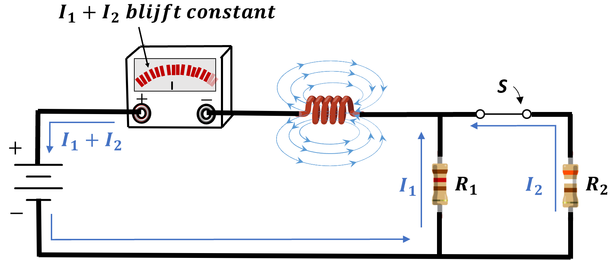

# Het werkingsprincipe van een spoel

Een spoel is een passieve elektrische component, gevormd door een draadspiraal, die de eigenschap vertoont van inductantie. Inductantie is de eigenschap van een spoel die een verandering in stroom tegenwerkt. De basis voor inductantie is het elektromagnetische veld dat eender welke geleider omringt wanneer er stroom doorheen gaat.

Wat is belangrijk?

* Je beschrijft de opbouw en de eigenschappen van een spoel.
* Je definieert inductantie en kent zijn eenheid.
* Je verklaart het begrip inductiespanning.
* Je verklaart hoe een spoel zijn energie opslaat.
* Je geeft aan welke fysische eigenschappen van een spoel de inductantie beïnvloeden.
* Je beschrijft de begrippen windingsweerstand en windingscapaciteit.
* Je verklaart aan de hand van de wet van Faraday en de wet van Lenz hoe spanning wordt geïnduceerd over een spoel.

## Inductantie 

Figuur 9-9 toont het elektrisch symbool van een spoel.

Figuur 9-9 : elektrisch symbool van een spoel

Men bekomt een spoel met een bepaalde inductantie door een geleider spiraalvormig op te rollen. Een voorbeeld hiervan is te zien in figuur 9-10. De stroom door de opgerolde geleider produceert een elektromagnetisch veld. Rond iedere gemaakte lus \(winding\) ontstaat een elektromagnetisch veld.

De velden van de individuele windingen staan in dezelfde richting zodat ze samen een krachtiger veld vormen in en rondom de spoel. De richting van het veld creëert een magnetische noord- en zuidpool.

Figuur 9-10 : De stroom door een spoel creëert een 3D-elektromagnetisch veld rondom de spoel. De weerstand begrenst de stroom.

Als de stroom verandert, verandert ook het elektromagnetische veld. Een toename van de stroom zorgt voor een toenamen van het veld en een afname in stroom vermindert het elektromagnetisch veld. Een veranderende stroom produceert een veranderend elektromagnetisch veld rond de inductantie \(ook bekend als spoel of choke\). Op zijn beurt veroorzaakt het veranderende elektromagnetische veld een geïnduceerde spanning. Deze eigenschap wordt zelfinductie genoemd en gesymboliseerd met $$L.$$

Inductantie is een maat voor het vermogen van een spoel om een geïnduceerde spanning te verkrijgen als resultaat van een verandering in zijn stroom. De geïnduceerde spanning staat steeds in een zodanige richting zodat deze zich verzet tegen die verandering in stroom.

### Eenheid van inductantie 

De eenheid van inductantie is de Henry \(H\). Per definitie is de inductantie van een spoel gelijk aan $$1 H$$ als deze een geïnduceerde spanning opwekt van $$1 V$$ ten gevolge van een stroomverandering van $$1 A$$ per seconde door deze spoel. Henry is een grote eenheid. In praktische toepassingen wordt veel gebruik gemaakt van spoelen in de orde van µH en $$mH$$ . Nanohenry wordt bijvoorbeeld toegepast voor zeer kleine spoeltjes.

## Opslaan van energie 

Als gevolg van een bepaalde stroomdoorgang in een spoel wordt er rondom de spoel energie opgeslagen in de vorm van een elektromagnetisch veld. De hoeveelheid opgeslagen energie is gelijk aan:

$$W=\frac{1}{2}\times L\times {i}^{2} \mathit{ }\mathit{ }\left(9-7\right)$$

De hoeveelheid opgeslagen energie is recht evenredig met de grootte van de inductantie en het kwadraat van de stroom.

## Fysische eigenschappen van een spoel 

### Kernmateriaal 

Een spoel is in feite een draadspiraal die rondom een bepaald materiaal gewikkeld wordt. Dit bepaald materiaal wordt de kern genoemd. Spoelen worden zowel over magnetisch materiaal als niet magnetisch materiaal gewikkeld. Voorbeelden van niet-magnetische materialenzijn lucht, hout, koper, plastic en glas. De permeabiliteiten van deze materialen zijn hetzelfde als voor een vacuüm.

Voorbeelden van magnetische materialenzijn ijzer, nikkel, staal, kobalt of legeringen. Deze materialen hebben permeabiliteiten die honderden of duizenden malen groter zijn dan die van vacuüm en zijn geclassificeerd als ferromagnetisch. Een ferromagnetische kern zorgt voor een lager reluctantiepad \( $$\mathcal{R}$$ \) voor de magnetische krachtlijnen en maakt zo een sterker magnetisch veld mogelijk.

De permeabiliteit $$\mu$$ bepaalt hoe gemakkelijk een magnetisch veld zich kan nestelen in een bepaald materiaal. De inductantie is recht evenredig met de permeabiliteit van het kernmateriaal.

### De zelfinductie $$\mathit{L}$$ 

Zoals aangegeven in figuur 9-11 is het aantal windingen van de draad, de lengte en de dwarsdoorsnede van de kern factoren bij het instellen van de waarde vaninductie. De inductie is omgekeerd evenredig met de lengte van de kern en direct\)evenredig met het oppervlak van de dwarsdoorsnede. Ook is de inductantie direct gerelateerd aan het aantal windingen in het kwadraat. Deze relatie is als volgt:

Figuur 9-11 : factoren die de inductiewaarde van een spoel bepalen

$$\mathit{L}={\mathit{N}}^{2}.\mathit{ }\frac{ {\mathit{\mu }}_{\mathit{r}}.{\mathit{\mu }}_{0}.\mathit{A}}{\mathit{l}\mathit{ }}\mathit{ }\mathit{ }\mathit{ }\mathit{ }\mathit{ }\mathit{ }\mathit{ }\mathit{ }\mathit{ }\mathit{ }\left(9-8\right)$$

Met :

* $$\mathit{L}$$ : de zelfinductie in Henry
* $${\mu }_{0}$$ : de absolute permeabiliteit en gelijk aan $$\frac{4\pi 1{0}^{-7} Wb}{Am}$$ . Dit is de permeabiliteit van vacuüm
* $$\mathit{A}$$ : de oppervlak van de doorsnede van de wikkelingen van de spoel in meter
* $$\mathit{l}$$ : de lengte van de \(werkelijke\) spoel in meter
* $$\mathit{N}$$ : het aantal wikkelingen van de spoel

### De windingsweerstand $${\mathit{R}}_{\mathit{W}}$$ 

De draad van een spoel bestaat uit een bepaald materiaal \(bijvoorbeeld geïsoleerde koperdraad\). Deze draad heeft een bepaalde weerstand per lengte-eenheid. Wanneer vele draadwindingen worden gebruikt om een spoel te vormen kan deze totale weerstand aanzienlijk zijn. Deze inherente weerstand wordt de gelijkstroomweerstand of de wikkelweerstand $${R}_{W}$$ genoemd

Hoewel deze weerstand wordt verdeeld over de lengte van de draad, zoals weergegeven in de figuur 9-13 \(a\), wordt dit soms in een schema aangegeven als de weerstand die in serie verschijnt metde inductantie van de spoel, zoals weergegeven in figuur 10-6 \(b\). In veel toepassingen kan de windingsweerstand worden genegeerd waardoor de spoel als ideaal beschouwd kan worden. Inandere toepassingen dient rekening gehouden te worden met deze weerstand.

|  |  |
| :--- | :--- |
| \(a\) | \(b\) |

Figuur 9-13 : Windingsweerstand van een spoel

### Windingscapaciteit $${\mathit{C}}_{\mathit{W}}$$ 

Wanneer twee geleiders \(windingen\) naast elkaar worden geplaatst, is er altijd een bepaalde capaciteit tussen hen. Dit houdt in dat tussen twee windingen van een spoel er een parasitaire capaciteit aanwezig is zoals te zien is in figuur 9-14 \(a\). Deze parasitaire capaciteit wordt ook wel eens strooicapaciteit genoemd. Meer algemeen wordt bij een spoel deze parasitaire capaciteit als de windingscapaciteit \( $${C}_{w})$$ aangegeven.

In veel toepassingen is de windingscapaciteit zeer klein en heeft deze geen significant effect op de werking van de spoel. Bij hoge frequenties kan de waarde van de windingscapaciteit behoorlijk belangrijk worden en dient hiermee rekening gehouden te worden. Bij deze frequenties moet je de spoel aanzien zoals in het equivalent schema in figuur 9-14 \(b\). De capaciteit werkt effectief in parallel. Het totaal van de strooicapaciteiten tussen elke lus van de winding is aangegeven in dit schema als een capaciteit die parallel met de spoel en zijn wikkelweerstand verschijnt.

|  |  |
| :--- | :--- |
| \(a\) | \(b\) |

Figuur 9-14 : de windingscapaciteit van een spoel

## De wet van Faraday 

Michael Faraday ontdekte het principe van elektromagnetische inductie in 1831. Het belangrijkste idee achter de wet van Faraday is dat een veranderend magnetisch veld een spanning in een geleider kan induceren . Soms wordt de wet van Faraday ook vermeld als de inductiewet van Faraday.

Faraday experimenteerde met spoelen en zijn wet is een uitbreiding van het principe van elektromagnetische inductie voor rechte geleiders. Wanneer een geleider wordt gewikkeld in meerdere bochten kunnen meerdere delen van deze geleider worden blootgesteld aan het magnetische veld waardoor de geïnduceerde spanning groter is. Wanneer de flux op een of andere manier verandert, zal er een geïnduceerde spanning ontstaan. De verandering in het magnetische veld kan worden veroorzaakt door relatieve beweging tussen het magnetische veld en de spoel.

De opmerkingen van Faraday kunnen als volgt worden weergegeven:

* De hoeveelheid spanning geïnduceerd in een spoel is recht evenredig met de mate van verandering van het magnetisch veld ten opzichte van de spoel.
* De hoeveelheid spanning geïnduceerd in een spoel is recht evenredig met het aantal windingen in de spoel.

Dat de hoeveelheid geïnduceerde spanning recht evenredig is met de mate van verandering in het magnetisch veld kan aangetoond worden door een staafmagneet door een spoel te laten bewegen. De beweging van de staafmagneet creëert een veranderlijk magnetisch veld rondom de spoel waardoor er een bepaalde spanning wordt geproduceerd. Deze spanning kan zichtbaar gemaakt worden met een voltmeter. Dit principe wordt weergegeven in figuur 9-15.

|  |  |
| :--- | :--- |
| \(a\) Magneet beweegt door een spoel met een bepaalde snelheid | \(b\) Magneet beweegt door dezelfde spoel als in \(a\) maar met een hogere snelheid |

Figuur 9-15 : Een voorbeeld van Faraday’s eerste observatie. De hoeveelheid geïnduceerde spanningn is recht evenredig met de snelheid van verandering van het magnetisch veld ten opzichte van de spoel.

In figuur 9-15 \(b\) beweegt de staafmagneet trager door de spoel dan in figuur 9-15 \(a\). Via de figuren is goed te zien dat hoe sneller de magneet beweegt, hoe groter de opgewekte inductiespanning is.

|  |  |
| :--- | :--- |
| \(a\) Magneet beweegt door een spoel en induceert een spanning | \(b\) Magneet beweegt met dezelfde snelheid door een spoel met meer windingen en induceert hierdoor een grotere spanning. |

Figuur 9-16 : Een voorbeeld van Faraday’s tweede observatie. De hoeveelheid geïnduceerde spanning is direct evenredig met het aantal windingen van een spoel.

Wanneer men dezelfde staafmagneet door een spoel beweegt en men verhoogt het aantal wikkelingen dan zal in de spoel met de meeste wikkelingen de meeste spanning worden geïnduceert. Dit is weergegeven in figuur 9-16.

De wet van Faraday houdt het volgende in:

De spanning over een spoel is gelijk aan het aantal windingen van de spoel vermenigvuldigt met de snelheid van verandering van de magnetische flux.

Iedere relatieve beweging tussen het magnetisch veld en de magneet veroorzaakt de verandering van dat magnetisch veld waardoor een inductiespanning wordt geïnduceerd in de spoel. Het veranderlijk magnetisch veld kan ook veroorzaakt worden door een wisselstroom te sturen doorheen een elektromagneet. Een elektromagneet is een spoel die gewikkeld is op een materiaal met een grote waarde voor de permeabiliteit. Enkel als er stroom door deze spoel vloeit ontstaat er een magnetisch veld. Vandaar de naam elektromagneet. Door een veranderlijke stroom te sturen door zo’n spoel ontstaat er een veranderlijk magnetisch veld. Dit type van veranderlijk magnetisch veld ligt aan de basis van transformatie-acties in wisselstroomschakelingen.

## De wet van Lenz 

De wet van Lenz vult de wet van Faraday aan door de richting te bepalen van de geïnduceerde spanning. De wet van Lenz vertelt ons het volgende:

Wanneer de stroom door een spoel verandert en een geïnduceerde spanning wordt gecreëerd als een resultaat van het veranderende magnetische veld, dan is de richting van de geïnduceerde spanning zodanig dat het altijd tegen de verandering in stroom is.

Figuur 9-17 illustreert de wet van Lenz. In deel \(a\) is de stroom constant en beperkt door door weerstand $${R}_{1}$$ . Er is geen geïnduceerde spanning omdat het magnetische veld niet verandert.

In figuur 9-17\(b\) wordt de schakelaar wordt plotseling gesloten, $${R}_{2}$$ wordt parallel geplaatst met $${R}_{1}$$ en vermindert dus de totale weerstand. De stroom probeert te vergroten en het magnetische veld begint uit te zetten. Echter de geïnduceerde spanning verzet zich tegen deze poging tot stroomtoename en kan dit gedurende een ogenblik verhinderen.

In figuur 9-17 \(c\) neemt de geïnduceerde spanning geleidelijk af waardoor de stroom zal gaan toenemen. In figuur 9-17 \(d\) heeft de stroom een constante waarde bereikt zoals bepaald door de parallelweerstanden en de geïnduceerde spanning is nul. In figuur 9-17\(e\) is de schakelaar plotseling geopend. Voor een ogenblik zal ook nu de geïnduceerde spanning voorkomen dat er een afname van de stroom zal zijn. In figuur 9-17 \(f\) neemt de geïnduceerde spanning geleidelijk af waardoor de stroom terug naar de waarde kan dalen die bepaald is door $${R}_{1}$$ . Merk op dat de geïnduceerde spanning een polariteit heeft die tegen elke stroomverandering is. De polariteit van de geïnduceerde spanning is tegenovergesteld aan die van de batterijspanning voor een toename van stroom en helpt de batterijspanning voor een afname van stroom.

|  |  |
| :--- | :--- |
| Schakelaar open : constante stroom en constant magnetisch veld waardoor er geen geïnduceerde spanning aanwezig is | Op het moment dat de schakelaar gesloten wordt vergroot het magnetisch veld en induceert een spanning die zodanig gericht is dat ze een stijging van de stroom verhindert. De totale stroom blijft hetzelfde als tijdens het moment dat de schakelaar open was. |
|  |  |
| Direct nadat de schakelaar gesloten is zal de snelheid waarmee het magnetisch veld zich uitbreidt verminderen. Dit laat toe dat de stroom exponentieel zal stijgen vermits de geïnduceerde spanning afneemt door het minder snel uitbreiden van het magnetische veld. | De schakelaar blijft gesloten. De stroom en het magnetisch veld blijven constant waardoor er geen geïnduceerde spanning meer aanwezig is. |
|  |  |
| Op het moment dat de schakelaar terug wordt geopend begint het magnetisch veld in te zakken. Hierdoor wordt een spanning geïnduceerd die zich verzet tegen het dalen van de stroom. | Nadat de schakelaar geopend is zal de snelheid van het in elkaar zakken van het magnetisch veld dalen waardoor ook de geïnduceerde spanning zal dalen. Hierdoor kan de stroom vergroten naar zijn oorspronkelijke waarde. |

Figuur 9-17 : Demonstratie van de wet van Lenz in een inductieve schakeling. Als de stroom plotseling probeert te veranderen zal het elektromagnetisch veld veranderen en hierdoor een spanning induceren in een richting die de verandering in stroom probeert tegen te gaan.

## Test jezelf : Het werkingsprincipe van een spoel 

1. Noem de parameters op die een bijdrage leveren tot de inductantie van een spoel.
2. **Beschrijf wat er gebeurt met** $$\mathit{L}$$ **als :**
   1. $$\mathit{N}$$ **stijgt**
   2. De lengte van de kern stijgt
   3. De doorsnede van de kern daalt
   4. Een ferromagnetische kern wordt vervangen door een luchtkern.
3. Verklaar waarom spoelen een bepaalde windingsweerstand hebben.
4. Verklaar waarom spoelen een bepaalde windingscapaciteit bezitten.
5. Wat houdt de wet van Faraday in?
6. Wat houdt de wet van Lenz in?

