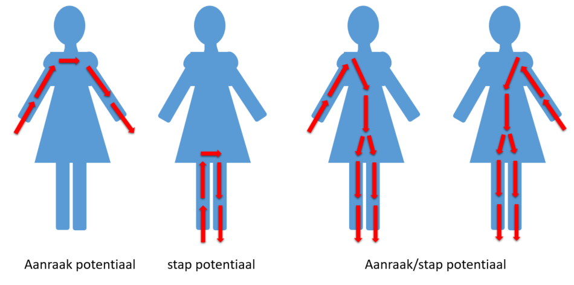
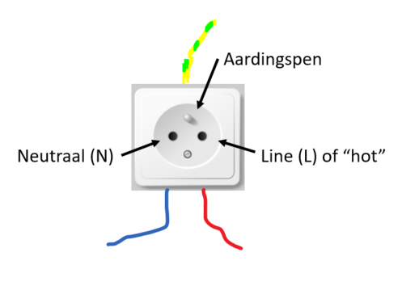
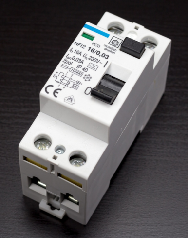

# Elektrische veiligheid

Waarom moeten we zo voorzichtig zijn met elektriciteit?

Veiligheid is een belangrijk aandachtspunt bij het werken met elektrische systemen. De mogelijkheid van een elektrische schok of een brandwonde is steeds aanwezig. Dit houdt in dat je steeds aandachtig en voorzichtig moet blijven als je met elektriciteit te maken hebt. Je lichaam zorgt voor een stroomweg wanneer er een spanning wordt aangelegd tussen twee punten op je lichaam. De stroom die ten gevolge van de aangelegde spanning door je lichaam stroomt, zorgt voor een elektrische schok. In figuur 1-13 worden deze stroompaden weergegeven.

Elektrische componenten werken vaak bij hoge temperaturen waardoor er kans bestaat dat je je huid \(vingers\) kan verbranden als je in contact komt met deze componenten in bedrijf. Ook de aanwezigheid van elektriciteit zorgt voor een potentieel brandgevaar.

Wat onthoud je best na deze sectie?

* **Hoe je elektrische gevaren herkent en hoe de juiste veiligheidsprocedures in acht neemt.**
* **De oorzaak van een elektrische schok.**
* **Welke stroompaden er zijn die door je lichaam gaan.**
* **Het effect van elektrische stoom op het menselijk lichaam.**
* **De veiligheidsmaatregelen waarop je moet letten wanneer je werkt met elektriciteit.**

## Elektrische schok 

Niet de spanning maar de stroom door je lichaam is de oorzaak van een elektrische schok . Natuurlijk heb je spanning over een weerstand nodig om stroom te produceren. Wanneer een punt op het lichaam in contact komt met een spanning en een ander punt in contact komt met een andere spanning of massa \(bv aarding of een metalen chassis\), zal er een bepaalde stroom vloeien door het lichaam van het ene punt naar het andere. H et pad van de stroom is afhankelijk van de punten waarover de spanning optreedt. De ernst van de resulterende elektrische schok is afhankelijk van de hoeveelheid spanning en het pad dat de stroom door het lichaam volgt bepaalt welke weefsels en organen zullen worden beïnvloed. De stroombanen kunnen in drie groepen worden onderverdeeld die genoemd worden naar de manier waarmee de aanraking gebeurt: aanraak \(touch\)potentiaal, stap \(step\) potentiaal, en aanraak/stap \(touch/step\) potentiaal . Zie figuur 1-13.

Figuur 1-13 : risico’s op een elektrische schok en hoe de stroom door het lichaam vloeit

Invloed van de stroom op het menselijk lichaam

De hoeveelheid stroom is afhankelijk van de spanning en weerstand. Het menselijk lichaam heeft een weerstand die van verschillende factoren afhankelijk is waarvan de body mass, vochtgehalte van de huid en de contactpunten van het lichaam met een spanningspotentiaal de belangrijkste zijn. Tabel 1-4 toont de effecten op het menselijk lichaam ten gevolge van verschillende waarden van stroomdoorgang in milliampère.

| Fysische effecten van stoomdoorgang door het menselijk lichaam \(afhankelijk van de body mass\) |  |
| :--- | :--- |
| Stroom | Fysisch effect |
| 400 µA | Lichte sensatie |
| 1,1 mA | Perceptiedrempel |
| 1,8 mA | Schok, geen pijn en geen verlies van spiercontrole |
| 9 mA | Pijnlijke schok, geen verlies van spiercontrole |
| 16 mA | Pijnlijke schok, loslaatdrempel |
| 23 mA | Ernstige pijnlijke schok, spiersamentrekkingen, ademhalingsmoeilijkheden |
| 75 mA | Ventriculaire fibrillatie \(snel en chaotisch trillen van de hartkamers\), drempel |
| 235 mA | Ventriculaire fibrillatie, meestal fataal voor de duur van 5 seconden of meer |
| 4 A | Hartverlamming \(geen ventriculaire fibrillatie\) |
| 5 A | Tissue \(een aggregaat van cellen in een organisme dat soortgelijke structuur en functie heeft\) verbrandt |

Tabel 1-4 : Fysische effect van een bepaalde stroomdoorgang door het menselijk lichaam

**De elektrische weerstand van het menselijk lichaam**

De weerstand van het menselijk lichaam is typisch tussen de 10 k Ω en 50 k Ω en is afhankelijk van de twee punten waartussen wordt gemeten. Het vocht van de huid beïnvloedt ook de weerstand tussen twee punten. De weerstand bepaalt de hoeveelheid spanning die vereist is voor elk van de in tabel 1-4 vermelde effecten. Bijvoorbeeld, als je een weerstand hebt van 10 kΩ tussen twee gegeven punten op je lichaam dan levert een spanningsval van 90 V over deze twee punten genoeg stroom \(9 mA\) om een pijnlijke schok te produceren.

## Dagelijkse netspanning van 230 V 

We zijn gewoon aan de dagelijkse netspanning \(wisselspanning van 230 Veff\) maar ze kan dodelijk zijn. Het beste is om voorzichtig te zijn rond elke spanningsbron \(zelfs lage spanningen kunnen voor ernstige brandgevaar zorgen\). Als algemene regel geldt dat je moet voorkomen dat je werkt aan een onder stroom staand circuit. Daarom controleer je steeds eerst of de stroom is uitgeschakeld met een geschikt meetinstrument vooraleer je aanpassingen maakt of herstellingen uitvoert aan de elektrische installatie of een elektronisch toestel.

 In de meeste labo’s \(zoals in het onderwijs\) wordt gebruik gemaakt van lage spanningen. Toch is het aan te raden om zo min mogelijk de elektrische schakelingen aan te raken. Als je werkt op een circuit dat is aangesloten op de netspanning moet je om veiligheidsreden eerst de service loskoppelen, een bericht plaatsen op het apparaat of de locatie waar de dienst wordt verbroken en een hangslot gebruiken om te voorkomen dat iemand per ongeluk de stroom zou inschakelen . Deze procedure heet lockout /tagout en wordt op grote schaal gebruikt in de industrie. Er zijn specifieke OSHA en industrienormen voor lock-out / tag-out.

_Figuur 1-14 : aansluiting stopcontact_

De meeste laboratoriumapparatuur is aangesloten op het elektrisch net : in Europa is dit 230 Veff \(Vrms\) en in Noord Amerika is dit 120 V rms \(rms wordt besproken in sectie 8-2\). Een defect apparaat kan ertoe leiden dat de "hot" geleiders per ongeluk worden blootgesteld . Controleer steeds het snoer voor blootliggende draden en controleer de apparatuur voor ontbrekende deksels of andere mogelijke veiligheidsproblemen.

De eenfase nutsleidingen in huizen en elektrische laboratoria gebruiken drie geïsoleerde draden die worden aangeduid als de "hot“ of Line \(L\) , \(zwarte of rode draad \), neutraal \(N\) \(blauwe draad\) en aarding \(groen/gele draad \). In Noord Amerika wordt voor de neutraal een witte draad gebruikt en voor de randaarde een groene draad. Het is normaal dat door de “hot” en “neutral” stroom vloeit maar door de aarding mag nooit de stroom vloeien in de normale werking . De aarding is verbonden met de metalen buitenkant van ingekapseld materiaal en is ook verbonden met de metalen verbindingspin van een stopcontact.

_Figuur 1-15: vb. van verliesstroom-schakelaar \(reageert op een verlies- stroom van 30 mA_

Veel circuits zijn verder beschermd met een speciaal apparaat dat verliesstroomschakelaar \(differentieelschakelaar\) wordt genoemd. Als er een storing optreedt in een verliesstroomschakelaar dan detecteert een interne sensor dat de stroom in de “hot” lijn \(Line\) en de neutrale lijn \(N\) niet aan elkaar gelijk zijn. Dit houdt in dat één van de twee elektriciteitsdraden op een of andere manier een verbinding maakt kt met de aarding. Er is dus een verlies van stroom naar de aarding toe. Deze stroomweg kan veroorzaakt worden door een persoon die \(per ongeluk\) contact maakt met de stroomvoerende geleider. Hierdoor vloeit een deel van de stroom via zijn lichaam naar de aarde \(aarding\) toe. Een verliesstroomschakelaar reageert erg snel en verbreekt het elektrisch contact in het circuit als er een verliesstroom van een bepaalde stroomwaarde optreedt. Er bestaan verliesstroomschakelaars die reageren vanaf dat er een verlies is van 30 mA en een ander type dat reageert vanaf een verliesstroom van 300 mA. Verliesstroomschakelaars zijn nodig in gebieden waar kans op een elektrische schok bestaat, zoals plaatsen waar water of vocht aanwezig is zoals zwembaden, badkamers, keukens, kelders en garages. Verliesstroomschakelaars zijn uitgerust met een testknop. Wanneer de testknop wordt ingedrukt, wordt het circuit onmiddellijk geopend. Daarnaast is er ook een resetknop aanwezig \(on/off schakelaar\) die gebruikt wordt om het circuit terug in te schakelen.

## Veiligheidsmaatregelen 

Wanneer je werkt met elektriciteit en elektronisch materieel zijn heel wat praktische dingen die je moet doen. Enkele belangrijke voorzorgsmaatregelen worden hier genoemd :

* Vermijd contact met een spanningsbron. Schakel de stroom uit voordat u werkt op circuits en delen van dit circuit moet aanraken.
* Werk niet alleen. Een telefoon moet beschikbaar zijn voor noodgevallen.
* Werk niet bij vermoeidheid of het nemen van medicijnen die u slaperig maken.
* Verwijder ringen, horloges, en andere metalen sieraden wanneer u werkt op circuits.
* Werk niet aan apparatuur tot je de juiste procedures kent en je bewust bent van de potentiële gevaren.
* Zorg dat de netsnoeren in goede staat zijn en de aarding niet ontbreekt.
* Onderhoud uw gereedschap goed. Zorg ervoor dat de isolatie van metalen gereedschapshandgrepen in goede staat is.
* Behandel gereedschap goed en zorg voor een nette werkplek.
* Draag een veiligheidsbril indien nodig, in het bijzonder bij het solderen, het knippen van draden, of het werken met elektrisch gereedschap.
* Schakel altijd spanning uit en ontlaadt de condensatoren voordat u een deel van een circuit aanraakt met je handen.
* Weet waar de locatie is van de nood-stop-schakelaar en de nooduitgangen.
* Draag altijd schoenen en hou ze droog. Sta niet op metalen of natte vloeren wanneer je werkt aan elektrische circuits.
* Raak geen instrumenten aan wanneer uw handen nat zijn.
* Gebruik altijd draden met isolatie en connectoren of clips met isolatiekraag.
* Houd de kabels en draden zo kort mogelijk. Sluit gepolariseerde componenten steeds correct aan.
* Meld eventuele onveilige situaties.
* Wees je bewust van- en volg alle regels op de werkplaats en laboratorium. Breng geen drankjes of voedsel in de buurt van apparatuur.
* Als een ander persoon een apparaat niet kan loslaten dat onder spanning staat , schakel dit apparaat onmiddellijk uit. Indien dit niet mogelijk is gebruik dan alle beschikbaar niet-geleidend materiaal om te proberen het lichaam van de persoon te scheiden van het apparaat.
* Gebruik een lock-out / tag-out procedure om te voorkomen dat iemand het toestel inschakelt waar u aan werkt.
* Nooit aannemen dat een circuit is uitgeschakeld. Double-check met een betrouwbare meter vóór dat je begint met de werkzaamheden.
* Stel de stroombegrenzer \(limiter\) steeds in op elektronische voedingen om stromen groter dan noodzakelijk te voorkomen tijdens het testen van het circuit.
* Sommige componenten, zoals condensatoren, kunnen een dodelijke lading voor langere tijd vasthouden nadat de voeding is afgezet. Ze moeten eerst worden ontladen voordat je aan het circuit werkt.
* Bij het aanschakelen of het maken van aansluitingen sluit je steeds het punt waar de hoogste spanning op staat als laatste aan.
* Vermijd contact met de terminals \(aansluitpunten\) van de voedingen.

## Test jezelf aangaande elektrische veiligheid 

1. **Wat veroorzaakt fysieke pijn en/of beschadiging aan het lichaam als elektrisch contact wordt gemaakt?**
2. **Is het verstandig om een ring te dragen bij het werken aan een elektrisch circuit? \(ja of neen?\)**
3. **Levert het staan op een natte vloer geen gevaar op voor de veiligheid bij het werken met elektriciteit. \(ja of neen?\)**
4. **Een circuit kan worden bedraad zonder het afsluiten van de spanning als je voorzichtig bent. \(ja of neen?\)**
5. **Elektrische schokken kunnen zeer pijnlijk zijn of zelfs fataal. \(ja of neen?\)**
6. **Wat is een verliesstroomschakelaar?**

