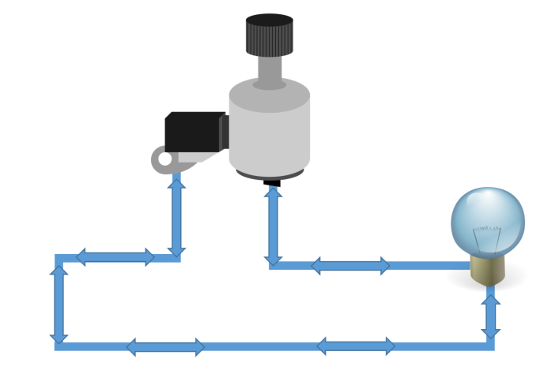
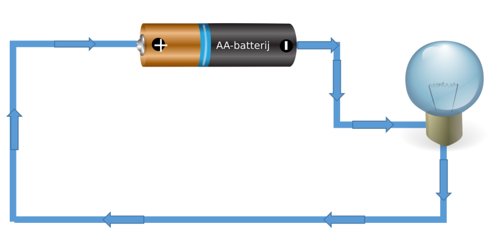
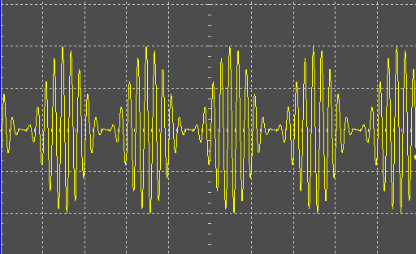

# Soorten schakelingen

Je kan jezelf de vraag stellen waarom het nodig is om naast elektronische systemen ook noties te hebben van elektrische systemen? We weten dat elektrische systemen omgaan met vermogens terwijl elektronische systemen werken met signalen. De elektrische systemen kunnen zowel op gelijkstroom \(DC\) als op wisselstroom \(AC\) werken. Elektronische systemen vereisen over het algemeen een energiebron. Het is bijgevolg belangrijk om inzicht te hebben in elektrische systemen naast de elektronische systemen. Gelukkig zijn de meeste van de fundamentele wetten voor beide systemen dezelfde. Deze sectie richt zich op de aard van schakelingen die gebruikt worden in elektrische en elektronische systemen.

Wat onthoud je best na deze sectie?

* De beschrijving van wat een schakeling is in algemene termen.
* Het verschil tussen actieve en passieve componenten.
* Een aantal toepassingen voor AC- en DC-schakelingen in de elektrische stroomverdeling.
* Een vergelijk tussen digitale en analoge elektronische schakeling.
* _**De definitie van een transducer.**_

## Componenten 

Een circuit is gebaseerd op het Latijns woord circuitus, wat betekent om rond te gaan. Een circuit noemt ook een schakeling. Een schakeling moet bijgevolg beschikken over een volledig pad \(zoals een cirkel\) dat start vanaf een bron, een belasting bevat en terugkeert naar de bron. Wanneer de schakeling bestaat uit een volledig pad dan is deze gesloten. Dit betekent dat de elektronen vanaf de bron kunnen vloeien door een belasting en dan de andere klem van de bron bereiken. Naast één of meer bronnen bevatten schakelingen ook componenten. Een component is een apparaat \(device\) dat de elektrische eigenschappen van de schakeling verandert. Er bestaan zowel passieve componenten als actieve componenten. Een passieve component is een component die geen bepaald elektrisch vermogen nodig heeft om te functioneren. Actieve componenten daarentegen hebben een bepaald vermogen nodig van een bron om te kunnen functioneren. De meeste systemen bestaan uit schakelingen die zowel passieve als actieve componenten bevatten.

Passieve component

Een passieve component kan de stroom in een signaal niet verhogen. De drie fundamentele passieve componenten zijn weerstanden, condensatoren en spoelen. Andere passieve componenten zijn dioden, transformatoren, batterijen en motoren. Een batterij wordt beschouwd als een passieve component vermits deze niet in staat is het vermogen van een signaal te verhogen \(hoewel het wel elektrisch vermogen levert\).

Actieve component

Een actieve component kan de stroom in een signaal verhogen. De actieve componenten worden gewoonlijk omschreven als componenten die het signaalvemogen kunnen verhogen. Algemeen zijn ze ingedeeld als transistoren, operationele versterkers en microprocessoren.

Soms is er geen ingangssignaal in het systeem, maar wordt het intern geproduceerd. Een elektronische oscillatorschakeling is een voorbeeld waarbij de output intern wordt gegenereerd. Een apparaat \(device\) dat op deze wijze output genereerd, wordt beschouwd als een actief apparaat. Oscillatoren zijn bijgevolg elektronische schakelingen die een continue output genereren. Er zijn verschillende vormen van outputs mogelijk zoals sinusvorm, blokvorm en zaagtandvorm.

## Elektrische schakelingen 

Elektrische schakelingen leveren en controleren elektrisch vermogen in de vorm van wisselstroom of gelijkstoom.

 AC-schakelingen

Figuur 1-8 : opwekken AC met alternator \(dynamo\)

Alternated Current \(AC\) verandert een aantal keren per seconde van polariteit. Wanneer deze AC-stroom 50 keer van polariteit verandert per seconde komt dit overeen met een frequentie van 50 Hz. Op enkele uitzonderingen na leveren de elektriciteitsnetten over de wereld AC. De meest voorkomende manier om AC op te wekken is opwekking met een alternator. In een alternator draaien een aantal geleiders rond in een magnetische veld. Hierdoor wordt een inductiespanning opgewekt welke de AC-spanning is.

AC kan gemakkelijk van een lage spanning naar een hogere spanning worden getransformeerd en omgekeerd. Dit met lagere kosten dan het omvormen van DC. Toch zijn er een aantal zeer hoge spanningssystemen die gebruik maken van gelijkstroom. Bijvoorbeeld bepaalde zeekabels die elektriciteit doorsturen van een centrale op het vaste land naar een eiland. Over lange afstanden zijn hoge AC-spanningen veel efficiënter om over te zenden dan met DC-spanningen. Hierdoor gebruiken bijna alle vermogendistributiesystemen AC. In de loop der tijd zijn er verschillende systemen ontwikkeld met verschillende frequenties en spanningen om elektrisch vermogen te leveren aan klanten. Het grootste deel van de wereld gebruikt een standaardfrequentie gelijk aan 50 Hz. In de Verenigde Staten en Noord Amerika wordt als frequentie 60 Hz gebruikt. In vliegtuigen en bepaalde militaire toepassingen waar gewicht kritisch is, wordt een frequentie van 400 Hz gebruikt. De reden hiervoor is dat 400 Hz het toelaat om kleinere en lichtere componenten te gebruiken.

DC-schakelingen

Figuur 1-9 : DC via batterij

 Direct Current \(DC – gelijkstroom\) is de vorm van elektrische stroom die niet verandert van polariteit. Hoewel de meeste stroomnetten bestaan uit AC, bestaat er hoogspanningsgelijkstroomtechnologie \(HVDC\) voor een aantal transmissies over een lange afstand en onderwater transmissie. Ook al is het omzetten van lage gelijkspanning naar zeer hoge gelijkspanning, nodig voor efficiënte transmissie, duurder dan AC; de toren en transmissielijnen kunnen voor gelijkstroom ontworpen worden aan een lagere kost per kilometer voor zeer lange afstanden. Gebruik van DC kan dus kosteneffectief zijn. DC kan ook nuttig zijn voor interfacing onafhankelijke AC-netwerken die niet gesynchroniseerd zijn. Dit gebeurt onder andere in Japan waar twee totaal verschillende frequenties in gebruik zijn \(zowel 50 Hz als 60 Hz\). DC wordt ook gegenereerd voor een aantal low-voltage militaire- en vliegtuigsystemen voor het leveren van elektrische energie. Typisch wordt hiervoor 28 V gebruikt.

## Elektronische schakelingen 

Elektronische schakelingen werken met signalen. Pure DC bevat geen signaalinformatie maar doordat actieve elektronische schakelingen DC nodig hebben is DC heel belangrijk voor elektronische toepassingen. De studie van DC-schakelingen vormt de basis voor iedereen die een goed begrip wil hebben van de elektrische- of elektronische systemen. DC-bronnen zijn batterijen, brandstofcellen, zonnecellen en generatoren. Deze bronnen worden in sectie 2-3 besproken. Een veel gebruikte methode om DC te bekomen is AC omzetten in DC met een voeding \(power supply\). Voedingen worden in sectie 2-7 besproken.

Een signaal kan informatie bevatten via een opzettelijke verandering van een bepaalde parameter zoals spannings- of frequentieverandering. Er zijn twee grote onderverdelingen voor soorten signalen : digitale signalen en analoge signalen.

Digitale signalen

Digitale signalen zijn signalen met discrete niveaus. In sommige gevallen kan het signaal intern worden gegenereerd in het systeem. Een fietswaarschuwingslampje is een voorbeeld van zulk eenvoudig digitaal systeem waarin een knipperend signaal intern wordt gegenereerd.

Analoge signalen

Analoge signalen variëren continu over een toegestaan bereik. Stel bijvoorbeeld een AM-radiosignaal. De zender zendt een hoogfrequent signaal \(draaggolf of carrier genoemd\) waarvan de amplitude wordt gevarieerd \(of gemoduleerd\) door een lagere frequentie die de informatie bevat. Figuur 1-10 illustreert een AM-signaal dat een voorbeeld is van een analoog signaal. In dit geval zit de informatie in de in hoogte veranderende amplitude \(envelope\) van de draaggolf.

Figuur 1-10: voorbeeld van een AM-signaal \(draaggolf 1 kHz en informatiesignaal 100 Hz\)

Transducer

Dikwijls worden elektronische schakelingen gebruikt die zowel digitale als analoge signalen verwerken. Denk maar aan de digitale temperatuurmeterschakeling van vorige sectie. De conversie van het analoog signaal naar het digitale signaal wordt via een converter \(ADC\) gedaan. De ADC krijgt dikwijls zijn input van een zogenaamde transducer. Een transducer is een apparaat dat energie in de ene vorm omtransformeerd naar energie in een andere vorm. Bij elektronische systemen met een transducer is één van die energievormen het elektrisch signaal. De temperatuursensor van de digitale temperatuurmeting is zo’n voorbeeld van transducer. In dit geval converteert de transducer de temperatuur in een spanning. Deze spanning wordt op zijn beurt geconverteerd in een digitaal signaal voor verdere verwerking.

In sommige gevallen zoals bij audio wordt een digitaal signaal muzieksignaal \(CD\) omgevormd naar een analoog signaal om de muziek hoorbaar te maken. Hiervoor is een digitaal naar analoog converter \(DAC\) nodig. Zo wordt het digitaal signaal van een CD via een DAC omgezet naar een analoog signaal. Dit analoog signaal wordt op zijn beurt via een luidspreker omgezet in een akoestisch signaal. De luidspreker is dus een transducer die elektrische energie in geluid omzet.

## Test jezelf aangaande soorten schakelingen 

1. Wat is het verschil tussen een passieve en een actieve component?
2. Waarom wordt een batterij niet beschouwd als een elektronisch apparaat \(device\)?
3. Welke zijn de twee frequenties die wereldwijd gebruikt worden in de meeste elektriciteitscentrales?
4. Waarom is DC zo belangrijk voor actieve schakelingen?
5. Wat is het verschil tussen een digitale en een analoge schakeling?
6. Wat is een transducer?

