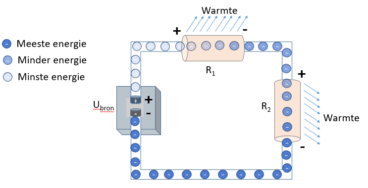

# Energie-omzetting en spanningsval in een weerstand

Figuur 3-17 illustreert lading in de vorm van elektronen die uit de negatieve pool \(teveel van elektronen\) van een spanningsbron vertrekken en via een stroompad terugvloeien naar de positieve pool \(te weinig aan elektronen\). De elektronen stromen door elk van de weerstanden die met elkaar zijn verbonden om een stroomkring te vormen. Dit type verbinding wordt een serieschakeling genoemd \(zie hoofdstuk 4\).

De elektronen stromen door elke weerstand waarbij een deel van hun energie wordt afgegeven in de vorm van warmte. Daarom hebben de elektronen meer energie wanneer ze de weerstand intreden dan wanneer ze de weerstand verlaten. Dit wordt in de figuur 3-17 weergegeven door de afname in de intensiteit van de blauwe kleur.

Figuur 3-17 : Wanneer elektronen door een weerstand vloeien geven ze energie af ten gevolge van de weerstand; deze afgegeven energie wordt in warmte omgezet

Wanneer de elektronen door de schakeling zijn gereisd en terug gegaan zijn naar de positieve pool van de accu, zijn de elektronen op hun laagste energieniveau.

Herinner je dat de spanning gelijk is aan energie per lading. De formule hiervoor is _U = W/Q_. De lading _Q_ stelt een bepaalde hoeveelheid elektronen voor. Afhankelijk van de spanning van de spanningsbron wordt een bepaalde hoeveelheid energie verleend aan alle elektronen die stromen vanuit de minpool naar de schakeling. Eens deze elektronen in de schakeling aanwezig zijn beginnen ze hun energie te verliezen aan de weerstand die ze ondervinden in de schakeling. In figuur 3-17 is de spanning onderaan _R\_\_2_ gelijk aan _W\_\_ingang R2_ _/Q_ en de spanning bovenaan _R\_\_2_ is gelijk aan _W\_\_uitgang R2_ _/Q_ . Dezelfde hoeveelheid elektronen die _R\_\_2_ binnentreden verlaten ook _R\_\_2_; maar de hoeveelheid energie die ze bevatten is lager bij het verlaten van _R\_2 dan bij het binnenkomen van \_R\_\_2_. Hieruit kan je concluderen dat de spanning aan de zijde van \_R\_2 waar de elektronen binnenstromen hoger is dan de spanning aan de zijde van de weerstand \_R\_2 waar de elektronen uitstromen. Dit dalen van de spanning ten gevolge van energieverlies wordt spanningsval genoemd.

De spanning aan de bovenzijde van _R\_2 is minder negatief \(of meer positief\) dan de spanning aan de onderzijde van \_R\_2. Vervolgens stromen de elektronen \_R\_\_1_ in waar ze nog meer energie verliezen, wat resulteert in een bepaalde spanningsval over R1. Ook voor R1 geldt dat de elektronen bij het binnengaan van de weerstand meer energie bevatten dan de elektronen die de weerstand verlaten. De afgegeven energie in de weerstand wordt ook hier terug omgezet in warmte.

## Test jezelf aangaande energie-omzetting en spanningsval in een weerstand 

1. Wat is de voornaamste reden voor energie-omzetting in een weerstand?
2. Wat betekent spanningsval?
3. Wat is de polariteit van een spanningsval in relatie met de stroomrichting?

