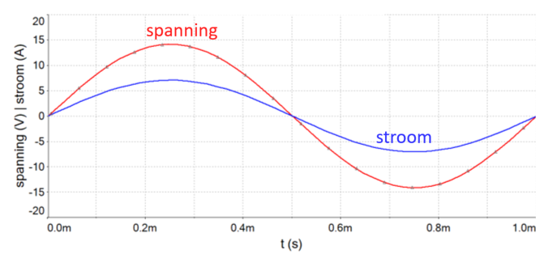
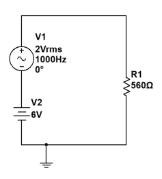
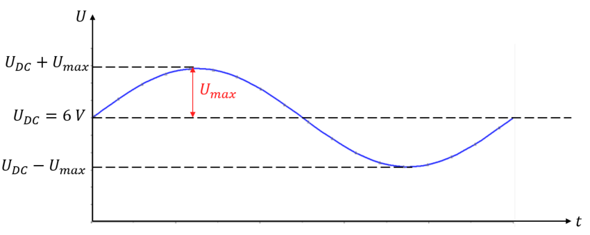
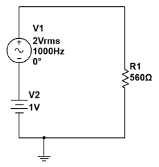
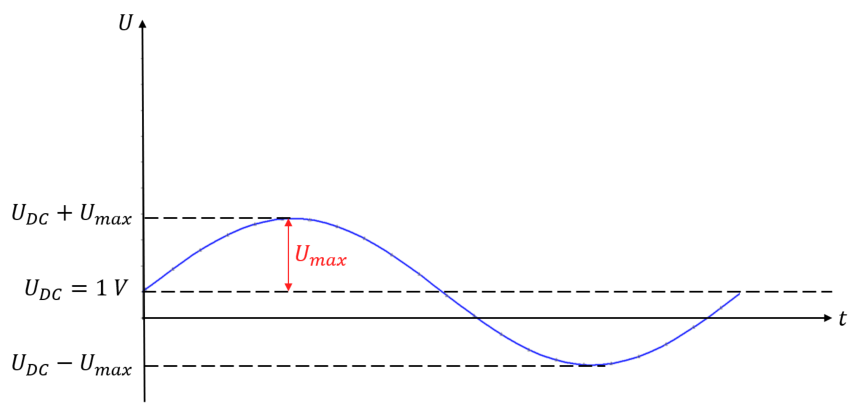

# Analyse van  wisselstroomschakelingen

Wanneer een in de tijd variërende spanning zoals een sinusvormige spanning wordt toegevoerd aan een schakeling dan kunnen de wet van Ohm, de wetten van Kirchhoff en de vermogenformules ook hierop toegepast worden op dezelfde wijze als bij de gelijkstroomschakelingen.

Wat is belangrijk?

* Je past de wet van Ohm toe op resistieve wisselstroomschakelingen.
* Je pas de wetten van Kirchhoff toe op resistieve wisselstroomschakelingen.
* Je bepaalt het vermogen in resistieve wisselstroomschakelingen.
* Je kan de totale spanning bepalen met zowel de gelijkstroomcomponent als de wisselstroomcomponent inbegrepen.

Wanneer een sinusvormige spanning over een weerstand staat, zoals weergegeven in figuur 7-29, dan is de stroom ook sinusvormig. De stroom is nul wanneer de spanning nul is, maximaal wanneer de spanning maximaal is, enz. Wanneer de spanning verandert van polariteit zal de stroom van richting omkeren. Hieruit kan je besluiten dat de spanning en stroom in fase zijn met elkaar.

|  |  |
| :--- | :--- |
| \(a\) | \(b\) |

Figuur 7-29 : een sinusvormige spanning produceert een sinusvormige stroom

Wanneer je de wet van Ohm toepast op een wisselstroomschakeling moet de spanningswaarde en stroomwaarde op dezelfde manier worden uitgedrukt. Is de spanning uitgedrukt met zijn effectieve waarde, dan moet de stroom ook uitgedrukt worden met zijn effectieve waarde. Is de spanning uitgedrukt met zijn maximale waarde, dan moet de stroom ook uitgedrukt worden met zijn maximale waarde, enz. De wetten van Kirchhoff zijn eveneens toepasbaar op wisselstroomschakelingen en op dezelfde wijze als bij gelijkstroomschakelingen. Zo zal in een wisselstroomschakeling de som der deelspanningen gelijk zijn aan de aangelegde wisselspanning. Ook de hoeveelheid wisselstroom die toekomt in een bepaald knooppunt is gelijk aan de hoeveel wisselstroom die er wegvloeit.

Het vermogen in resistieve wisselstroomschakelingen kan op dezelfde manier bepaald worden als in gelijkstroomschakelingen op voorwaarde dat je steeds de effectieve waarden \(rms-waarden\) moet nemen om het vermogen te bepalen. Waarom? Wel het effectief vermogen levert evenveel vermogen aan een bepaalde belasting alsof het gelijkstroomvermogen is van dezelfde grootte als de effectieve waarde.

Je kan het vermogen bepalen op volgende manieren:

$$P={U}_{eff} \times {I}_{eff}$$

$$P=\frac{ {U}_{eff}^{2}}{R}$$

$$P={I}_{eff}^{2}\times R$$

## Gesuperponeerde gelijk- en wisselspanningen 

In veel praktische schakelingen zal je zowel gelijkspanning als wisselspanningen gecombineerd vinden. Een voorbeeld hiervan is in de versterkingstechniek waar wisselspanningssignalen worden gesuperponeerd op een gelijkspanning die dient als instelspanning voor een bepaalde halfgeleider. Figuur 7-33 \(a\) toont een serieschakeling van een wisselspanningsbron met een gelijkspanningsbron. Deze twee spanningen worden met elkaar opgeteld om een wisselspanning te produceren al “rijdend” op een gelijkspanningsniveau \(zoals gemeten over de weerstand\).

Als de gelijkspanning groter is dan de piekwaarde van de sinusvormige spanning zal de gecombineerde wisselspanning met gelijkspanning een sinusgolf produceren die nooit van polariteit omkeert. Dit is in figuur 7-33 \(b\) weergegeven. Wanneer de gelijkspanning kleiner is dan de amplitude van de sinusspanning, zal de sinusspanning negatief worden gedurende een gedeelte van de onderste halve periode zoals weergegeven in figuur 7-33 \(d\). In beide gevallen zal de sinusspanning zijn maximale waarde bereiken gelijk aan de som van beide spanningen. De totale minimale spanning is gelijk aan het verschil van de gelijkspanningswaarde met de amplitude van de sinusspanning. In formulevorm:

$${U}_{totmax}={U}_{DC}+{U}_{max}\_totmin=U\_DC-U\_max$$

|  |  |
| :--- | :--- |
|  |  |

\| De sinusspanning wordt nooit negatief \| \|  \|  \| \|

\| De sinusspanning wordt negatief gedurende een bepaald deel van de negatieve halve periode \|

Figuur 7-34 : Sinusgolf gesuperponeerd op een gelijkspanningsniveau Figuur 7-34 : Sinusgolf gesuperponeerd op een gelijks panningsniveau

## Test jezelf : analyse van wisselstroomschakelingen 

1. **Een sinusvormige spanning waarbij de gemiddelde spanning over een halve periode gelijk is aan** $$\mathrm{12,5}\mathit{ }\mathit{V}$$ **wordt aangelegd aan een weerstand van** $$330\mathit{ }\mathit{\Omega }$$ **.** Wat is de maximale stroom door deze weerstand?
2. **De maximale spanningsvallen over drie in serie staande weerstanden zijn** $$\mathrm{6,2}\mathit{ }\mathit{V},\mathit{ }\mathrm{11,3}\mathit{ }\mathit{V}$$ **en** $$\mathrm{7,8}\mathit{ }\mathit{V}$$ **.** Bepaal de effectieve spanningswaarde van de bronspanning.
3. **Een sinusvormige wisselspanning met een** $$5\mathit{ }\mathit{V}$$ **amplitude** **wordt samengevoegd met een gelijkspanning van** $$+\mathrm{2,5}\mathit{ }\mathit{V}$$ **.** Heeft de resulterende spanning een alternerende polariteit.

