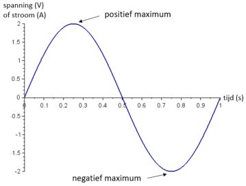
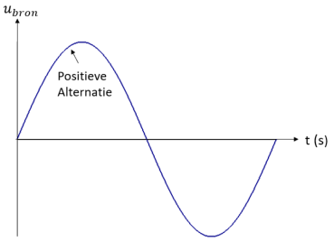
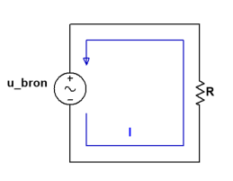
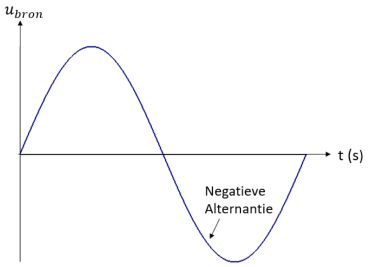
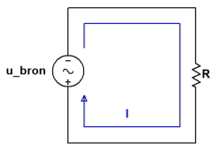
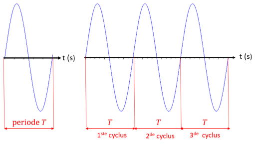
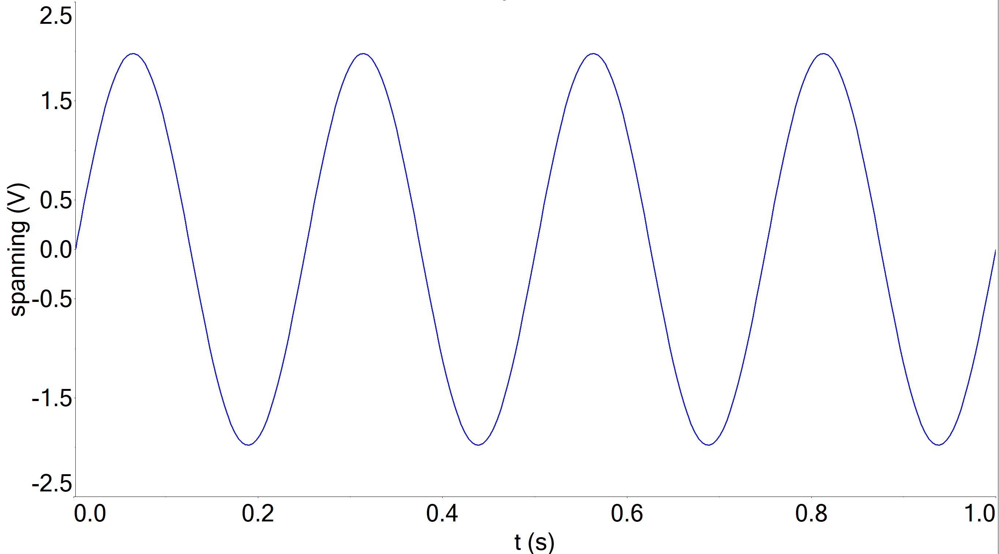
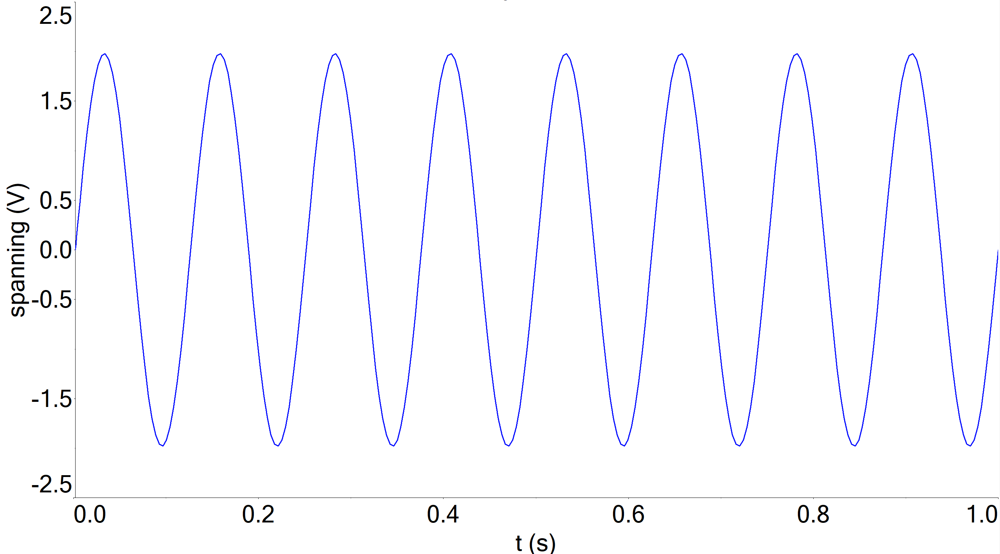

# De sinusoïdale golfvorm

De sinusvormige golfvorm of sinus is de fundamentele aard van de wisselstroom en wisselspanning. Het wordt ook aangeduid als een sinusgolf, of eenvoudigweg sinusoïde. De elektrische energielevering van de energieleveranciers is in de vorm van een sinusvormige spanning en stroom. Er bestaan ook andere golfvormen voor elektrische signalen. Deze bestaan uit een samenstelling van een grondgolf en verschillende sinusoïdale golfvormen die harmonischen worden genoemd.

Wat is belangrijk?

* Je definieert de periode.
* Je bepaalt de periode
* Je definieert de frequentie.
* Je bepaalt de frequentie.
* Je beschrijft de relatie tussen periode en frequentie.
* **Je beschrijft twee soorten elektronische signaalgeneratoren** .

Er zijn twee soorten bronnen die een sinusvormig elektrisch signaal produceren. De alternator en de oscillator. De alternator wekt het signaal op via een elektromechanische manier terwijl de oscillator het signaal opwekt op elektronische wijze. Figuur 7-1 toont het symbool van een wisselstroombron, ook wel AC-bron genoemd. AC staat voor Alternated Current.

|  |  |
| :--- | :--- |
| Figuur 7-1 algemeen symbool wisselspanningsbron | Figuur 7-2 ; voorstelling van 1 cyclus van een sinusgolf |

Figuur 7-2 toont de algemene vorm van een sinusgolf die ofwel een wisselstroom ofwel een wisselspanning kan zijn. De spanning \(of stroom\) wordt weergegeven op de verticale as terwijl de tijd wordt weergegeven op de horizontale as. Merk op hoe de spanning \(of stroom\) varieert in de tijd. Vanaf het tijdstip $$t=0$$ stijgt de spanning \(of stroom\) tot een positief maximum. Daarna gaat deze terug naar nul en neemt vervolgens in de andere zin toe tot een negatief maximum alvorens terug te keren naar nul. Eens de spanning \(of stroom\) nu terug nul bereikt is er een volledige cyclus van het signaal doorlopen.

## Polariteit van een sinusgolf 

Een sinus verandert de polariteit op zijn waarde nul. Dit wil zeggen dat de sinusgolf wisselt tussen positieve en negatieve waarden. Wanneer een sinusvormige spanningsbron \( $$u\_bron)$$ wordt aangesloten aan een resistieve schakeling vloeit er een alternerende stroom sinusoïdale stroom door de schakeling. Dit is in figuur 7-3 weergegeven.

|  |  |
| :--- | :--- |
| Gedurende de positieve alternantie van de spanning vloeit de stroom in de getoonde richting |  |
|  |  |
| Gedurende de negatieve alternantie van de spanning vloeit de stroom in de omgekeerde richting |  |

Figuur 7-3 : Alternerende stroom en spanning

## De periode van een sinusgolf 

Een sinus varieert in de tijd $$\left(t\right)$$ in een definieerbare wijze. De tijd die nodig is voor een gegeven sinusgolf om één keer de volledige cyclus te voltooien wordt de periode $$\left(T\right)$$ genoemd. Figuur 7-4 \(a\) illustreert de periode van een sinus. Een sinusgolf blijft zich in identieke cycli herhalen zoals is weergegeven in figuur 7-4 \(b\). Aangezien alle cycli van een herhalende sinusgolf hetzelfde zijn, is de periode altijd een vaste waarde voor een gegeven sinusgolf. De periode van een sinusgolf kan worden gemeten vanaf een nuldoorgang tot aan de volgende overeenkomstige nuldoorgang zoals aangegeven in figuur 7-4\(a\). De periode kan ook worden gemeten vanaf een maximum \(piek\) in een bepaalde cyclus tot de volgende overeenkomstige maximum \(piek\) in de volgende cyclus.

| \(a\) |  | \(b\) |
| :--- | :--- | :--- |

Figuur 7-4: De periode van een bepaalde sinusgolf is heeft dezelfde waarde voor iedere cyclus

## De frequentie van een sinusgolf 

Frequentie is het aantal cyclussen dan een sinusgolf vervolledigt per seconde. Hoe meer cycli er worden vervolledigd, hoe hoger de frequentie. De eenheid van frequentie is Hertz \( $$Hz$$ \). $$1 Hz$$ is het equivalent van één cyclus per seconde. Op analoge manier is vijftig hertz het equivalent van vijftig cyclussen per seconde. In de figuur 7-8 zijn twee sinusgolven weergegeven. In figuur 7-8 \(a\) vervolledigt de sinusgolf vier cycli per seconde. Dit betekent dat de frequentie gelijk is aan $$4 Hz$$ . In figuur 7-8 \(b\) vervolledigt de sinusgolf acht cycli per seconde wat overeen komt met een frequentie gelijk aan $$8 Hz$$ . Het signaal van de figuur 7-8 \(b\) heeft dus een dubbele frequentie dan het signaal van de figuur 7-8 \(a\).

|  |  |
| :--- | :--- |
| Lagere frequentie, minder cycli per seconde | Hogere frequentie meer cycli per seconde |

Figuur 7-8: illustratie van frequentie

## De relatie tussen de frequentie en de periode. 

De periode geeft de tijdsduur aan in seconde hoe lang een cyclus duurt. De frequentie geeft weer hoeveel cycli er zijn per seconde. De frequentie is bijgevolg omgekeerd evenredig met de periode. Immers hoe langer de tijdsduur van een cyclus, hoe minder cycli per seconden zich kunnen voordoen en omgekeerd. De relatie tussen frequentie en periode kan in formulevorm als volgt worden weergegeven:

$$f=\frac{1}{T} \left(7-1\right) of T=\frac{1}{f} \left(7-2\right)$$

## Elektronische signaalgeneratoren 

Een signaalgenerator is een toestel dat op elektronische wijze een sinusgolf produceert voor het testen of controleren van elektronische schakelingen en systemen. Er bestaan verschillende soorten generatoren gaande van een toestel voor speciale doeleinden, dat slechts één signaal produceert in een begrenst signaalbereik, tot programmeerbare toestellen die een groot bereik van frequenties leveren en verschillende golfvormen.

Een signaalgenerator bestaat uit een oscillator. Een oscillator is een elektronisch circuit dat een herhalende golfvorm produceert aan de uitgang met enkel een gelijkspanning als ingangssignaal. Een specifiek type van generator is de functiegenerator. Deze wordt zo genoemd omdat deze een verscheidenheid aan golfvormen genereert zoals sinus-, driehoeks- en blokvorm.

Figuur 7-10 : functiegenerator vanuit het labo

## Test jezelf : de sinusoïdale golfvorm 

1. Beschrijf het verloop van één cyclus van een sinusgolf.
2. Vanaf welk punt verandert een sinusgolf van polariteit?
3. Hoeveel maximale punten heeft een sinus gedurende één cyclus?
4. Hoe wordt de periode van een sinusgolf gemeten?
5. Wat is de definitie van frequentie? Wat is zijn eenheid?
6. Bepaal de frequentie als de periode gelijk is aan $$5 \mu s$$ .
7. Bepaal de periode als de frequentie gelijk is aan $$200 Hz$$ .

