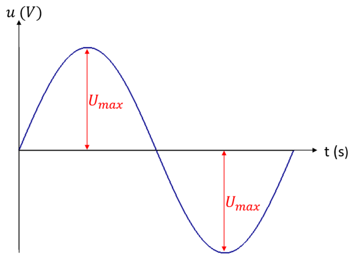
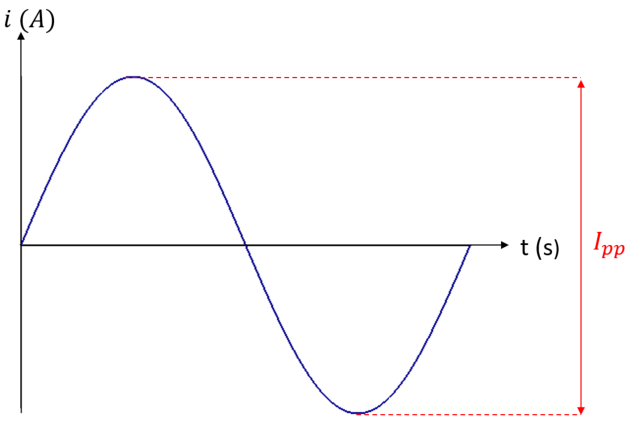
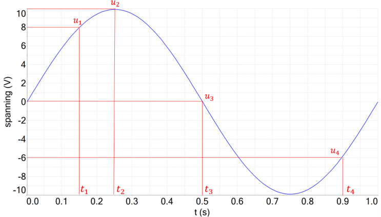
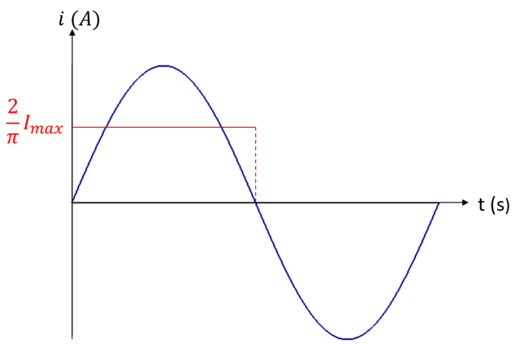

# De spanning- en stroomwaarden van een sinusgolf

Er zijn vijf verschillende manieren om de waarde van een sinusgolf in termen van zijn spanning- of stroomgrootte weer te geven: de momentele of ogenblikkelijke waarde, de maximale spanning, de top tot top waarde \(peak-to-peak\), de effectieve waarde \(rms – root mean square\) en de gemiddelde waarde.

Wat is belangrijk?

* Je bepaalt de maximale waarde van een sinusgolf.
* Je bepaalt de peak-to-peak waarde van een sinusgolf.
* Je bepaalt de momentele waarde van een sinusgolf
* Je bepaalt de effectieve waarde van een sinusgolf.
* Je bepaalt de gemiddelde waarde van een sinusgolf.

## De maximale waarde of amplitude 

De amplitude of maximale waarde van een sinusgolf is gelijk aan de spanning \(of stroom\) op positief maximum of op negatief maximum. Beide maxima zijn gelijk in grootte. De amplitude is bijgevolg de maximale waarde die de sinusgolf heeft gezien over een halve periode. De maximale spanning wordt aangeduid met $${U}_{max}.$$ meetinstellingen op de oscilloscoop en in engeltalige literatuur vind je de maximale spanning ook terug als de peak-spanning en voorgesteld door $${V}_{p}$$ of $${U}_{p}$$ .

Figuur 7-11: maximale spanning bij een sinusvormige spanning

## De top-tot-top waarde of peak-to-peak waarde 

De top-tot-top waarde, meestal peak-to-peak waarde genoemd, van een sinusgolf is de spanningswaarde \(of stroomwaarde\) tussen het positief maximum. De peak-to-peak waarden worden voorgesteld door $${U}_{pp}$$ of $${I}_{pp}$$ en is gelijk aan twee keer de maximale waarde van een sinusgolf. In formulevorm:

$${U}_{PP}=2\times {U}_{\mathrm{max}} \left(7-3\right)$$

$${I}_{pp}=2\times {I}_{\mathrm{max}} \left(7-4\right)\mathit{ }\mathit{ }\mathit{ }$$

Figuur 7-12 : peak-to-peak waarde van een sinusvormige stroomgolf

## De momentele waarde 

Op ieder tijdsmoment heeft een sinusgolf een momentele waarde. Betreft het een spanningsgolf dan spreekt men van de momentele spanning of ogenblikkelijke spanning. Betreft het een stroomgolf dan wordt gesproken over de momentele stroom of ogenblikkelijke stroom. Momentele waarde worden aangeduid met een kleine letter. Zo wordt de momentele spanning aangeduid met $$u$$ en de momentele stroom met $$i$$ .

Figuur 7-13 : voorbeeld van een sinusspanning met enkele momentele waarden aangeduid

De momentele spanningswaarde kan je bepalen met volgende formule:

$$u={U}_{\mathrm{max}}\mathit{ sin}\left(2\pi ft\right)$$ erbij is :

* $${U}_{max}$$ maximale spanning van de sinusgolf over een halve periode gezien.
* $$f$$ : De frequentie van de sinusgolf
* $$t$$ : Het beschouwde tijdsmoment waarom de momentele waarde wordt berekent

Hou rekening met het feit dat je rekenmachine in radialen moet staan in plaats van graden om de sinuswaarde te berekenen en aldus de juiste momentele waarde bepaalt.

De figuur 7-13 toont vier momentele spanningswaarden $${u}_{1}, {u}_{2}, {u}_{3}$$ en $${u}_{4}$$ op de overeenkomstige tijdsmomenten $${i}_{1}, {i}_{2}, {i}_{3}$$ en $${i}_{4}$$ . De sinusgolf heeft een periode van $$1 s$$ wat overeenkomt met een frequentie van $$1 Hz$$ . Uit de figuur is op te maken dat de maixmale spanning $${U}_{max}$$ k is aan $$10 V$$ . De momentele spanningswaarden op de vermelde tijdsmomenten in de figuur zijn gelijk aan :

* $${t}_{1}=\mathrm{0,15} s$$ : $$u\_1=U\_\mathrm{m}\mathrm{a}\mathrm{x}\mathrm{s}\mathrm{i}\mathrm{n}($$ 2 $$\pi ft\_1)= 10V \times \mathrm{s}\mathrm{i}\mathrm{n}(2\times \pi \times 1 Hz \times 0,15 s)=\mathrm{8,09} V$$
* $${t}_{2}=\mathrm{0,25} s$$ : $$u\_2=U\_\mathrm{m}\mathrm{a}\mathrm{x}\mathrm{s}\mathrm{i}\mathrm{n}($$ 2 $$\pi ft\_2)= 10V \times \mathrm{s}\mathrm{i}\mathrm{n}(2\times \pi \times 1 Hz \times 0,15 s)=10 V$$
* $${t}_{3}=\mathrm{0,5} s$$ : $$u\_3=U\_\mathrm{m}\mathrm{a}\mathrm{x}\mathrm{s}\mathrm{i}\mathrm{n}($$ 2 $$\pi ft\_3)= 10V \times \mathrm{s}\mathrm{i}\mathrm{n}(2\times \pi \times 1 Hz \times 0 s)=0 V$$
* $${t}_{4}=\mathrm{0,9} s$$ : $$u\_4=U\_\mathrm{m}\mathrm{a}\mathrm{x}\mathrm{s}\mathrm{i}\mathrm{n}($$ 2 $$\pi ft\_4)= 10V \times \mathrm{s}\mathrm{i}\mathrm{n}(2\times \pi \times 1 Hz \times \mathrm{0,9} s)=-\mathrm{5,87} V$$

## De effectieve waarde 

De meeste wisselspanningsvoltmeters geven de effectieve spanningswaarde weer. De effectieve waarde van een sinusvormige wisselspanning \( $$U\_eff)$$ is gelijk aan de gelijkspanningswaarde die evenveel warmte dissipeert in een weerstand als deze wisselspanning. Het is dus de waarde waarmee je, inzake vermogendissipatie, een sinusoïdale wisselspanning kan vergelijken met een gelijkspanning. In Engelstalige literatuur vind je de effectieve spanningswaarde $${U}_{eff}$$ terug als de rms-waarde $${V}_{rms}$$ . De term rms staat voor root mean square of het kwadratisch gemiddelde.

De relatie tussen de effectieve spanning/stroom en de maximale spanning/stroom is als volgt:

$${U}_{eff}=\frac{ {U}_{max}}{\sqrt{2}} \approx \mathrm{0,707} {U}_{\mathrm{max}} \left(7-5\right)$$

$${I}_{eff}=\frac{ {I}_{max}}{\sqrt{2}} \approx \mathrm{0,707} {I}_{\mathrm{max}} \left(7-6\right)$$

$${U}_{max}= \sqrt{2} {U}_{eff} \left(7-7\right)$$

$${I}_{max}= \sqrt{2} {I}_{eff} \left(7-8\right)$$

De relatie tussen de effectieve spanning/stroom en de peak-to-peak waarde van de spanning/stroom is als volgt:

$${U}_{pp}=2 \sqrt{2} {U}_{eff} \mathit{ }\left(7-9\right)$$

$${I}_{pp}=2 \sqrt{2} {I}_{eff} \mathit{ }\left(7-10\right)$$

## De gemiddelde waarde 

De gemiddelde waarde van een sinusvorm over een gehele periode gezien is steeds gelijk aan nul. De reden hiervoor is dat de positieve waarden gelijk en tegengesteld zijn aan de negatieve waarden in één periode. Om toch een nuttige vergelijkingswaarde te bekomen, en de gemiddelde waarde van een gelijkgerichte spanning te kunnen bepalen, wordt de gemiddelde waarde bepaald over een halve periode. De gemiddelde waarde wordt uitgedrukt in verhouding tot de maximale waarde. De gemiddelde spanningswaarde $${U}_{gem}$$ is dan als volgt te bepalen:

$${U}_{gem}=\frac{2}{\pi }{U}_{\mathrm{m}\mathrm{a}\mathrm{x}}\approx \mathrm{0,637} {U}_{\mathrm{m}\mathrm{a}\mathrm{x}\mathrm{ }} \left(7-11\right)$$

Voor de stroom vind je de gemiddelde stroomwaarde op analoge manier:

$${I}_{gem}=\frac{2}{\pi }{I}_{max}\approx \mathrm{0,637} {I}_{max} \left(7-12\right)$$

In de Engelstalige literatuur vind je voor de gemiddelde waarde de average value of voor spanning $${V}_{avg}$$ .

Figuur 7-14 : voorbeeld van gemiddelde waarde van een sinusvormige wisselstroom

## Test jezelf : De spanning- en stroomwaarden van een sinusgolf 

1. **Bepaal** $${\mathit{U}}_{\mathit{p}\mathit{p}}$$ **in volgende situaties:**

| \(a\) | $${\mathit{U}}_{\mathit{m}\mathit{a}\mathit{x}}=1\mathit{ }\mathit{V}$$ | \(b\) | $${\mathit{U}}_{\mathit{e}\mathit{f}\mathit{f}}=\mathrm{1,414}\mathit{ }\mathit{V}$$ | \(c\) | $${\mathit{U}}_{\mathit{g}\mathit{e}\mathit{m}}=3\mathit{ }\mathit{V}$$ |
| :--- | :--- | :--- | :--- | :--- | :--- |

1. **Bepaal** $${\mathit{U}}_{\mathit{e}\mathit{f}\mathit{f}}$$ **in volgende situaties:**

| \(a\) | $${\mathit{U}}_{\mathit{m}\mathit{a}\mathit{x}}=\mathrm{2,5}\mathit{ }\mathit{V}$$ | \(b\) | $${\mathit{U}}_{\mathit{e}\mathit{f}\mathit{f}\mathit{p}\mathit{p}}=10\mathit{ }\mathit{V}$$ | \(c\) | $${\mathit{U}}_{\mathit{g}\mathit{e}\mathit{m}}=\mathrm{1,5}\mathit{ }\mathit{V}$$ |
| :--- | :--- | :--- | :--- | :--- | :--- |
|  |  |  |  |  |  |

1. **Bepaal** $${\mathit{U}}_{\mathit{g}\mathit{e}\mathit{m}}$$ **in volgende situaties:**

\| \(a\) \| $${\mathit{U}}_{\mathit{m}\mathit{a}\mathit{x}}=10\mathit{ }\mathit{V}$$ \| \(b\) \| $${\mathit{U}}_{\mathit{e}\mathit{f}\mathit{f}\mathit{p}\mathit{p}}=\mathrm{2,3}\mathit{ }\mathit{V}$$ \| \(c\) \| $${\mathit{U}}_{\mathit{p}\mathit{p}}=60\mathit{ }\mathit{V}$$ \| \| --- \| --- \| --- \| --- \| --- \| --- \|

