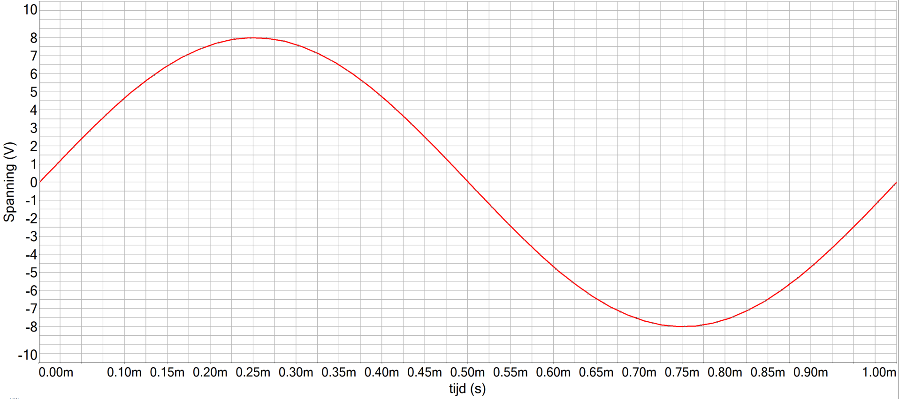
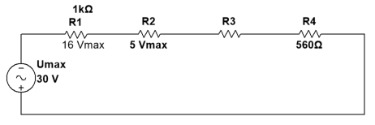
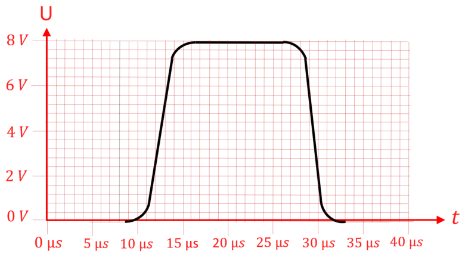
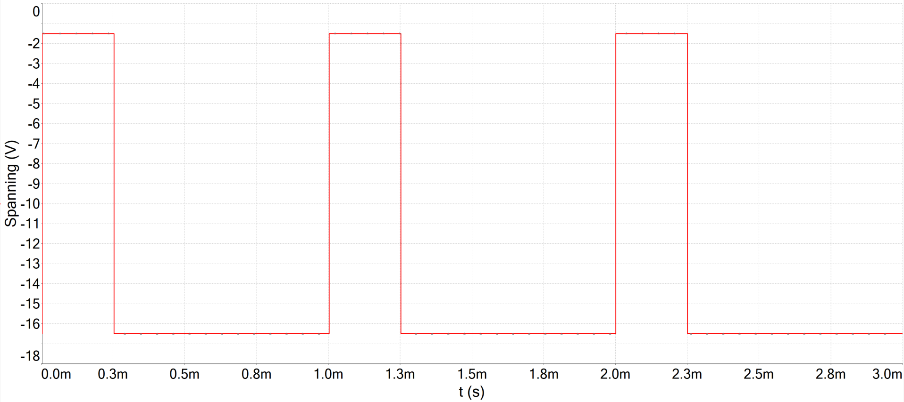

# Oefeningen

## De sinusoïdale golfvorm 

1. Bereken de frequentie voor ieder van volgende perioden:

| \(a\) | $$0,2 s$$ | \(b\) | $$100 ms$$ | \(c\) | $$250 ms$$ | \(d\) | $$500 \mu s$$ | \(e\) | $$10 \mu s$$ |
| :--- | :--- | :--- | :--- | :--- | :--- | :--- | :--- | :--- | :--- |
|  |  |  |  |  |  |  |  |  |  |

1. Bereken de periode van de volgende frequenties:

| \(a\) | $$80 Hz$$ | \(b\) | $$400 Hz$$ | \(c\) | $$22 kHz$$ | \(d\) | $$\mathrm{102,6} Mhz$$ | \(e\) | $$\mathrm{2,4} Ghz$$ |
| :--- | :--- | :--- | :--- | :--- | :--- | :--- | :--- | :--- | :--- |

1. Een sinusgolf doorloopt $$5$$ cycli in $$10 \mu s$$ . Wat is zijn periode?
2. Hoeveel tijd heeft een sinusgolf met frequentie $$50 kHz$$ nodig om $$100$$ cycli te vervolledigen?

## De spanning en stroomwaarden van een sinusgolf 

1. Een sinusoïdale stroom heeft een effectieve waarde van $$5 mA$$ . Bepaal de volgende waarden:

| \(a\) | $${I}_{max}$$ | \(b\) | $${I}_{gem}$$ | \(c\) | $${I}_{pp}$$ |
| :--- | :--- | :--- | :--- | :--- | :--- |

1. Bepaal de ogenblikkelijke spanningswaarden in figuur 7-53 bij $$\mathrm{0,175} ms, \mathrm{0,35} ms, \mathrm{0,75} ms en$$ 0,925 ms

Figuur 7-53

## Hoekmeting van een sinusgolf 

1. Sinusgolf $$A$$ heeft een positief gaande kruising met de horizontale as bij $$30°$$ ten opzichte van een referentiesinus. Sinusgolf $$B$$ heeft een positief gaande kruising met de horizontale as bij 45° ten opzichte van dezelfde referentie. Bepaal het faseverschil tussen de twee sinusgolven $$A$$ een $$B$$ . Welke van de twee sinusgolven is voor-ijlend ten opzichte van de andere sinusgolf?
2. Teken twee sinusgolven waarbij sinusgolf $$B$$ $$135°$$ na-ijlend is op sinusgolf $$A$$ . Beide sinusgolven hebben dezelfde amplitude.
3. Converteer de volgende hoekwaarden van radialen naar graden:

| \(a\) | $$\frac{\pi }{8}$$ | \(b\) | $$\frac{\pi }{3}$$ | \(c\) | $$\frac{3\pi }{5}$$ | \(d\) | $$\frac{6\pi }{5}$$ | \(e\) | $$\mathrm{1,8}\pi$$ |
| :--- | :--- | :--- | :--- | :--- | :--- | :--- | :--- | :--- | :--- |

1. Converteer de volgende hoekwaarden van graden naar radialen:

| \(a\) | $$30°$$ | \(b\) | $$45°$$ | \(c\) | $$78°$$ | \(d\) | $$200°$$ | \(e\) | $$300°$$ |
| :--- | :--- | :--- | :--- | :--- | :--- | :--- | :--- | :--- | :--- |

## De sinusgolfformule 

1. Bepaal voor een bepaalde sinusvormige referentiestroom met amplitude $$100 mA$$ de momentele stroomwaarden op volgende hoeken:

| \(a\) | $$35°$$ | \(b\) | $$95°$$ | \(c\) | $$190°$$ | \(d\) | $$215°$$ | \(e\) | $$275°$$ |
| :--- | :--- | :--- | :--- | :--- | :--- | :--- | :--- | :--- | :--- |

1. De sinusgolf $$A$$ ijlt $$30°$$ na op de sinusgolf $$B$$. Beide golven hebben dezelfde amplitude die gelijk is aan $$15 V$$. Stel dat $$A$$ de referentiegolf is waarbij de positief doorgaande kruising met de horizontale as op $$0°$$ gebeurt. Bepaal dan de momentele spanningswaarde van sinusgolf $$B$$ bij $$30°, 45°, 90°, 180°, 200°$$ en 300°.

## Analyse van wisselstroomschakelingen 

1. Een sinusoïdale spanning met amplitude $$10 V$$ is aangesloten op de resistieve schakeling in figuur 7-54. Bepaal de volgende stromen:

| \(a\) | $${I}_{eff}$$ | \(b\) | $${I}_{gem}$$ | \(c\) | $${I}_{max}$$ | \(d\) | $${I}_{pp}$$ | \(e\) | $$i$$ bij positief maximum van de sinusgolf |
| :--- | :--- | :--- | :--- | :--- | :--- | :--- | :--- | :--- | :--- |

Figuur 7-54

1. Bepaal de effectieve spanning over $${R}_{3}$$ in figuur 7-55.

Figuur 7-55

1. Hoeveel gelijkspanning moet je toevoegen aan een wisselspanningsbron met spanning $$3 {V}_{eff}$$ zodat de geleverde spanning aan een belasting niet alternerend is \(geen negatieve spanningswaarden\)?

## Niet sinusoïdale golfvormen 

1. Bepaal van de puls in figuur 7-56 de stijgtijd, daaltijd, pulsbreedte en amplitude.

Figuur 7-56

1. Bepaal de gemiddelde spanning van de puls in figuur 7-57.

Figuur 7-57

1. Bepaal de gemiddelde waarde van de positieve puls in figuur 7-58.

Figuur 7-58

1. Een blokgolf \(duty cycle $$50\%$$ \) heeft een periode van $$40 \mu s.$$ Bepaal de grondgolf en de zes eerste harmonischen.

