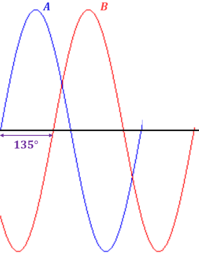

# Oplossingen

## Antwoorden test jezelf vragen 

### Test jezelf: de sinusoïdale golfvorm 

1. Een cyclus gaat vanaf de positief gaande nuldoorgang van de horizontale as naar positief maximum om vervolgens terug te dalen en door nul te gaan tot negatief maximum en vervolgens terug te stijgen tot nul bereikt wordt.
2. Een sinusfunctie verandert van polariteit vanaf de nuldoorgangen.
3. Een sinusgolf heeft twee maxima gedurende één cyclus.
4. Een periode kan worden gemeten vanaf een bepaalde nuldoorgang tot dezelfde nuldoorgang in de volgende cyclus. De periode kan ook worden gemeten vanaf een bepaald maximum tot het volgend overeenstemmend maximum.
5. Frequentie is het aantal cyclussen die worden afgelegd per seconde. De eenheid van frequentie is Hertz \(Hz\).
6. $$f=\frac{1}{5 \mu s}=200 kHz$$
7. $$T=\frac{1}{200 Hz}=5 ms$$

### Test jezelf : De spanning- en stroomwaarden van een sinusgolf 

1. \(a\) $${U}_{pp}=2 \times 1 V=2 V$$ \(b\) $${U}_{pp}=2 \times \sqrt{2} \times \mathrm{1,414} V=4 V$$ \(c\) $${U}_{pp}= \pi \times 3 V=\mathrm{9,42} V$$
2. \(a\) $${U}_{eff}=\frac{\mathrm{2,5} V}{\sqrt{2}}=\mathrm{1,77} V$$ \(b\) $${U}_{eff}=\frac{10 V}{2\times \sqrt{2}}=\mathrm{3,54} V$$ \(c\) $${U}_{eff}=\frac{\pi \times \mathrm{1,5} V}{2\times \sqrt{2}}=\mathrm{1,67} V$$
3. \(a\) $${U}_{gem}=\frac{2}{\pi }\times 10 V=\mathrm{6,37} V$$ \(b\) $${U}_{gem}=\frac{2\times \sqrt{2}}{\pi }\times \mathrm{2,3} V=\mathrm{2,07} V$$ \(c\) $${U}_{gem}=\frac{1}{\pi }\times 60 V= \mathrm{19,1} V$$

### Test jezelf : hoekmeting van een sinusgolf 

1. \(a\) $$90°$$ ; \(b\) $$180°$$ \(c\) $$270°$$ \(d\) $$360°$$
2. $$180°$$ of $$\pi rad$$
3. $$360°$$ of $$2\pi rad$$
4. $$B$$ ijlt $$45°$$ \(90° - 135°\) voor op $$C$$

### Test jezelf : de sinusgolfformule 

1. \(a\) $$\mathrm{sin}\left(30°\right)=\mathrm{0,5}$$ \(b\) $$\mathrm{sin}\left(60°\right)=\mathrm{0,866}$$ \(c\) $$\mathrm{sin}\left(90°\right)=1$$
2. $$u=10 V \times \mathrm{sin}\left(120°\right)=\mathrm{8,66} V$$
3. $$i=200 mA \times \mathrm{sin}\left(45°+10°\right)=\mathrm{163,83}\mathrm{ }\mathrm{m}\mathrm{A}$$

### Test jezelf : analyse van AC- circuits 

1. $${I}_{max}=\frac{ {U}_{max}}{R}=\frac{\mathrm{12,5} V}{330 \Omega }=\mathrm{59,5} mAroneff=\frac{\mathrm{6,2} V+\mathrm{11,3} V+\mathrm{7,8} V}{\sqrt{2}}=\mathrm{17,9} V$$
2. Ja deze samengevoegde spanning zal alterneren

### Test jezelf : niet sinusoïdale golfvormen 

1. \(a\) stijgtijd is het tijdsinterval van $$10 \%$$ tot $$90 \%$$ van de amplitude
2. daaltijd is het tijdsinterval van $$90 \%$$ tot $$10 \%$$ van de amplitude
3. pulsbreedte is het tijdsinterval tussen $$50 \%$$ van de stijgende flank tot $$50 \%$$ van de dalende flank
4. $$f=\frac{1}{1 ms}=1 kHz$$
5. $$amplitude=2V-0.5 V=1.5 V;d=\frac{10 \mu s}{40 \mu s} \times 100 \%=25\%$$ ; $${U}_{gem}=\mathrm{0,5} V+0.25 \times 2V=1 V$$
6. $$T=16 ms$$
7. $$f=\frac{4 cycli}{6 \mu s}=\mathrm{666,666} kHz$$
8. De fundamentele frequentie is de herhalingssnelheid van de golfvorm
9. $${f}_{2deharm}=2\times 3 kHz=6 kHz$$
10. $$f=\frac{1}{10 \mu s}=100 kHz$$

## Oplossingen waar / niet waar vragen 

| 1. | waar | 2. | niet waar | 3. | niet waar | 4. | waar | 5. | waar | 6. | niet waar |
| :--- | :--- | :--- | :--- | :--- | :--- | :--- | :--- | :--- | :--- | :--- | :--- |
| 7. | waar | 8. | waar | 9. | niet waar | 10. | niet waar | 11. | waar | 12. | waar |
|  |  |  |  |  |  |  |  |  |  |  |  |

## Oplossingen multiple choice test 

| 1. | \(c\) | 2. | \(b\) | 3. | \(c\) | 4. | \(b\) | 5. | \(c\) | 6. | \(a\) | 7. | \(a\) | 8. | \(a\) |
| :--- | :--- | :--- | :--- | :--- | :--- | :--- | :--- | :--- | :--- | :--- | :--- | :--- | :--- | :--- | :--- |
| 9. | \(d\) | 10. | \(b\) | 11. | \(a\) | 12. | \(d\) | 13. | \(c\) | 14. | \(b\) | 15. | \(d\) | 16. | \(b\) |

## Oplossingen oefeningen 

### De sinusoïdale golfvorm 

1. De frequenties zijn:

| \(a\) | $$5 Hz$$ | \(b\) | $$10 Hz$$ | \(c\) | $$4 Hz$$ | \(d\) | $$2 kHz$$ | \(e\) | $$100 kHz$$ |
| :--- | :--- | :--- | :--- | :--- | :--- | :--- | :--- | :--- | :--- |

1. De perioden zijn:

| \(a\) | $$\mathrm{12,5} ms$$ | \(b\) | $$\mathrm{2,5} ms$$ | \(c\) | $$\mathrm{45,45} ms$$ | \(d\) | $$\mathrm{9,75} ns$$ | \(e\) | $$\mathrm{0,416} ps$$ |
| :--- | :--- | :--- | :--- | :--- | :--- | :--- | :--- | :--- | :--- |

1. $$2 \mu s$$
2. $$2 ms$$

### De spanning en stroomwaarden van een sinusgolf 

1. De verschillende stroomwaarden zijn:

| \(a\) | $${I}_{max}=\mathrm{7,07}mA$$ | \(b\) | $${I}_{gem}=4.5 mA$$ | \(c\) | $${I}_{pp}=14.14 mV$$ |
| :--- | :--- | :--- | :--- | :--- | :--- |

1. $$t=\mathrm{0,175} ms;u=\mathrm{7,1} V t=\mathrm{0,35} ms;u=\mathrm{6,5} V$$

$$t=\mathrm{0,75} ms;u= -8 V t=0.925 ms;u=-\mathrm{3,6} V$$

### Hoekmeting van een sinusgolf 

1. $$15°$$ ; $$A$$ is voor-ijlend op $$B$$
2. Zie figuur 7-59

Figuur 7-59

1. Omvorming radialen naar graden

| \(a\) | $$\mathrm{22,5}°$$ | \(b\) | $$60°$$ | \(c\) | $$108°$$ | \(d\) | $$216°$$ | \(e\) | $$324°$$ |
| :--- | :--- | :--- | :--- | :--- | :--- | :--- | :--- | :--- | :--- |

1. Omvorming graden naar radialen:

| \(a\) | $$\frac{\pi }{6} rad$$ | \(b\) | $$\frac{\pi }{4} rad$$ | \(c\) | $$\mathrm{1,36} rad$$ | \(d\) | $$\mathrm{3,49} rad$$ | \(e\) | $$\mathrm{5,24} rad$$ |
| :--- | :--- | :--- | :--- | :--- | :--- | :--- | :--- | :--- | :--- |

### De sinusgolfformule 

1. Momentele stroomwaarde voor de verschillende hoekwaarden:

| \(a\) | $$\mathrm{57,4} mA$$ | \(b\) | $$\mathrm{99,6} mA$$ | \(c\) | $$-\mathrm{17,4} mA$$ | \(d\) | $$-\mathrm{57,4} mA$$ | \(e\) | $$-\mathrm{99,6} mA$$ |
| :--- | :--- | :--- | :--- | :--- | :--- | :--- | :--- | :--- | :--- |

1. $$30°;13 V 45°;\mathrm{14,5} V 90°;13 V 180°;-\mathrm{7,5} V 200°; -\mathrm{11,5} 300°; -\mathrm{7,5} V$$

### Analyse van wisselstroomschakelingen 

1. De stromen in de schakeling van figuur 7-54 :

| \(a\) | $$\mathrm{7,07} mA$$ | \(b\) | $$0 A$$ | \(c\) | $$10 mA$$ | \(d\) | $$20 mA$$ | \(e\) | $$10 mA$$ |
| :--- | :--- | :--- | :--- | :--- | :--- | :--- | :--- | :--- | :--- |
|  |  |  |  |  |  |  |  |  |  |

1. $$\mathrm{7,38} V$$
2. $$\mathrm{4,24} V$$

### Niet sinusoïdale golfvormen 

1. $${t}_{r}\approx \mathrm{2,5} \mu s$$ $${t}_{f} \approx \mathrm{1,5} \mu s$$ $${t}_{W}\approx 17 \mu s$$ $$Amplitude=\mathrm{7,8} V \left(\approx 8 V\right)$$
2. $$-12 V$$
3. $$-\mathrm{0,375} V$$
4. $$25 kHz$$ ; harmonischen: $$75 kHz, 125 kHz, 175 kHz, 225 kHz, 275 kHz$$ en $$325 kHz$$ .

